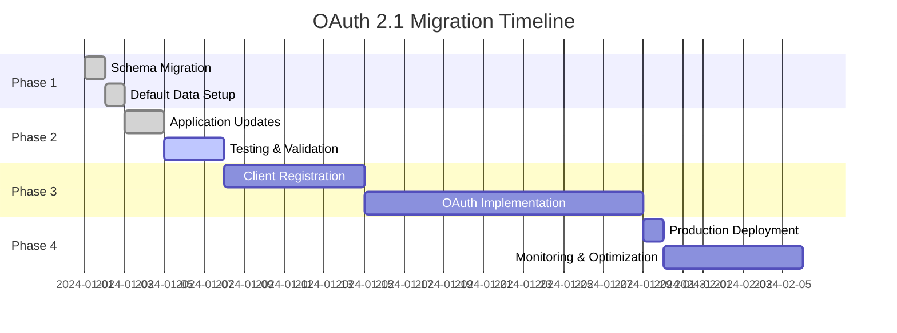

# Migration Guide: Password-Only to OAuth 2.1

This comprehensive guide provides step-by-step instructions for migrating existing Authly installations from password-only authentication to full OAuth 2.1 compliance, ensuring backward compatibility and seamless user experience.

## 🎯 Migration Overview

The OAuth 2.1 implementation in Authly maintains full backward compatibility while adding comprehensive authorization server capabilities:

### Pre-Migration State
- **Authentication**: Password grant only (`POST /auth/token`)
- **Authorization**: JWT token-based with user verification
- **Client Management**: No OAuth client support
- **Security**: Basic rate limiting and password hashing

### Post-Migration State
- **Authentication**: Password grant + OAuth 2.1 authorization code flow
- **Authorization**: Enhanced JWT tokens with OAuth scopes
- **Client Management**: Full OAuth client and scope administration
- **Security**: PKCE, client authentication, and advanced security features

### Migration Benefits
- **Standards Compliance**: Full OAuth 2.1 and RFC compliance
- **Enhanced Security**: PKCE, client authentication, token revocation
- **Scalability**: Support for multiple applications and clients
- **Flexibility**: Multiple authentication flows for different use cases
- **Admin Tools**: CLI administration interface for OAuth management

## 📋 Pre-Migration Checklist

### System Requirements Verification

```bash
# Check current Authly version
python -c "import authly; print(authly.__version__)"

# Verify Python version (3.11+ recommended)
python --version

# Check database connectivity
psql "$DATABASE_URL" -c "SELECT version();"

# Verify current schema
psql "$DATABASE_URL" -c "\dt"
```

### Database Backup

```bash
#!/bin/bash
# Create comprehensive backup before migration

# Configuration
BACKUP_DIR="/backups/authly_migration"
TIMESTAMP=$(date +%Y%m%d_%H%M%S)
BACKUP_FILE="authly_pre_migration_${TIMESTAMP}.sql"

# Create backup directory
mkdir -p "$BACKUP_DIR"

# Full database backup
pg_dump "$DATABASE_URL" --clean --if-exists --create > "${BACKUP_DIR}/${BACKUP_FILE}"

# Verify backup
if [ $? -eq 0 ]; then
    echo "✓ Database backup created: ${BACKUP_DIR}/${BACKUP_FILE}"
    
    # Compress backup
    gzip "${BACKUP_DIR}/${BACKUP_FILE}"
    echo "✓ Backup compressed: ${BACKUP_DIR}/${BACKUP_FILE}.gz"
else
    echo "✗ Database backup failed!"
    exit 1
fi

# Additional backups
cp pyproject.toml "${BACKUP_DIR}/pyproject_${TIMESTAMP}.toml"
cp -r src/authly "${BACKUP_DIR}/authly_source_${TIMESTAMP}"

echo "✓ Pre-migration backup completed"
```

### Configuration Audit

```bash
# Document current configuration
cat > migration_config_audit.txt << EOF
# Authly Configuration Audit - $(date)

## Environment Variables
DATABASE_URL: $(echo $DATABASE_URL | sed 's/:[^@]*@/:***@/')
JWT_SECRET_KEY: $([ -n "$JWT_SECRET_KEY" ] && echo "SET" || echo "NOT SET")
JWT_REFRESH_SECRET_KEY: $([ -n "$JWT_REFRESH_SECRET_KEY" ] && echo "SET" || echo "NOT SET")

## Current Features
- Password Grant: ENABLED
- User Registration: $([ -n "$SMTP_HOST" ] && echo "ENABLED" || echo "DISABLED")
- Rate Limiting: ENABLED
- Admin Interface: NONE

## Database Tables
$(psql "$DATABASE_URL" -c "\dt" | grep -E "(users|tokens)")

## Active Users
Active Users: $(psql "$DATABASE_URL" -t -c "SELECT COUNT(*) FROM users WHERE is_verified = true;")
Total Tokens: $(psql "$DATABASE_URL" -t -c "SELECT COUNT(*) FROM tokens WHERE expires_at > NOW();")
EOF

echo "✓ Configuration audit saved to migration_config_audit.txt"
```

## 🚀 Migration Process

### Phase 1: Schema Migration

#### Step 1: Database Schema Updates

```sql
-- migration/001_oauth_schema.sql
-- Add OAuth 2.1 tables to existing database

-- OAuth clients table
CREATE TABLE IF NOT EXISTS clients (
    id UUID PRIMARY KEY DEFAULT uuid_generate_v4(),
    client_id VARCHAR(255) UNIQUE NOT NULL,
    client_name VARCHAR(255) NOT NULL,
    client_secret_hash VARCHAR(255), -- NULL for public clients
    client_type VARCHAR(20) NOT NULL CHECK (client_type IN ('confidential', 'public')),
    redirect_uris TEXT[] NOT NULL,
    client_uri VARCHAR(255),
    logo_uri VARCHAR(255),
    auth_method VARCHAR(50) DEFAULT 'client_secret_basic',
    require_pkce BOOLEAN DEFAULT true,
    is_active BOOLEAN DEFAULT true,
    created_at TIMESTAMP WITH TIME ZONE DEFAULT CURRENT_TIMESTAMP,
    updated_at TIMESTAMP WITH TIME ZONE DEFAULT CURRENT_TIMESTAMP
);

-- OAuth scopes table
CREATE TABLE IF NOT EXISTS scopes (
    id UUID PRIMARY KEY DEFAULT uuid_generate_v4(),
    scope_name VARCHAR(255) UNIQUE NOT NULL,
    description TEXT,
    is_default BOOLEAN DEFAULT false,
    is_active BOOLEAN DEFAULT true,
    created_at TIMESTAMP WITH TIME ZONE DEFAULT CURRENT_TIMESTAMP,
    updated_at TIMESTAMP WITH TIME ZONE DEFAULT CURRENT_TIMESTAMP
);

-- Client-scope associations
CREATE TABLE IF NOT EXISTS client_scopes (
    client_id UUID NOT NULL REFERENCES clients(id) ON DELETE CASCADE,
    scope_id UUID NOT NULL REFERENCES scopes(id) ON DELETE CASCADE,
    PRIMARY KEY (client_id, scope_id)
);

-- Authorization codes table
CREATE TABLE IF NOT EXISTS authorization_codes (
    id UUID PRIMARY KEY DEFAULT uuid_generate_v4(),
    code VARCHAR(255) UNIQUE NOT NULL,
    client_id UUID NOT NULL REFERENCES clients(id) ON DELETE CASCADE,
    user_id UUID NOT NULL REFERENCES users(id) ON DELETE CASCADE,
    scopes TEXT[] NOT NULL,
    code_challenge VARCHAR(255) NOT NULL,
    code_challenge_method VARCHAR(10) DEFAULT 'S256',
    redirect_uri TEXT NOT NULL,
    expires_at TIMESTAMP WITH TIME ZONE NOT NULL,
    created_at TIMESTAMP WITH TIME ZONE DEFAULT CURRENT_TIMESTAMP
);

-- Enhance existing tokens table for OAuth support
ALTER TABLE tokens ADD COLUMN IF NOT EXISTS client_id UUID REFERENCES clients(id) ON DELETE CASCADE;
ALTER TABLE tokens ADD COLUMN IF NOT EXISTS scopes TEXT[];

-- Performance indexes
CREATE INDEX CONCURRENTLY IF NOT EXISTS idx_clients_client_id ON clients(client_id);
CREATE INDEX CONCURRENTLY IF NOT EXISTS idx_clients_active ON clients(is_active);
CREATE INDEX CONCURRENTLY IF NOT EXISTS idx_scopes_name ON scopes(scope_name);
CREATE INDEX CONCURRENTLY IF NOT EXISTS idx_scopes_active ON scopes(is_active);
CREATE INDEX CONCURRENTLY IF NOT EXISTS idx_scopes_default ON scopes(is_default);
CREATE INDEX CONCURRENTLY IF NOT EXISTS idx_client_scopes_client_id ON client_scopes(client_id);
CREATE INDEX CONCURRENTLY IF NOT EXISTS idx_authorization_codes_code ON authorization_codes(code);
CREATE INDEX CONCURRENTLY IF NOT EXISTS idx_authorization_codes_expires_at ON authorization_codes(expires_at);
CREATE INDEX CONCURRENTLY IF NOT EXISTS idx_tokens_client_id ON tokens(client_id);
```

#### Step 2: Execute Schema Migration

```bash
#!/bin/bash
# scripts/migrate_schema.sh

set -e

echo "Starting OAuth 2.1 schema migration..."

# Verify database connectivity
psql "$DATABASE_URL" -c "SELECT 1;" > /dev/null 2>&1
if [ $? -ne 0 ]; then
    echo "Error: Cannot connect to database"
    exit 1
fi

# Apply schema migration
echo "Applying OAuth 2.1 schema..."
psql "$DATABASE_URL" -f migration/001_oauth_schema.sql

if [ $? -eq 0 ]; then
    echo "✓ Schema migration completed successfully"
else
    echo "✗ Schema migration failed"
    exit 1
fi

# Verify new tables
echo "Verifying OAuth tables..."
TABLES=$(psql "$DATABASE_URL" -t -c "\dt" | grep -E "(clients|scopes|authorization_codes)" | wc -l)
if [ "$TABLES" -ge 3 ]; then
    echo "✓ OAuth tables created successfully"
else
    echo "✗ OAuth table creation incomplete"
    exit 1
fi

echo "Schema migration completed!"
```

### Phase 2: Default Data Setup

#### Step 1: Create Default OAuth Scopes

```sql
-- migration/002_default_scopes.sql
-- Insert default OAuth scopes

INSERT INTO scopes (scope_name, description, is_default, is_active) VALUES
('read', 'Read access to user data', true, true),
('write', 'Write access to user data', false, true),
('profile', 'Access to user profile information', true, true),
('admin', 'Administrative access to system functions', false, true)
ON CONFLICT (scope_name) DO NOTHING;

-- Verify insertion
SELECT scope_name, description, is_default, is_active 
FROM scopes 
ORDER BY is_default DESC, scope_name;
```

#### Step 2: Create Migration OAuth Client

```python
# scripts/create_migration_client.py
"""Create initial OAuth client for testing migration."""

import asyncio
import bcrypt
import secrets
from authly.database import get_connection_pool
from authly.oauth.repositories import ClientRepository, ScopeRepository

async def create_migration_client():
    """Create initial OAuth client for migration testing."""
    
    # Database connection
    pool = await get_connection_pool(os.environ["DATABASE_URL"])
    
    async with pool.connection() as conn:
        client_repo = ClientRepository(conn)
        scope_repo = ScopeRepository(conn)
        
        # Generate client credentials
        client_id = "migration-test-client"
        client_secret = f"cs_test_{secrets.token_urlsafe(32)}"
        client_secret_hash = bcrypt.hashpw(
            client_secret.encode('utf-8'), 
            bcrypt.gensalt()
        ).decode('utf-8')
        
        # Create client
        client_data = {
            "client_id": client_id,
            "client_name": "Migration Test Client",
            "client_type": "confidential",
            "client_secret_hash": client_secret_hash,
            "redirect_uris": ["https://example.com/callback", "http://localhost:3000/callback"],
            "client_uri": "https://example.com",
            "auth_method": "client_secret_basic",
            "require_pkce": True,
            "is_active": True
        }
        
        try:
            created_client = await client_repo.create(client_data)
            print(f"✓ Migration client created: {client_id}")
            print(f"  Client Secret: {client_secret}")
            print(f"  Store this secret securely for testing!")
            
            # Associate with default scopes
            default_scopes = await scope_repo.get_default_scopes()
            for scope in default_scopes:
                await client_repo.associate_scope(created_client.id, scope.id)
            
            print(f"✓ Associated with {len(default_scopes)} default scopes")
            
        except Exception as e:
            print(f"✗ Failed to create migration client: {e}")
    
    await pool.close()

if __name__ == "__main__":
    asyncio.run(create_migration_client())
```

### Phase 3: Application Updates

#### Step 1: Update Dependencies

```toml
# pyproject.toml updates for OAuth 2.1
[tool.poetry.dependencies]
python = "^3.11"
fastapi = "^0.104.0"
uvicorn = {extras = ["standard"], version = "^0.24.0"}
psycopg = {extras = ["binary", "pool"], version = "^3.1.9"}
psycopg-toolkit = "^0.2.0"
fastapi-testing = "^0.1.0"
pydantic = "^2.4.0"
python-jose = {extras = ["cryptography"], version = "^3.3.0"}
python-multipart = "^0.0.6"
bcrypt = "^4.0.1"
click = "^8.1.7"

[tool.poetry.scripts]
authly-admin = "authly.admin.cli:main"
```

#### Step 2: Environment Configuration Updates

```bash
# .env updates for OAuth 2.1
# Add these new environment variables to existing configuration

# OAuth 2.1 Configuration
OAUTH_ENABLED=true
AUTHORIZATION_CODE_EXPIRE_MINUTES=10
PKCE_REQUIRED=true
REQUIRE_USER_CONSENT=true

# Enhanced Security
CORS_ORIGINS=https://yourapp.com,https://admin.yourapp.com
ALLOWED_HOSTS=auth.yourapp.com,api.yourapp.com

# Admin CLI Access
ADMIN_CLI_ENABLED=true

# Optional: Enhanced features
REDIS_URL=redis://localhost:6379/0  # For distributed rate limiting
METRICS_ENABLED=true                # For monitoring
```

#### Step 3: Configuration Validation

```python
# scripts/validate_config.py
"""Validate configuration for OAuth 2.1 migration."""

import os
import sys
from typing import List

def validate_oauth_config() -> List[str]:
    """Validate OAuth 2.1 configuration."""
    
    errors = []
    
    # Required environment variables
    required_vars = [
        "DATABASE_URL",
        "JWT_SECRET_KEY", 
        "JWT_REFRESH_SECRET_KEY"
    ]
    
    for var in required_vars:
        if not os.getenv(var):
            errors.append(f"Missing required environment variable: {var}")
    
    # OAuth-specific validation
    oauth_enabled = os.getenv("OAUTH_ENABLED", "false").lower() == "true"
    if oauth_enabled:
        # Check JWT secret strength
        jwt_secret = os.getenv("JWT_SECRET_KEY", "")
        if len(jwt_secret) < 32:
            errors.append("JWT_SECRET_KEY must be at least 32 characters for OAuth 2.1")
        
        refresh_secret = os.getenv("JWT_REFRESH_SECRET_KEY", "")
        if len(refresh_secret) < 32:
            errors.append("JWT_REFRESH_SECRET_KEY must be at least 32 characters")
        
        # CORS validation
        cors_origins = os.getenv("CORS_ORIGINS", "")
        if not cors_origins:
            errors.append("CORS_ORIGINS must be configured for OAuth 2.1")
    
    return errors

def main():
    """Main validation function."""
    
    print("Validating OAuth 2.1 configuration...")
    
    errors = validate_oauth_config()
    
    if errors:
        print("❌ Configuration validation failed:")
        for error in errors:
            print(f"  - {error}")
        sys.exit(1)
    else:
        print("✅ Configuration validation passed!")
        print("System is ready for OAuth 2.1 migration.")

if __name__ == "__main__":
    main()
```

### Phase 4: Testing Migration

#### Step 1: Backward Compatibility Tests

```python
# tests/test_migration_compatibility.py
"""Test backward compatibility after OAuth 2.1 migration."""

import pytest
import httpx
from fastapi.testclient import TestClient

from authly.main import app

@pytest.fixture
def client():
    """Test client for migration testing."""
    return TestClient(app)

def test_password_grant_still_works(client, test_user):
    """Verify existing password grant continues to work."""
    
    # Test existing password grant endpoint
    response = client.post("/auth/token", json={
        "grant_type": "password",
        "username": test_user.email,
        "password": "testpassword"
    })
    
    assert response.status_code == 200
    
    token_data = response.json()
    assert "access_token" in token_data
    assert "refresh_token" in token_data
    assert token_data["token_type"] == "Bearer"

def test_existing_tokens_still_valid(client, existing_access_token):
    """Verify existing tokens continue to work."""
    
    headers = {"Authorization": f"Bearer {existing_access_token}"}
    
    response = client.get("/api/v1/users/me", headers=headers)
    assert response.status_code == 200

def test_token_refresh_backward_compatible(client, existing_refresh_token):
    """Verify token refresh maintains backward compatibility."""
    
    response = client.post("/auth/token", json={
        "grant_type": "refresh_token",
        "refresh_token": existing_refresh_token
    })
    
    assert response.status_code == 200
    
    token_data = response.json()
    assert "access_token" in token_data
    assert "refresh_token" in token_data

def test_user_registration_unchanged(client):
    """Verify user registration process is unchanged."""
    
    user_data = {
        "email": "newuser@example.com",
        "username": "newuser",
        "password": "NewPassword123!"
    }
    
    response = client.post("/auth/register", json=user_data)
    assert response.status_code == 201
```

#### Step 2: OAuth 2.1 Functionality Tests

```python
# tests/test_oauth_migration.py
"""Test new OAuth 2.1 functionality after migration."""

import pytest
import httpx
from fastapi.testclient import TestClient

@pytest.mark.asyncio
async def test_oauth_discovery_endpoint(client):
    """Test OAuth 2.1 discovery endpoint."""
    
    response = client.get("/.well-known/oauth-authorization-server")
    assert response.status_code == 200
    
    metadata = response.json()
    assert "authorization_endpoint" in metadata
    assert "token_endpoint" in metadata
    assert "revocation_endpoint" in metadata

@pytest.mark.asyncio 
async def test_oauth_authorization_endpoint(client, migration_test_client):
    """Test OAuth authorization endpoint."""
    
    # Test authorization request
    params = {
        "response_type": "code",
        "client_id": migration_test_client.client_id,
        "redirect_uri": "https://example.com/callback",
        "scope": "read profile",
        "state": "test-state",
        "code_challenge": "test-challenge",
        "code_challenge_method": "S256"
    }
    
    response = client.get("/authorize", params=params)
    # Should return authorization form or redirect
    assert response.status_code in [200, 302]

@pytest.mark.asyncio
async def test_oauth_token_endpoint(client, migration_test_client):
    """Test OAuth token endpoint with authorization_code grant."""
    
    # This would typically require a full authorization flow
    # For migration testing, we can test the endpoint structure
    response = client.post("/auth/token", json={
        "grant_type": "authorization_code",
        "code": "invalid-code",  # Will fail validation
        "client_id": migration_test_client.client_id,
        "client_secret": "invalid-secret",
        "code_verifier": "test-verifier",
        "redirect_uri": "https://example.com/callback"
    })
    
    # Should return proper OAuth error
    assert response.status_code == 400
    error_data = response.json()
    assert "error" in error_data
```

#### Step 3: CLI Administration Tests

```bash
#!/bin/bash
# tests/test_cli_migration.sh

echo "Testing CLI administration functionality..."

# Test CLI connectivity
authly-admin status
if [ $? -ne 0 ]; then
    echo "❌ CLI administration not working"
    exit 1
fi

# Test client listing
authly-admin client list
if [ $? -ne 0 ]; then
    echo "❌ Client listing failed"
    exit 1
fi

# Test scope listing
authly-admin scope list
if [ $? -ne 0 ]; then
    echo "❌ Scope listing failed"
    exit 1
fi

echo "✅ CLI administration tests passed"
```

## 🔄 Rollback Procedures

### Emergency Rollback

```bash
#!/bin/bash
# scripts/emergency_rollback.sh

set -e

BACKUP_FILE=${1}

if [ -z "$BACKUP_FILE" ]; then
    echo "Usage: $0 <backup_file>"
    echo "Example: $0 /backups/authly_pre_migration_20240101_120000.sql.gz"
    exit 1
fi

echo "⚠️  EMERGENCY ROLLBACK INITIATED"
echo "Backup file: $BACKUP_FILE"

# Confirm rollback
read -p "This will restore the database to pre-migration state. Continue? (yes/no): " CONFIRM
if [ "$CONFIRM" != "yes" ]; then
    echo "Rollback cancelled"
    exit 1
fi

# Stop application
echo "Stopping application..."
pkill -f "uvicorn authly" || true

# Decompress backup if needed
if [[ "$BACKUP_FILE" == *.gz ]]; then
    echo "Decompressing backup..."
    gunzip -c "$BACKUP_FILE" > "/tmp/rollback.sql"
    BACKUP_FILE="/tmp/rollback.sql"
fi

# Restore database
echo "Restoring database..."
psql "$DATABASE_URL" < "$BACKUP_FILE"

# Remove OAuth-specific environment variables
echo "Cleaning OAuth configuration..."
unset OAUTH_ENABLED
unset AUTHORIZATION_CODE_EXPIRE_MINUTES
unset PKCE_REQUIRED

# Restart application with original configuration
echo "Restarting application..."
uvicorn authly.main:app --host 0.0.0.0 --port 8000 &

echo "✅ Emergency rollback completed"
echo "⚠️  Verify application functionality manually"
```

### Selective Feature Rollback

```python
# scripts/disable_oauth_features.py
"""Disable OAuth features without full rollback."""

import asyncio
import os
from authly.database import get_connection_pool

async def disable_oauth_features():
    """Disable OAuth features while maintaining compatibility."""
    
    pool = await get_connection_pool(os.environ["DATABASE_URL"])
    
    async with pool.connection() as conn:
        # Deactivate all OAuth clients
        await conn.execute(
            "UPDATE clients SET is_active = false WHERE is_active = true"
        )
        
        # Clear OAuth-specific tokens
        await conn.execute(
            "UPDATE tokens SET invalidated = true WHERE client_id IS NOT NULL"
        )
        
        print("✅ OAuth features disabled")
        print("Password grant authentication remains available")
    
    await pool.close()

if __name__ == "__main__":
    asyncio.run(disable_oauth_features())
```

## 📊 Post-Migration Validation

### Comprehensive System Tests

```bash
#!/bin/bash
# scripts/post_migration_validation.sh

echo "Running post-migration validation..."

# Test backward compatibility
echo "Testing backward compatibility..."
python -m pytest tests/test_migration_compatibility.py -v

# Test OAuth functionality
echo "Testing OAuth 2.1 functionality..."
python -m pytest tests/test_oauth_migration.py -v

# Test CLI administration
echo "Testing CLI administration..."
./tests/test_cli_migration.sh

# Performance validation
echo "Testing performance impact..."
python scripts/performance_comparison.py

# Security validation
echo "Running security validation..."
python scripts/security_validation.py

echo "✅ Post-migration validation completed"
```

### Performance Impact Assessment

```python
# scripts/performance_comparison.py
"""Compare performance before and after OAuth 2.1 migration."""

import asyncio
import time
import statistics
import httpx

async def benchmark_endpoint(url: str, payload: dict, iterations: int = 100):
    """Benchmark endpoint performance."""
    
    times = []
    
    async with httpx.AsyncClient() as client:
        for _ in range(iterations):
            start_time = time.time()
            
            try:
                response = await client.post(url, json=payload)
                end_time = time.time()
                
                if response.status_code in [200, 400]:  # Expected responses
                    times.append(end_time - start_time)
                    
            except Exception as e:
                print(f"Request failed: {e}")
    
    if times:
        return {
            "avg_time": statistics.mean(times),
            "median_time": statistics.median(times),
            "p95_time": sorted(times)[int(len(times) * 0.95)],
            "total_requests": len(times)
        }
    else:
        return None

async def main():
    """Run performance comparison."""
    
    base_url = "http://localhost:8000"
    
    # Test password grant performance (existing functionality)
    password_payload = {
        "grant_type": "password",
        "username": "test@example.com",
        "password": "testpassword"
    }
    
    print("Benchmarking password grant performance...")
    password_results = await benchmark_endpoint(
        f"{base_url}/auth/token", 
        password_payload
    )
    
    if password_results:
        print(f"Password Grant Results:")
        print(f"  Average: {password_results['avg_time']:.3f}s")
        print(f"  95th percentile: {password_results['p95_time']:.3f}s")
    
    # Test OAuth discovery performance (new functionality)
    print("Benchmarking OAuth discovery performance...")
    discovery_start = time.time()
    
    async with httpx.AsyncClient() as client:
        for _ in range(100):
            await client.get(f"{base_url}/.well-known/oauth-authorization-server")
    
    discovery_avg = (time.time() - discovery_start) / 100
    print(f"Discovery Average: {discovery_avg:.3f}s")
    
    print("✅ Performance comparison completed")

if __name__ == "__main__":
    asyncio.run(main())
```

## 🎯 Client Migration Strategies

### Existing API Consumers

#### Strategy 1: No Changes Required
For existing API consumers using password grant:

```javascript
// Existing code continues to work unchanged
const response = await fetch('/auth/token', {
  method: 'POST',
  headers: { 'Content-Type': 'application/json' },
  body: JSON.stringify({
    grant_type: 'password',
    username: 'user@example.com',
    password: 'userpassword'
  })
});

const { access_token, refresh_token } = await response.json();
// Use tokens exactly as before
```

#### Strategy 2: Enhanced Security (Optional)
For consumers wanting OAuth 2.1 benefits:

```javascript
// Step 1: Register as OAuth client
const clientRegistration = await fetch('/admin/oauth/clients', {
  method: 'POST',
  headers: { 
    'Content-Type': 'application/json',
    'Authorization': 'Bearer admin_token'
  },
  body: JSON.stringify({
    client_name: 'My Application',
    client_type: 'confidential',
    redirect_uris: ['https://myapp.com/callback'],
    scopes: ['read', 'write', 'profile']
  })
});

// Step 2: Implement OAuth 2.1 flow (later)
// This can be done gradually without breaking existing functionality
```

### Gradual Migration Timeline



## 🔧 Troubleshooting Migration Issues

### Common Migration Problems

#### Issue 1: Schema Migration Fails

**Symptoms:**
```
ERROR: relation "clients" already exists
```

**Solution:**
```sql
-- Check if tables exist and have correct structure
\d clients
\d scopes
\d authorization_codes

-- If tables exist but incomplete, update them
ALTER TABLE clients ADD COLUMN IF NOT EXISTS require_pkce BOOLEAN DEFAULT true;
ALTER TABLE tokens ADD COLUMN IF NOT EXISTS client_id UUID REFERENCES clients(id);
```

#### Issue 2: CLI Commands Not Working

**Symptoms:**
```bash
authly-admin: command not found
```

**Solution:**
```bash
# Reinstall with CLI support
poetry install

# Verify CLI is available
which authly-admin

# Check if entry point is configured
poetry run authly-admin --help
```

#### Issue 3: OAuth Endpoints Return 404

**Symptoms:**
- `/authorize` returns 404
- `/.well-known/oauth-authorization-server` returns 404

**Solution:**
```python
# Verify OAuth router is included in main app
from authly.oauth.routers import oauth_router

app.include_router(oauth_router)  # This should be present

# Check environment configuration
print(os.getenv("OAUTH_ENABLED"))  # Should be "true"
```

### Migration Rollback Scenarios

#### Scenario 1: Performance Degradation

```bash
# Quick performance check
curl -w "@curl-format.txt" -s -o /dev/null http://localhost:8000/auth/token

# If response time > 500ms, consider rollback
./scripts/emergency_rollback.sh /backups/pre_migration_backup.sql.gz
```

#### Scenario 2: Client Compatibility Issues

```python
# Disable OAuth features temporarily
python scripts/disable_oauth_features.py

# Update environment to disable OAuth
export OAUTH_ENABLED=false

# Restart application
pkill -f uvicorn && uvicorn authly.main:app &
```

## ✅ Migration Success Criteria

### Functional Validation

- [ ] ✅ Existing password grant authentication works
- [ ] ✅ Existing tokens remain valid
- [ ] ✅ User registration/verification unchanged
- [ ] ✅ OAuth discovery endpoint responds
- [ ] ✅ OAuth authorization endpoint accepts requests
- [ ] ✅ OAuth token endpoint supports authorization_code grant
- [ ] ✅ CLI administration commands work
- [ ] ✅ Default scopes are created and functional

### Performance Validation

- [ ] ✅ Password grant response time < 100ms (95th percentile)
- [ ] ✅ OAuth discovery response time < 50ms
- [ ] ✅ Database query performance unchanged
- [ ] ✅ Memory usage increase < 20%
- [ ] ✅ No significant CPU impact

### Security Validation

- [ ] ✅ All security headers present
- [ ] ✅ Rate limiting functional
- [ ] ✅ PKCE validation enforced
- [ ] ✅ Client authentication working
- [ ] ✅ Token revocation functional

## 📋 Post-Migration Tasks

### Documentation Updates

1. **Update API Documentation** - Add OAuth 2.1 endpoints
2. **Client Integration Guides** - Provide OAuth migration guides for consumers
3. **Admin Procedures** - Document OAuth client management procedures
4. **Security Policies** - Update security policies for OAuth compliance

### Monitoring Setup

```bash
# Add OAuth-specific monitoring
# Update monitoring configuration
cat >> monitoring/prometheus.yml << EOF
  - job_name: 'authly-oauth'
    static_configs:
      - targets: ['authly:8000']
    metrics_path: /metrics
    params:
      format: ['prometheus']
EOF
```

### Training and Documentation

1. **Admin Training** - Train administrators on OAuth client management
2. **Developer Documentation** - Provide OAuth integration examples
3. **Security Guidelines** - Document OAuth security best practices
4. **Troubleshooting Guides** - Create OAuth-specific troubleshooting documentation

This migration guide provides a comprehensive path from password-only authentication to full OAuth 2.1 compliance while maintaining backward compatibility and ensuring a smooth transition for all stakeholders.