# CAlita: Adaptive LLM-based Iterative Task Automation

> Inspired by the paper "Alita: Generalist Agent Enabling Scalable Agentic Reasoning with Minimal Predefinition and Maximal Self-Evolution".

CAlita is an intelligent meta-agent system that automatically invents Python scripts as tools to solve complex tasks through an iterative CodeReAct (Code Reasoning and Acting) loop. The system can analyze natural language requirements, detect capability gaps, search for external resources, generate and register executable code, and manage isolated execution environments between tasks. CAlita refer to OpenAlita，rebuild with E2B sandbox and dynamic McpBox.

## 🚀 Key Features

- **Intelligent Task Analysis**: Uses LLM-powered brainstorming to analyze tasks and detect capability gaps
- **Dynamic Code Generation**: Automatically generates self-contained Python scripts based on task specifications
- **Isolated Execution Environment**: Creates and manages Conda environments for safe script execution
- **External Resource Integration**: Searches and incorporates web resources when needed
- **Iterative Refinement**: Learns from execution failures and refines solutions automatically
- **MCP Registry**: Stores and reuses successful Model Context Protocols (MCPs)
- **Comprehensive Benchmarking**: Supports evaluation on GAIA, MathVista, and PathVQA datasets

## 🏗️ Architecture

CAlita consists of several core components:

### Core Modules

- **ManagerAgent**: Central coordinator that orchestrates the entire pipeline
- **MCPBrainstorm**: Analyzes tasks and generates tool specifications using LLM
- **ResearchAgent**: Performs intelligent information retrieval using LangGraph and MCP tools
- **ScriptGenerator**: Generates executable Python scripts from specifications
- **CodeRunner**: Executes scripts in isolated Conda environments
- **EnvironmentManager**: Manages Conda environment creation and dependency installation
- **MCPRegistry**: Persistent storage for successful Model Context Protocols
- **Benchmark**: Evaluation framework for multiple datasets

### Workflow

```mermaid
flowchart TD
    A["🎯 Input Task"] --> B["🧠 ManagerAgent.orchestrate()"]
    B --> C["📊 MCPBrainstorm.brainstorm()"]
    C --> D{"🔍 Capability Gap Detected?"}
    
    D -->|Yes| E["🌐 ResearchAgent.search()"]
    D -->|No| F["📝 ScriptGenerator.generate_script()"]
    
    E --> G["🔗 ResearchAgent.retrieve()"]
    G --> H["📚 Collect External Resources"]
    H --> F
    
    F --> I["🏗️ EnvironmentManager.create_environment()"]
    I --> J["📦 EnvironmentManager.install_dependencies()"]
    J --> K["▶️ CodeRunner.run_script()"]
    
    K --> L{"✅ Execution Successful?"}
    
    L -->|Yes| M["💾 MCPRegistry.register_mcp()"]
    L -->|No| N{"🔄 Max Iterations Reached?"}
    
    N -->|No| O["📝 Update Context with Error"]
    O --> C
    N -->|Yes| P["❌ Return Failure"]
    
    M --> Q["✨ Return Success Result"]
    
    style A fill:#e1f5fe
    style B fill:#f3e5f5
    style C fill:#fff3e0
    style E fill:#e8f5e8
    style F fill:#fff8e1
    style K fill:#fce4ec
    style M fill:#e0f2f1
    style Q fill:#e8f5e8
    style P fill:#ffebee
```



#### Detailed Process Flow:

1. **Task Analysis**: Analyze input task and detect capability gaps
2. **Resource Gathering**: Search external resources if gaps are detected
3. **Script Generation**: Generate self-contained Python script
4. **Environment Setup**: Create isolated Conda environment with dependencies
5. **Execution**: Run script and capture output
6. **Registration**: Store successful scripts as reusable MCPs
7. **Iteration**: Refine based on feedback if execution fails

## 📋 Prerequisites

- Python 3.8+
- Conda package manager
- OpenAI API access
- Required Python packages (see installation section)

## 🛠️ Installation

1. **Clone the repository**:
   ```bash
   git clone <repository-url>
   cd CAlita_repo
   ```

2. **Install dependencies**:
   ```bash
   pip install -r requirements.txt
   ```
   
   Required packages:
   - `openai`
   - `exa-py`
   - `requests`
   - `pyyaml`
   - `conda` (system package)

3. **Set up configuration**:
   - Copy `config.yaml.example` to `config.yaml` and update the API keys:
   ```yaml
   api:
     openai_api_key: "your-actual-openai-api-key-here"
     anthropic_api_key: "your-actual-anthropic-api-key-here"  # If using Anthropic models
   exa:
     exa_api_key: "your-actual-exa-api-key-here"
   ```

## ⚙️ Configuration

The system is configured through `config.yaml`. Key configuration sections:

### Agent Configuration
```yaml
agent:
  primary_llm: "gpt-4o"                    # Primary LLM model
  secondary_llm: "gpt-4o-mini"              # Secondary model
  mcp_prompt_template: "templates/mcp_prompt.txt"
  script_gen_prompt_template: "templates/script_template.txt"
```

### Environment Configuration
```yaml
environment:
  conda_base_env: "base"                   # Base Conda environment
  env_prefix: "CAlita_env_"                 # Environment name prefix
  dependency_timeout: 300                  # Installation timeout (seconds)
```

### API Configuration
```yaml
api:
  openai_api_key: "<YOUR_OPENAI_API_KEY_HERE>"  # OpenAI API key
  openai_api_url: "https://api.openai.com/v1"   # OpenAI API endpoint
  anthropic_api_key: "<YOUR_ANTHROPIC_API_KEY_HERE>"  # Anthropic API key
  anthropic_base_url: "https://api.anthropic.com"  # Anthropic API endpoint (optional)
exa:
  exa_api_key: "<YOUR_EXA_API_KEY_HERE>"        # Exa API key for semantic search
```

### Benchmark Configuration
```yaml
benchmark:
  gaia:
    dataset_path: "data/gaia.json"
  mathvista:
    sample_size: 100
    dataset_path: "data/mathvista.json"
  pathvqa:
    sample_size: 100
    dataset_path: "data/pathvqa.json"
```

## 🚀 Usage

### Single Task Mode

Run CAlita on a single natural language task:

```bash
python run_app.py
```

Set the experiment mode in `config.yaml`:
```yaml
misc:
  experiment_mode: "single_task"
```

Then enter your task when prompted:
```
Enter a natural language query/task: Calculate the fibonacci sequence up to 100
```

### Benchmark Mode

Run evaluation on benchmark datasets:

```bash
python run_app.py
```

Set the experiment mode in `config.yaml`:
```yaml
misc:
  experiment_mode: "benchmark"
```

This will evaluate the system on GAIA, MathVista, and PathVQA datasets and output metrics including pass@1 and pass@3 scores.

### Programmatic Usage

```python
from manager_agent import ManagerAgent
from utils import get_global_config

# Load configuration
config = get_global_config("config.yaml")

# Initialize the agent
manager = ManagerAgent(config)

# Process a task
result = manager.generate("Create a function to sort a list of numbers")
print(result)
```

## 📁 Project Structure

```
CAlita_repo/
├── app.py                 # Main entry point
├── config.yaml           # Configuration file
├── manager_agent.py      # Central coordinator
├── mcp_brainstorm.py     # Task analysis module
├── web_agent.py          # Web search and navigation
├── script_generator.py   # Code generation module
├── code_runner.py        # Script execution module
├── env_manager.py        # Environment management
├── mcp_registry.py       # MCP storage and retrieval
├── benchmark.py          # Evaluation framework
├── utils.py              # Shared utilities
├── templates/            # Prompt templates (create this directory)
│   ├── mcp_prompt.txt
│   └── script_template.txt
├── data/                 # Dataset files (create this directory)
│   ├── gaia.json
│   ├── mathvista.json
│   └── pathvqa.json
└── logs/                 # Log files (auto-created)
    └── CAlita.log
```

## 🔧 Template Files

Create the following template files in the `templates/` directory:

### `templates/mcp_prompt.txt`
```
Analyze the following task and determine if there are any capability gaps:

Task: {task}
Context: {context}

Respond with a JSON object containing:
- "capability_gap": boolean indicating if new tools are needed
- "mcp_spec": detailed specification if gap exists
- "dependencies": list of required Python packages
- "search_query": query for external resource search
```

### `templates/script_template.txt`
```
Generate a complete, self-contained Python script for the following task:

Task: {task_description}
Specification: {tool_spec}
External Resources: {external_context}

The script should:
1. Include all necessary imports
2. Be executable without external files
3. Handle errors gracefully
4. Print clear output
```

## 📊 Evaluation Metrics

The system supports comprehensive evaluation with the following metrics:

- **Pass@1**: Success rate on first attempt
- **Pass@3**: Success rate within 3 attempts
- **Dataset-specific metrics**: 
  - GAIA: Breakdown by difficulty levels (Level 1, 2, 3)
  - MathVista: Mathematical reasoning accuracy
  - PathVQA: Medical image question answering accuracy

## 🔍 Logging

Logs are automatically generated in `logs/CAlita.log`. Configure logging level in `config.yaml`:

```yaml
logging:
  level: "INFO"              # DEBUG, INFO, WARNING, ERROR
  log_file: "logs/CAlita.log"
```

## Inspiration and Credits
This project is inspired by the CAlita project by CharlesQ9 and the concepts presented in the research paper "CAlita: Generalist Agent Enabling Scalable Agentic Reasoning with Minimal Predefinition and Maximal Self-Evolution".

Original CAlita Project: CharlesQ9/CAlita on GitHub
Research Paper: CAlita: Generalist Agent Enabling Scalable Agentic Reasoning with Minimal Predefinition and Maximal Self-Evolution (arXiv:2505.20286)
Full credits to the authors and contributors of these works for the foundational architecture and ideas.

## 🤝 Contributing

1. Fork the repository
2. Create a feature branch (`git checkout -b feature/amazing-feature`)
3. Commit your changes (`git commit -m 'Add amazing feature'`)
4. Push to the branch (`git push origin feature/amazing-feature`)
5. Open a Pull Request

## 📄 License

This project is licensed under the MIT License - see the LICENSE file for details.

## 🙏 Acknowledgments

- OpenAI for providing the LLM API
- The research community for benchmark datasets (GAIA, MathVista, PathVQA)
- Contributors and maintainers of the open-source libraries used

## 📞 Support

For questions, issues, or contributions, please:
- Open an issue on GitHub
- Check the logs in `logs/CAlita.log` for debugging
- Ensure your OpenAI API key is properly configured
- Verify Conda is installed and accessible
