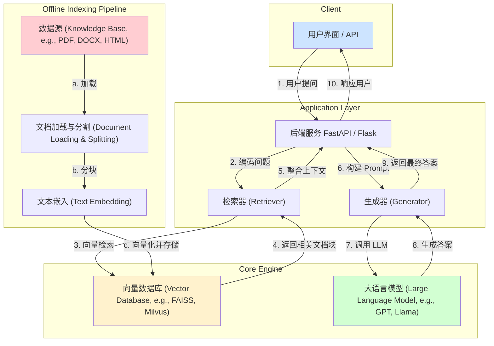
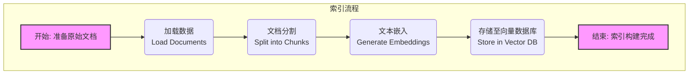
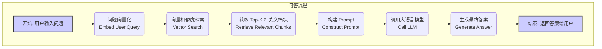

```mermaid
graph TD
    subgraph 用户端 [Client]
        A[用户界面 / API]
    end

    subgraph RAG 应用服务 [Application Layer]
        B[后端服务 FastAPI / Flask]
        C["检索器 (Retriever)"]
        D["生成器 (Generator)"]
    end

    subgraph 核心引擎 [Core Engine]
        E["向量数据库 (Vector Database, e.g., FAISS, Milvus)"]
        F["大语言模型 (Large Language Model, e.g., GPT, Llama)"]
    end

    subgraph 离线索引管道 [Offline Indexing Pipeline]
        G["数据源 (Knowledge Base, e.g., PDF, DOCX, HTML)"]
        H["文档加载与分割 (Document Loading & Splitting)"]
        I["文本嵌入 (Text Embedding)"]
    end

    %% 流程连接
    A -- 1. 用户提问 --> B
    B -- 2. 编码问题 --> C
    C -- 3. 向量检索 --> E
    E -- 4. 返回相关文档块 --> C
    C -- 5. 整合上下文 --> B
    B -- 6. 构建 Prompt --> D
    D -- 7. 调用 LLM --> F
    F -- 8. 生成答案 --> D
    D -- 9. 返回最终答案 --> B
    B -- 10. 响应用户 --> A

    %% 索引流程连接
    G -- a. 加载 --> H
    H -- b. 分块 --> I
    I -- c. 向量化并存储 --> E

    %% 样式
    style A fill:#cde4ff
    style F fill:#d2ffd2
    style E fill:#fff2cd
    style G fill:#ffcdd2

```


```mermaid
graph TD
    subgraph 索引流程
        A[开始: 准备原始文档] --> B(加载数据<br/>Load Documents)
        B --> C(文档分割<br/>Split into Chunks)
        C --> D(文本嵌入<br/>Generate Embeddings)
        D --> E(存储至向量数据库<br/>Store in Vector DB)
        E --> F[结束: 索引构建完成]
    end

    style A fill:#f9f,stroke:#333,stroke-width:2px
    style F fill:#f9f,stroke:#333,stroke-width:2px

```



```mermaid
graph TD
    subgraph 问答流程
        A[开始: 用户输入问题] --> B(问题向量化<br/>Embed User Query)
        B --> C(向量相似度检索<br/>Vector Search)
        C --> D(获取 Top-K 相关文档块<br/>Retrieve Relevant Chunks)
        D --> E(构建 Prompt<br/>Construct Prompt)
        E --> F(调用大语言模型<br/>Call LLM)
        F --> G(生成最终答案<br/>Generate Answer)
        G --> H[结束: 返回答案给用户]
    end

    style A fill:#ccf,stroke:#333,stroke-width:2px
    style H fill:#ccf,stroke:#333,stroke-width:2px

```

```mermaid
```