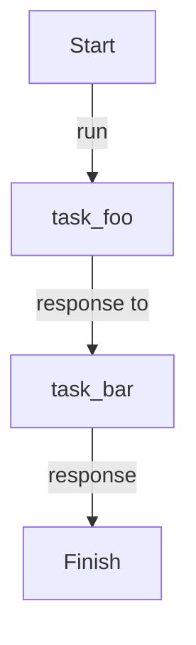
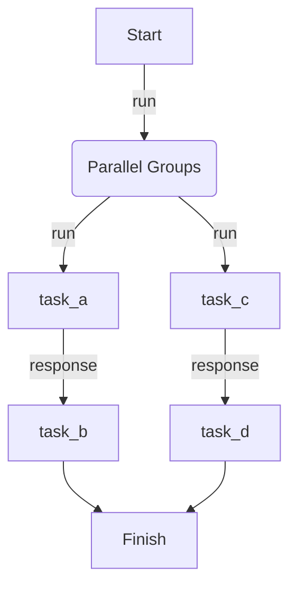
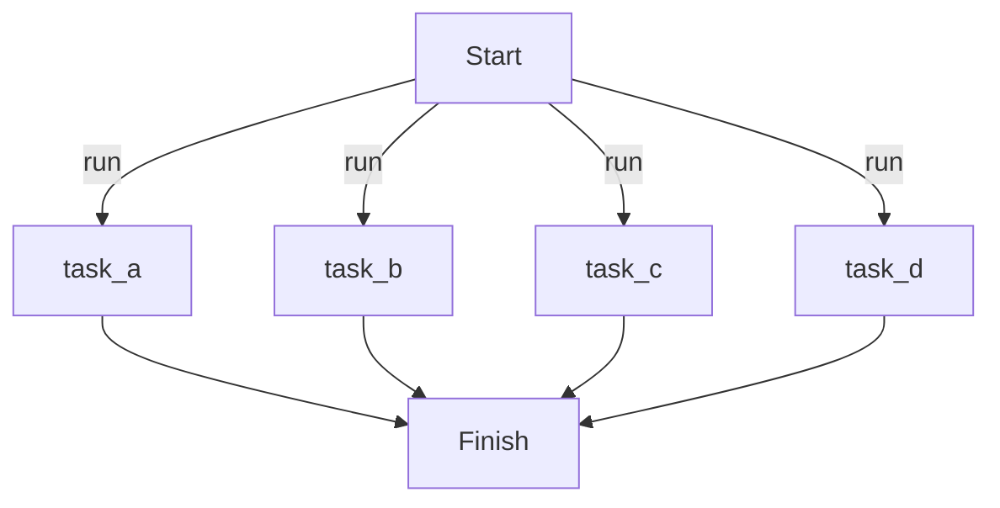

<div align="center">
  <a aria-label="Serverless.com" href="https://dotflow.io">Website</a>
  &nbsp;•&nbsp;
  <a aria-label="Dotglow Documentation" href="https://dotflow-io.github.io/dotflow/">Documentation</a>
  &nbsp;•&nbsp;
  <a aria-label="Pypi" href="https://pypi.org/project/dotflow/">Pypi</a>
</div>

<br/>

<div align="center">


</div>

# Welcome to dotflow

With Dotflow, you get a powerful and easy-to-use library designed to create execution pipelines without complication. Add tasks intuitively and control the entire process with just a few commands.

Our goal is to make task management faster and more secure, without overwhelming you with complexity. Simply instantiate the DotFlow class, add your tasks with the `add` method, and start execution with the `start` method.

Start with the basics [here](https://dotflow-io.github.io/dotflow/nav/getting-started/).

## Table of Contents

<details>
<summary>Click to expand</summary>

- [Getting Help](#getting-help)
- [Getting Started](#getting-started)
    - [Install](#install)
- [A Simple Example](#a-simple-example)
- [First Steps](#first-steps)
    - [Import](#import)
    - [Callback function](#callback-function)
    - [Task function](#task-function)
    - [DotFlow Class](#dotflow-class)
    - [Add Task](#add-task)
    - [Start](#start)
- [CLI](#cli)
    - [Simple Start](#simple-start)
    - [With Initial Context](#with-initial-context)
    - [With Callback](#with-callback)
    - [With Mode](#with-mode)
- [More Examples](#more-examples)
- [Commit Style](#commit-style)
- [License](#license)

</details>

## Getting Help

We use GitHub issues for tracking bugs and feature requests and have limited bandwidth to address them. If you need anything, I ask you to please follow our templates for opening issues or discussions.

- 🐛 [Bug Report](https://github.com/dotflow-io/dotflow/issues/new/choose)
- 📕 [Documentation Issue](https://github.com/dotflow-io/dotflow/issues/new/choose)
- 🚀 [Feature Request](https://github.com/dotflow-io/dotflow/issues/new/choose)
- 💬 [General Question](https://github.com/dotflow-io/dotflow/issues/new/choose)

## Getting Started

### Install

To install `Dotflow`, run the following command from the command line:

**With Pip**

```bash
pip install dotflow
```

**With Poetry**

```bash
poetry add dotflow
```

## A Simple Example

The simplest file could look like this:

```python
from dotflow import DotFlow, action

def my_callback(*args, **kwargs):
    print(args, kwargs)

@action
def my_task_x():
    print("task")

@action
def my_task_y():
    print("task")

workflow = DotFlow()

workflow.task.add(step=my_task_x, callback=my_callback)
workflow.task.add(step=my_task_y, callback=my_callback)

workflow.start()
```

## First Steps

#### 1. Import

Start with the basics, which is importing the necessary classes and methods. ([DotFlow](https://dotflow-io.github.io/dotflow/nav/reference/dotflow/), [action](https://dotflow-io.github.io/dotflow/nav/reference/action/))

```python
from dotflow import DotFlow, action
```

#### 2. Callback function

Create a `my_callback` function to receive execution information of a task. `It is not necessary` to include this function, as you will still have a report at the end of the execution in the instantiated object of the `DotFlow` class. This `my_callback` function is only needed if you need to do something after the execution of the task, for example: sending a message to someone, making a phone call, or sending a letter. [More details](https://dotflow-io.github.io/dotflow/nav/reference/utils/#dotflow.utils.basic_functions.basic_callback)

```python
def my_callback(*args, **kwargs):
    print(args, kwargs)
```

#### 3. Task function

Now, create the function responsible for executing your task. It's very simple; just use the [action](https://dotflow-io.github.io/dotflow/nav/reference/action/) decorator above the function, and that's it—you've created a task.

```python
@action
def my_task_x():
    print("task")
```

#### 4. DotFlow Class

Instantiate the DotFlow class in a `workflow` variable to be used in the following steps. [More details](https://dotflow-io.github.io/dotflow/nav/reference/dotflow/).

```python
workflow = DotFlow()
```

#### 5. Add Task

Now, simply add the `my_task_x` and `my_callback` functions you created earlier to the workflow using the code below. This process is necessary to define which tasks will be executed and the order in which they will run. The execution order follows the sequence in which they were added to the workflow. [More details](https://dotflow-io.github.io/dotflow/nav/reference/task-builder/#dotflow.core.task.TaskBuilder.add)

- Adding one step at a time:

```python
workflow.task.add(step=my_task_x, callback=my_callback)
workflow.task.add(step=my_task_y, callback=my_callback)
```

- Adding multiple steps at the same time:

```python
workflow.task.add(step=[my_task_x, my_task_y], callback=my_callback)
```

- Adding a step with the module path:

```python
workflow.task.add(step="module.task.my_task_x", callback=my_callback)
```

#### 6. Start

Finally, just execute the workflow with the following code snippet. [More details](https://dotflow-io.github.io/dotflow/nav/reference/workflow/#dotflow.core.workflow.Manager)

```python
workflow.start()
```

## CLI

#### Simple Start

```bash
dotflow start --step examples.cli_with_mode.simple_step
```

#### With Initial Context

```bash
dotflow start --step examples.cli_with_initial_context.simple_step --initial-context abc
```

#### With Callback

```bash
dotflow start --step examples.cli_with_callback.simple_step --callback examples.cli_with_callback.callback
```

#### With Mode

```bash
dotflow start --step examples.cli_with_mode.simple_step --mode sequential
```

```bash
dotflow start --step examples.cli_with_mode.simple_step --mode background
```

```bash
dotflow start --step examples.cli_with_mode.simple_step --mode parallel
```

## Process Mode

#### Sequential

```python
workflow.task.add(step=task_foo)
workflow.task.add(step=task_bar)

workflow.start()
```
<details>
<summary>Click to see diagram</summary>



</details>

#### Sequential with Groups

```python
workflow.task.add(step=task_foo, group_name="foo")
workflow.task.add(step=task_bar, group_name="bar")

workflow.start()
```

<details>
<summary>Click to see diagram</summary>



</details>

#### Background

```python
workflow.task.add(step=task_foo)
workflow.task.add(step=task_bar)

workflow.start(mode="background")
```

<details>
<summary>Click to see diagram</summary>


</details>

#### Parallel

```python
workflow.task.add(step=task_a)
workflow.task.add(step=task_b)
workflow.task.add(step=task_c)
workflow.task.add(step=task_d)

workflow.start(mode="parallel")
```

<details>
<summary>Click to see diagram</summary>



</details>

## More Examples

| Example | Command |
| ------- | ------- |
| [cli_with_callback](https://github.com/dotflow-io/examples/blob/master/cli_with_callback.py) | `dotflow start --step examples.cli_with_callback.simple_step --callback examples.cli_with_callback.callback` |
| [cli_with_initial_context](https://github.com/dotflow-io/examples/blob/master/cli_with_initial_context.py) | `dotflow start --step examples.cli_with_initial_context.simple_step --initial-context abc` |
| [cli_with_mode](https://github.com/dotflow-io/examples/blob/master/cli_with_mode.py) | `dotflow start --step examples.cli_with_mode.simple_step --mode sequential` |
| [cli_with_output_context](https://github.com/dotflow-io/examples/blob/master/cli_with_output_context.py) | `dotflow start --step examples.cli_with_output_context.simple_step --storage file` |
| [cli_with_path](https://github.com/dotflow-io/examples/blob/master/cli_with_path.py) | `dotflow start --step examples.cli_with_path.simple_step --path .storage --storage file` |
| [flow](https://github.com/dotflow-io/examples/blob/master/flow.py) | `python examples/flow.py` |
| [simple_class_workflow](https://github.com/dotflow-io/examples/blob/master/simple_class_workflow.py) | `python examples/simple_class_workflow.py` |
| [simple_cli](https://github.com/dotflow-io/examples/blob/master/simple_cli.py) | `dotflow start --step examples.simple_cli.simple_step` |
| [simple_function_workflow](https://github.com/dotflow-io/examples/blob/master/simple_function_workflow.py) | `python examples/simple_function_workflow.py` |
| [simple_function_workflow_with_error](https://github.com/dotflow-io/examples/blob/master/simple_function_workflow_with_error.py) | `python examples/simple_function_workflow_with_error.py` |
| [step_class_result_context](https://github.com/dotflow-io/examples/blob/master/step_class_result_context.py) | `python examples/step_class_result_context.py` |
| [step_class_result_storage](https://github.com/dotflow-io/examples/blob/master/step_class_result_storage.py) | `python examples/step_class_result_storage.py` |
| [step_class_result_task](https://github.com/dotflow-io/examples/blob/master/step_class_result_task.py) | `python examples/step_class_result_task.py` |
| [step_function_result_context](https://github.com/dotflow-io/examples/blob/master/step_function_result_context.py) | `python examples/step_function_result_context.py` |
| [step_function_result_storage](https://github.com/dotflow-io/examples/blob/master/step_function_result_storage.py) | `python examples/step_function_result_storage.py` |
| [step_function_result_task](https://github.com/dotflow-io/examples/blob/master/step_function_result_task.py) | `python examples/step_function_result_task.py` |
| [step_with_groups](https://github.com/dotflow-io/examples/blob/master/step_with_groups.py) | `python examples/step_with_groups.py` |
| [step_with_initial_context](https://github.com/dotflow-io/examples/blob/master/step_with_initial_context.py) | `python examples/step_with_initial_context.py` |
| [step_with_many_contexts](https://github.com/dotflow-io/examples/blob/master/step_with_many_contexts.py) | `python examples/step_with_many_contexts.py` |
| [step_with_notify_telegram](https://github.com/dotflow-io/examples/blob/master/step_with_notify_telegram.py) | `python examples/step_with_notify_telegram.py` |
| [step_with_previous_context](https://github.com/dotflow-io/examples/blob/master/step_with_previous_context.py) | `python examples/step_with_previous_context.py` |
| [step_with_storage_file](https://github.com/dotflow-io/examples/blob/master/step_with_storage_file.py) | `python examples/step_with_storage_file.py` |
| [step_with_storage_mongodb](https://github.com/dotflow-io/examples/blob/master/step_with_storage_mongodb.py) | `python examples/step_with_storage_mongodb.py` |
| [workflow_background_mode](https://github.com/dotflow-io/examples/blob/master/workflow_background_mode.py) | `python examples/workflow_background_mode.py` |
| [workflow_keep_going_true](https://github.com/dotflow-io/examples/blob/master/workflow_keep_going_true.py) | `python examples/workflow_keep_going_true.py` |
| [workflow_parallel_mode](https://github.com/dotflow-io/examples/blob/master/workflow_parallel_mode.py) | `python examples/workflow_parallel_mode.py` |
| [workflow_sequential_group_mode](https://github.com/dotflow-io/examples/blob/master/workflow_sequential_group_mode.py) | `python examples/workflow_sequential_group_mode.py` |
| [workflow_sequential_mode](https://github.com/dotflow-io/examples/blob/master/workflow_sequential_mode.py) | `python examples/workflow_sequential_mode.py` |
| [workflow_step_callback](https://github.com/dotflow-io/examples/blob/master/workflow_step_callback.py) | `python examples/workflow_step_callback.py` |
| [workflow_with_backoff](https://github.com/dotflow-io/examples/blob/master/workflow_with_backoff.py) | `python examples/workflow_with_backoff.py` |
| [workflow_with_callback_failure](https://github.com/dotflow-io/examples/blob/master/workflow_with_callback_failure.py) | `python examples/workflow_with_callback_failure.py` |
| [workflow_with_callback_success](https://github.com/dotflow-io/examples/blob/master/workflow_with_callback_success.py) | `python examples/workflow_with_callback_success.py` |
| [workflow_with_retry](https://github.com/dotflow-io/examples/blob/master/workflow_with_retry.py) | `python examples/workflow_with_retry.py` |
| [workflow_with_retry_delay](https://github.com/dotflow-io/examples/blob/master/workflow_with_retry_delay.py) | `python examples/workflow_with_retry_delay.py` |
| [workflow_with_timeout](https://github.com/dotflow-io/examples/blob/master/workflow_with_timeout.py) | `python examples/workflow_with_timeout.py` |

## Commit Style

- ⚙️ FEATURE
- 📝 PEP8
- 📌 ISSUE
- 🪲 BUG
- 📘 DOCS
- 📦 PyPI
- ❤️️ TEST
- ⬆️ CI/CD
- ⚠️ SECURITY

## License


This project is licensed under the terms of the MIT License.
