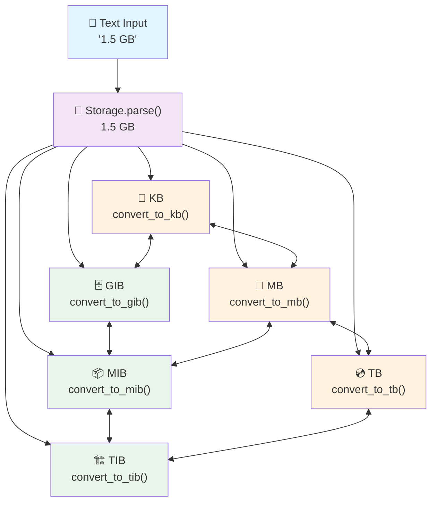

<div align="center">

# filesizelib

[](https://python.org)
[](https://opensource.org/licenses/MIT)
[](https://mypy.readthedocs.io/)

</div>

## Features

- 📦 **Comprehensive Unit Support**: Binary (KiB, MiB, GiB...), decimal (KB, MB, GB...), and bit units
- 🧮 **Smart Arithmetic Support**: Same-unit operations preserve units (1 GB + 2 GB = 3 GB), mixed units convert automatically
- ✨ **Exact Decimal Precision**: Eliminates floating-point errors (6.682 MB stays exactly 6.682 MB, not 6.68200000000000038369 MB)
- 🎯 **Configurable Precision**: Eliminate scientific notation with configurable decimal precision (no more 1.23e-05 GB!)
- 🔤 **Intuitive String Initialization**: Direct string parsing in constructors - `Storage("1.5 GB")` works out of the box
- ⚡ **Property-Based Conversions**: Access any unit as a property - `storage.MB`, `storage.GiB`, `storage.TB`, etc.
- 🔢 **Smart Type Conversion**: Built-in `int()` and `float()` support for seamless byte operations
- 📝 **Flexible String Parsing**: Case-insensitive parsing with support for various formats and separators
- 🏷️ **Multiple Aliases**: Use `Storage`, `FileSizeLib`, or `FileSize` - all functionally identical
- 🔗 **Cross-Platform File Operations**: Get file and directory sizes using `pathlib` with platform-specific optimizations
- ⚡ **Platform-Specific Optimizations**: Windows, Linux, and macOS-specific implementations for better performance
- 🔒 **Type Safety**: Complete type annotations for better IDE support and code safety
- 🎯 **Zero Dependencies**: Uses only Python standard library

## Installation

```bash
pip install filesizelib
```

## Quick Start

```python
from filesizelib import Storage, StorageUnit, FileSize

# 🆕 NEW: Direct string initialization - no need for .parse()!
size = Storage("1.5 GB")                    # Direct string parsing
filesize = FileSize("2.5 TB")               # FileSize alias works identically

# 🆕 NEW: Property-based conversions - access any unit as a property
print(size.GIB)                             # 1.396 GIB  
print(size.MB)                              # 1500.0 MB
print(size.TB)                              # 0.0015 TB

# 🆕 NEW: Smart type conversion - int() and float() return bytes
print(int(size))                            # 1500000000 (bytes as integer)
print(float(size))                          # 1500000000.0 (bytes as float)

# Traditional methods still work perfectly
size_classic = Storage.parse("1.5 GB")      # Classic parsing method
converted = size_classic.convert_to_gib()   # Classic conversion method

# Smart arithmetic and file operations
file_size = Storage.get_size_from_path(".")  # Get directory size
total = size + file_size                     # Add sizes
print(f"Total: {total.auto_scale()}")       # Auto-scale for readability
```

## ✨ Exact Decimal Precision

filesizelib eliminates floating-point precision errors using Python's Decimal module:

```python
from filesizelib import Storage

# ❌ Before: Floating-point precision errors
# Other libraries might show: 6.68200000000000038369 MB

# ✅ After: Exact decimal precision
precise = Storage("6.682 MB")
print(precise)                          # 6.682 MB (exact!)
print(precise.decimal_value)            # Decimal('6.682')
print(precise.value)                    # 6.682 (float for compatibility)

# Perfect arithmetic precision
a = Storage("1.1 GB")
b = Storage("2.2 GB") 
result = a + b
print(result)                           # 3.3 GB (exactly!)
print(result.decimal_value)             # Decimal('3.3')

# For applications requiring exact precision
exact_bytes = precise.convert_to_bytes()  # Returns Decimal
float_bytes = float(exact_bytes)          # Convert to float if needed
```

## Unit Conversion Flow



## Supported Units

### Binary Units (Base 1024)
- `BYTES` (1 byte)
- `KIB` (1,024 bytes)
- `MIB` (1,048,576 bytes)
- `GIB`, `TIB`, `PIB`, `EIB`, `ZIB`, `YIB`

### Decimal Units (Base 1000)
- `KB` (1,000 bytes)
- `MB` (1,000,000 bytes)
- `GB` (1,000,000,000 bytes)
- `TB`, `PB`, `EB`, `ZB`, `YB`

### Bit Units
- `BITS` (1/8 byte)
- `KILOBITS`, `MEGABITS`, `GIGABITS`, `TERABITS`, `PETABITS`, `EXABITS`, `ZETTABITS`, `YOTTABITS`

## Advanced Usage

### New Features Overview

```python
from filesizelib import Storage, StorageUnit, FileSizeLib, FileSize

# 🆕 Multiple aliases - all functionally identical
storage = Storage("1.5 GB")
filesizelib = FileSizeLib("1.5 GB")  
filesize = FileSize("1.5 GB")
print(storage == filesizelib == filesize)  # True

# 🆕 Direct string initialization (no .parse() needed)
size1 = Storage("2.5 TB")                  # Direct string parsing
size2 = Storage("1024")                    # No unit = bytes by default
size3 = Storage("512 MiB")                 # Binary units supported

# 🆕 Property-based conversions - instant access to any unit
data = Storage("1 GiB")
print(data.MB)        # 1073.741824 MB (as Storage object)
print(data.GB)        # 1.073741824 GB (as Storage object)
print(data.BYTES)     # 1073741824 BYTES (as Storage object)
print(data.BITS)      # 8589934592 BITS (as Storage object)

# 🆕 Smart type conversion - crucial differences explained
print(f"data.value = {data.value}")           # 1.0 (original value in original unit)
print(f"int(data) = {int(data)}")             # 1073741824 (bytes as integer)
print(f"float(data) = {float(data)}")         # 1073741824.0 (bytes as float)

# Key differences: .value vs .decimal_value vs int()/float()
gb_size = Storage("1.5 GB")
print(f"gb_size.value = {gb_size.value}")     # 1.5 (original GB value as float)
print(f"gb_size.decimal_value = {gb_size.decimal_value}")  # Decimal('1.5') (exact)
print(f"int(gb_size) = {int(gb_size)}")       # 1500000000 (converted to bytes)
print(f"float(gb_size) = {float(gb_size)}")   # 1500000000.0 (converted to bytes)
```

### 🔍 Important: Understanding .value vs .decimal_value vs int() vs float()

This is crucial for proper usage - these four approaches return different values with different precision characteristics:

```python
# Example with a 1.5 GB file
file_size = Storage("1.5 GB")

# 1. .value - Returns the original numeric value as float (backward compatibility)
print(f"file_size.value = {file_size.value}")        # 1.5 (float - GB value)
print(f"type: {type(file_size.value)}")              # <class 'float'>
print(f"file_size.unit = {file_size.unit}")          # StorageUnit.GB

# 2. .decimal_value - Returns exact decimal precision (NEW!)
print(f"file_size.decimal_value = {file_size.decimal_value}")  # Decimal('1.5')
print(f"type: {type(file_size.decimal_value)}")      # <class 'decimal.Decimal'>

# 3. int() - Returns total bytes as integer (for exact byte operations)
print(f"int(file_size) = {int(file_size)}")          # 1500000000 (bytes)
print(f"type: {type(int(file_size))}")                # <class 'int'>

# 4. float() - Returns total bytes as float (for calculations)
print(f"float(file_size) = {float(file_size)}")      # 1500000000.0 (bytes)
print(f"type: {type(float(file_size))}")              # <class 'float'>

# Precision comparison example
precise_size = Storage("6.682 MB")
print(f"String: {precise_size}")                     # 6.682 MB (exact display)
print(f"Value (float): {precise_size.value}")        # 6.682 (may have tiny precision loss)
print(f"Decimal: {precise_size.decimal_value}")      # Decimal('6.682') (exact!)

# Real-world usage examples:
# Use .value for backward compatibility and general float operations
display_text = f"{file_size.value} {file_size.unit.name}"  # "1.5 GB"

# Use .decimal_value for financial calculations, exact measurements
from decimal import Decimal
cost_per_gb = Decimal("0.023")  # $0.023 per GB
monthly_cost = file_size.decimal_value * cost_per_gb  # Exact calculation

# Use int() for byte-level operations, file I/O, or exact comparisons
bytes_needed = int(file_size)                         # Get exact byte count
if bytes_needed > 1000000000:                         # Compare with byte threshold
    print("Large file detected")

# Use float() for mathematical calculations involving bytes (when precision loss is acceptable)
average_byte_size = float(file_size) / 1000           # Calculate per-unit metrics
compression_ratio = float(file_size) / float(compressed_size)

# Property conversions return Storage objects (not raw numbers)
mb_version = file_size.MB                             # Returns Storage(1500, MB)
print(f"As MB object: {mb_version}")                  # "1500 MB"
print(f"MB as bytes: {int(mb_version)}")              # Still 1500000000 bytes
```

#### Quick Reference Table

| Method | Returns | Unit | Use Case | Example Output |
|--------|---------|------|----------|----------------|
| `.value` | `float` | Original | Backward compatibility, general use | `1.5` |
| `.decimal_value` | `Decimal` | Original | Exact precision, financial calculations | `Decimal('1.5')` |
| `int()` | `int` | Bytes | Byte operations, file I/O | `1500000000` |
| `float()` | `float` | Bytes | Byte calculations (precision loss OK) | `1500000000.0` |

### Comprehensive Examples

```python
# Create storage values (traditional approach still works)
storage1 = Storage(1, StorageUnit.KIB)
storage2 = Storage(512, StorageUnit.BYTES)

# Smart arithmetic - same units preserve unit, mixed units convert to bytes
same_unit_total = Storage(1, StorageUnit.GB) + Storage(2, StorageUnit.GB)  # 3 GB (preserved!)
mixed_unit_total = storage1 + storage2  # 1536 BYTES (converted)
doubled = storage1 * 2  # 2 KIB

# Comparisons
print(storage1 > storage2)  # True
print(storage1 == Storage(1024, StorageUnit.BYTES))  # True

# Unit conversion
print(storage1.convert_to_bytes())  # 1024.0
print(storage2.convert_to(StorageUnit.KIB))  # 0.5 KIB

# String parsing (flexible formats)
size1 = Storage.parse("1.5 MB")      # 1.5 MB
size2 = Storage.parse("1,024 KiB")   # 1024.0 KIB (comma as decimal separator)
size3 = Storage.parse("500GB")       # 500.0 GB (no space)
size4 = Storage.parse("2.5 tb")      # 2.5 TB (case insensitive)
size5 = Storage.parse("1024")        # 1024.0 BYTES (defaults to bytes)

# Auto-scaling for human-readable output
large_size = Storage(1536000000, StorageUnit.BYTES)
print(large_size.auto_scale())  # 1.43 GIB (binary) or 1.536 GB (decimal)

# Decimal precision control (eliminates scientific notation)
Storage.set_decimal_precision(5)  # Configure precision globally
small_value = Storage(9.872019291e-05, StorageUnit.GIB)
print(f"Precise: {small_value}")  # 0.0001 GIB (no scientific notation!)

# File operations
file_size = Storage.get_size_from_path("/path/to/file.txt")
dir_size = Storage.get_size_from_path("/path/to/directory")
print(f"Directory size: {dir_size.auto_scale()}")
```

### Platform-Specific Optimizations

```python
from filesizelib import Storage

# Automatically detect and use platform-specific optimizations
platform_storage = Storage.get_platform_storage()
size = platform_storage.get_size_from_path("/large/directory")

# Platform info
info = platform_storage.get_platform_info()
print(f"Platform: {info['platform']}")
print(f"Optimizations: {info.get('api_optimization', 'none')}")
```

### String Parsing Features

The `parse()` method supports various input formats:

```python
from filesizelib import Storage, StorageUnit

# Case insensitive
Storage.parse("1.5 mb")      # Works
Storage.parse("1.5 MB")      # Works
Storage.parse("1.5 Mb")      # Works

# Decimal separators
Storage.parse("1.5 MB")      # Dot separator
Storage.parse("1,5 MB")      # Comma separator

# Spacing
Storage.parse("1.5 MB")      # With space
Storage.parse("1.5MB")       # Without space

# Default unit
Storage.parse("1024")        # Defaults to bytes
Storage.parse("1024", StorageUnit.KIB)  # Custom default

# Comprehensive unit aliases
Storage.parse("1 kilobyte")  # Full name
Storage.parse("1 kb")        # Abbreviation
Storage.parse("1 k")         # Single letter
```

### Error Handling

```python
from filesizelib import Storage, StorageUnit

# Invalid values raise appropriate exceptions
try:
    Storage(-1, StorageUnit.BYTES)  # Raises ValueError
except ValueError as e:
    print(f"Error: {e}")

try:
    Storage.parse("invalid")  # Raises ValueError
except ValueError as e:
    print(f"Parsing error: {e}")

try:
    storage = Storage(1, StorageUnit.KIB)
    result = storage / 0  # Raises ZeroDivisionError
except ZeroDivisionError as e:
    print(f"Division error: {e}")
```

## Real-World Examples

### Download Time Calculator

All aliases (Storage, FileSizeLib, FileSize) work identically - choose your preference!

```python
from filesizelib import FileSizeLib, FileSize, Storage

# 🆕 Multiple initialization approaches - all equivalent
movie = FileSizeLib("1.4 GB")              # String initialization
song = FileSize("4.5 MB")                  # FileSize alias
document = Storage(250, StorageUnit.KB)     # Traditional approach

# 🆕 Network speeds using property conversions
broadband_mbps = Storage("50 Megabits")     # 50 Mbps
fiber_gbps = FileSize("1 Gigabit")          # 1 Gbps

# Calculate download times using int() for precise byte calculations
movie_bytes = int(movie)                    # Get exact byte count
broadband_bytes_per_sec = int(broadband_mbps) # Bytes per second

movie_time_broadband = movie_bytes / broadband_bytes_per_sec
movie_time_fiber = int(movie) / int(fiber_gbps)

print(f"Movie download ({movie}):")
print(f"  Broadband: {movie_time_broadband:.1f} seconds")
print(f"  Fiber: {movie_time_fiber:.1f} seconds")

# 🆕 Use properties for quick unit access
print(f"Movie size in different units:")
print(f"  MB: {movie.MB}")
print(f"  MiB: {movie.MIB}") 
print(f"  Bytes: {int(movie):,}")
```

### Storage Capacity Planning

```python
from filesizelib import FileSize, Storage

# 🆕 Mix different initialization styles as needed
photos = FileSize("2.8 MiB") * 2000              # 2000 photos (string init)
music = Storage("4.5 MB") * 500                  # 500 songs (string init)
videos = Storage(1.2, StorageUnit.GB) * 50       # 50 videos (traditional)
documents = FileSize("250 KB") * 1000            # 1000 documents (string init)

total_needed = photos + music + videos + documents
print(f"Total storage needed: {total_needed.auto_scale()}")

# 🆕 Available storage with property access
available = Storage("500 GB")
remaining = available - total_needed

print(f"Available: {available}")
print(f"Remaining: {remaining.auto_scale()}")

# 🆕 Detailed breakdown using properties and int() conversion
print(f"\nDetailed breakdown:")
print(f"  Photos: {photos.auto_scale()} ({int(photos):,} bytes)")
print(f"  Music: {music.auto_scale()} ({int(music):,} bytes)")
print(f"  Videos: {videos.auto_scale()} ({int(videos):,} bytes)")
print(f"  Documents: {documents.auto_scale()} ({int(documents):,} bytes)")

# 🆕 Usage percentage using float() for precise calculation
usage_percent = (float(total_needed) / float(available)) * 100
print(f"\nStorage usage: {usage_percent:.1f}%")

# 🆕 Unit conversions using properties
print(f"\nTotal needed in different units:")
print(f"  GB: {total_needed.GB}")
print(f"  GiB: {total_needed.GIB}")
print(f"  TB: {total_needed.TB}")
```

## Development

### Running Tests

```bash
# Run basic functionality tests
python test_basic_functionality.py
```

### Building and Installation

please install uv first

```bash
# Install development dependencies
uv sync
```

## License

This project is licensed under the MIT License - see the [LICENSE](LICENSE) file for details.