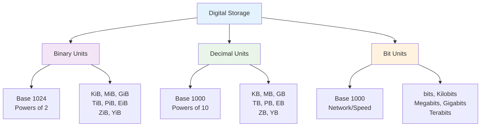
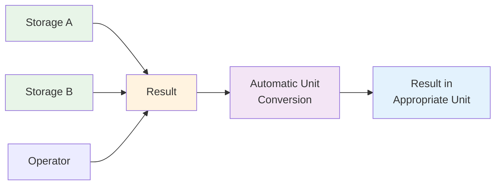
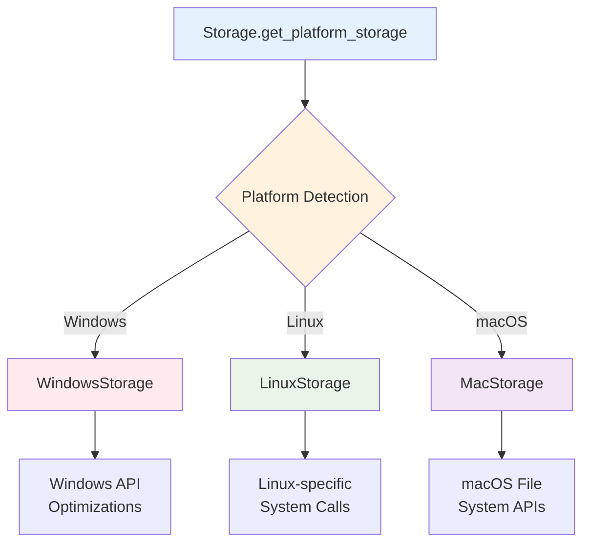

# Basic Concepts

Understanding the core concepts behind FileSizeLib will help you use the library more effectively. This guide covers both fundamental concepts and the latest feature enhancements.

## 🧠 Storage Units Overview

Storage units represent different ways to measure digital information. FileSizeLib supports three main categories:



## 📊 Binary vs Decimal Units

One of the most important concepts to understand is the difference between binary and decimal units:

### Binary Units (Base 1024)

Binary units use powers of 2 and are denoted with "i" (binary):

| Unit | Full Name | Value | Bytes |
|------|-----------|-------|-------|
| B | Byte | 1 | 1 |
| KiB | Kibibyte | 1024¹ | 1,024 |
| MiB | Mebibyte | 1024² | 1,048,576 |
| GiB | Gibibyte | 1024³ | 1,073,741,824 |
| TiB | Tebibyte | 1024⁴ | 1,099,511,627,776 |

### Decimal Units (Base 1000)

Decimal units use powers of 10 and are more commonly used by manufacturers:

| Unit | Full Name | Value | Bytes |
|------|-----------|-------|-------|
| B | Byte | 1 | 1 |
| KB | Kilobyte | 1000¹ | 1,000 |
| MB | Megabyte | 1000² | 1,000,000 |
| GB | Gigabyte | 1000³ | 1,000,000,000 |
| TB | Terabyte | 1000⁴ | 1,000,000,000,000 |

### Why the Difference Matters

```python
from filesizelib import Storage, StorageUnit, FileSizeLib

# A "1 GB" hard drive actually has different capacities:
decimal_gb = Storage(1, StorageUnit.GB)  # 1,000,000,000 bytes
binary_gib = FileSizeLib(1, StorageUnit.GIB) # 1,073,741,824 bytes (using alias)

print(f"1 GB = {decimal_gb.convert_to_bytes():,.0f} bytes")
print(f"1 GiB = {binary_gib.convert_to_bytes():,.0f} bytes")
print(f"Difference: {(binary_gib - decimal_gb).convert_to_bytes():,.0f} bytes")

# Output:
# 1 GB = 1,000,000,000 bytes
# 1 GiB = 1,073,741,824 bytes  
# Difference: 73,741,824 bytes
```

!!! info "Real-World Impact"
    This is why a "500 GB" hard drive might show as only ~465 GiB in your operating system!

## 💾 The Storage Class (and FileSizeLib Alias)

The `Storage` class is the heart of FileSizeLib. It represents a storage value with these key properties.
For convenience, you can also use `FileSizeLib` as an identical alias to `Storage`.

### Core Components

```python
from filesizelib import Storage, StorageUnit, FileSizeLib

storage = Storage(1.5, StorageUnit.GB)
# Or equivalently:
storage_alias = FileSizeLib(1.5, StorageUnit.GB)  # FileSizeLib is identical to Storage

# Core properties (same for both Storage and FileSizeLib)
print(f"Value: {storage.value}")  # 1.5
print(f"Unit: {storage.unit}")    # StorageUnit.GB
print(f"Bytes: {storage.convert_to_bytes()}")  # 1500000000.0
```

### Immutability

Storage objects are **immutable** - operations return new objects:

```python
original = Storage(1, StorageUnit.GB)
doubled = original * 2

print(f"Original: {original}")  # 1.0 GB (unchanged)
print(f"Doubled: {doubled}")    # 2.0 GB (new object)
```

### Type Safety

Bytesize provides complete type annotations for better IDE support:

```python
from filesizelib import Storage, StorageUnit, FileSizeLib
from typing import Union

def calculate_bandwidth(file_size: Storage, time_seconds: float) -> Storage:
    """Calculate bandwidth given file size and time."""
    bytes_per_second = file_size.convert_to_bytes() / time_seconds
    return FileSizeLib.parse_from_bytes(bytes_per_second)  # Can use either Storage or FileSizeLib}
```

## 🔄 Conversion Philosophy

FileSizeLib provides two approaches to unit conversion:

### 1. Explicit Conversion

```python
storage = Storage(1, StorageUnit.GB)

# Traditional method - explicit and clear
mb_storage = storage.convert_to(StorageUnit.MB)
print(f"Explicit: {mb_storage}")  # 1000.0 MB
```

### 2. Convenient Methods

```python
# Convenient methods - shorter and more readable
mb_storage = storage.convert_to_mb()
print(f"Convenient: {mb_storage}")  # 1000.0 MB

# Both produce identical results
assert storage.convert_to(StorageUnit.MB) == storage.convert_to_mb()
```

### Auto-Scaling

FileSizeLib can automatically choose the best unit for display:

```python
large_file = Storage(1536000000, StorageUnit.BYTES)

# Auto-scale chooses the most readable unit
print(f"Auto-scaled: {large_file.auto_scale()}")  # 1.43 GIB

# You can prefer binary or decimal
binary = large_file.auto_scale(prefer_binary=True)   # 1.43 GIB
decimal = large_file.auto_scale(prefer_binary=False) # 1.536 GB
```

## 🧮 Smart Arithmetic Operations

FileSizeLib supports natural arithmetic operations with intelligent unit handling. When both operands have the same unit, the result preserves that unit for better readability:

### Basic Operations



### Smart Unit Handling Rules

1. **Same-Unit Addition/Subtraction**: When both operands have the same unit, result preserves that unit
2. **Mixed-Unit Addition/Subtraction**: Different units automatically convert to bytes  
3. **Multiplication**: Result keeps the storage unit (factor is dimensionless)
4. **Division**: Can return Storage (when dividing by a number) or float (when dividing by Storage)

```python
from filesizelib import Storage, StorageUnit, FileSizeLib

# Same-unit operations preserve unit
same_unit_1 = Storage(1, StorageUnit.GB)
same_unit_2 = Storage(2, StorageUnit.GB)  
total_same = same_unit_1 + same_unit_2
print(f"Same units: {total_same}")  # 3 GB (unit preserved!)

# Mixed-unit operations convert to bytes
file1 = Storage(1.5, StorageUnit.GB)
file2 = Storage(512, StorageUnit.MB)
total_mixed = file1 + file2
print(f"Mixed units: {total_mixed}")  # 2012000000.0 BYTES

# Use auto_scale for readability
print(f"Readable: {total_mixed.auto_scale()}")  # 1.87 GIB

# Division - different result types
per_chunk = file1 / 3      # Storage object
ratio = file1 / file2      # float ratio

print(f"Per chunk: {per_chunk}")  # 0.5 GB
print(f"Ratio: {ratio:.2f}")       # 2.93
```

## 📁 File System Integration

FileSizeLib integrates seamlessly with Python's file system operations:

### Path Handling

```python
from pathlib import Path
from filesizelib import Storage, FileSizeLib

# Works with strings and Path objects (use Storage or FileSizeLib)
file_size = Storage.get_size_from_path("README.md")
dir_size = FileSizeLib.get_size_from_path(Path("./docs"))  # Same functionality

print(f"File: {file_size.auto_scale()}")
print(f"Directory: {dir_size.auto_scale()}")
```

### Platform Optimizations

FileSizeLib provides platform-specific optimizations:



## 🔤 String Parsing Flexibility

FileSizeLib's string parser is designed to handle real-world input:

### Supported Formats

```python
# All of these work (Storage and FileSizeLib identical):
sizes = [
    Storage.parse("1.5 GB"),      # Standard format
    FileSizeLib.parse("1.5GB"),      # No space (using alias)
    Storage.parse("1,5 GB"),      # European decimal
    FileSizeLib.parse("1.5 gb"),     # Lowercase (using alias)
    Storage.parse("1.5 gigabytes"), # Full name
    FileSizeLib.parse("1.5 g"),      # Single letter (using alias)
    Storage.parse("1536"),        # Just number (bytes)
]

### Parser Rules

1. **Case insensitive**: `GB`, `gb`, `Gb` all work
2. **Flexible spacing**: Space optional between number and unit
3. **Multiple separators**: Both `.` and `,` accepted as decimal separators
4. **Unit aliases**: Full names, abbreviations, and single letters
5. **Default unit**: Numbers without units default to bytes

## 🎯 Design Philosophy

FileSizeLib follows these core principles:

### Pythonic

```python
# Natural, readable operations
total_size = file1 + file2 + file3
average_size = total_size / 3
is_large = file_size > Storage.parse("1 GB")
```

### Explicit is Better than Implicit

```python
# Clear about what units you're working with
bandwidth = Storage(100, StorageUnit.MEGABITS)  # Network speed
file_size = Storage(100, StorageUnit.MB)        # File size

# Explicit conversions
print(f"Bandwidth: {bandwidth.convert_to_megabits()}")
print(f"File size: {file_size.convert_to_mb()}")
```

### Zero Dependencies

FileSizeLib uses only Python's standard library, making it:
- Lightweight and fast to install
- More secure (fewer attack vectors)
- Highly compatible across Python versions
- Easy to audit and maintain

## 🚀 Performance Considerations

### Efficient Operations

```python
# These operations are optimized:
large_list = [FileSizeLib.parse(f"{i} MB") for i in range(1000)]  # Using alias
total = sum(large_list, Storage(0, StorageUnit.BYTES))  # Efficient sum

# Same-unit operations are extra efficient (no conversion needed)
same_unit_list = [Storage(i, StorageUnit.GB) for i in range(100)]
same_unit_total = sum(same_unit_list, Storage(0, StorageUnit.GB))  # Preserves GB

# Chaining is also optimized:
result = (Storage.parse("1 TB")
          .convert_to_gib()
          .convert_to_mb()
          .auto_scale())
```

### Platform Optimizations

Each platform-specific storage class provides optimized file operations:

- **Windows**: Uses Windows API for faster directory traversal
- **Linux**: Leverages Linux-specific system calls
- **macOS**: Uses native macOS file system APIs

## 🎨 Decimal Precision Control

FileSizeLib eliminates scientific notation and provides configurable decimal precision:

```python
from filesizelib import Storage, StorageUnit

# Default precision (20 decimal places) - no scientific notation
small_value = Storage(9.872019291e-05, StorageUnit.GIB)
print(f"Default: {small_value}")  # 0.00009872019291 GIB (no scientific notation!)

# Configure precision
Storage.set_decimal_precision(5)
print(f"5 decimals: {small_value}")  # 0.0001 GIB

# Get current precision
print(f"Current: {Storage.get_decimal_precision()}")  # 5

# Reset to default
Storage.set_decimal_precision(20)
```

## 🆕 New Features Guide

FileSizeLib has been enhanced with powerful new features that make it even more intuitive and flexible.

### Multiple Aliases

Choose the class name that feels most natural to you - they're all functionally identical:

```python
from filesizelib import Storage, FileSizeLib, FileSize

# All of these are exactly the same
storage = Storage("1.5 GB")
filesizelib = FileSizeLib("1.5 GB")  
filesize = FileSize("1.5 GB")          # 🆕 NEW

print(storage == filesizelib == filesize)  # True
```

### Direct String Initialization

**Major improvement**: No more `.parse()` calls needed!

```python
# 🆕 NEW: Direct string initialization (recommended)
size1 = Storage("1.5 GB")              # Clean and simple
size2 = FileSize("2048")                # No unit = bytes
size3 = Storage("1,5 GB")               # European decimal separator

# 🔄 Traditional approach still works
size4 = Storage.parse("1.5 GB")        # Old way
size5 = Storage(1.5, StorageUnit.GB)   # Numeric way

# All approaches are equivalent
assert Storage("1 GB") == Storage.parse("1 GB") == Storage(1, StorageUnit.GB)
```

### Property-Based Conversions

**Game changer**: Access any unit as a simple property!

```python
file_size = Storage("1.5 GB")

# 🆕 Property access - incredibly convenient
print(file_size.MB)          # 1500.0 MB
print(file_size.GIB)         # 1.396 GIB
print(file_size.BITS)        # 12000000000.0 BITS
print(file_size.BYTES)       # 1500000000 BYTES

# 🆕 Property chaining works too!
result = Storage("1 TiB").GIB.MIB
print(result)                 # 1048576.0 MIB

# 🔄 Traditional methods still available
print(file_size.convert_to_mb())  # Same as file_size.MB
```

### Smart Type Conversion

**Critical feature**: Built-in `int()` and `float()` support for byte operations.

```python
storage = Storage("1.5 GB")

# 🆕 Magic methods return bytes
bytes_as_int = int(storage)     # 1500000000 (integer bytes)
bytes_as_float = float(storage) # 1500000000.0 (float bytes)

# Original value and unit unchanged
print(storage.value)            # 1.5 (original value)
print(storage.unit)             # StorageUnit.GB (original unit)
```

### 🔍 Critical Concept: .value vs int() vs float()

**This is the most important concept to understand** - these three approaches return completely different values:

```python
file_size = Storage("1.5 GB")

# 1. .value - Returns the ORIGINAL numeric value in the ORIGINAL unit
original_value = file_size.value        # 1.5 (the GB value)
original_unit = file_size.unit          # StorageUnit.GB
print(f"Original: {original_value} {original_unit.name}")  # "1.5 GB"

# 2. int() - Returns TOTAL BYTES as integer (for exact operations)
total_bytes_int = int(file_size)        # 1500000000 (bytes as int)
print(f"Bytes (int): {total_bytes_int}")

# 3. float() - Returns TOTAL BYTES as float (for calculations)
total_bytes_float = float(file_size)    # 1500000000.0 (bytes as float)
print(f"Bytes (float): {total_bytes_float}")

# Real-world usage examples:

# Use .value for display purposes
display_text = f"{file_size.value} {file_size.unit.name}"  # "1.5 GB"

# Use int() for exact byte operations, file I/O, comparisons
if int(file_size) > 1000000000:  # Compare exact bytes
    print("Large file detected")

# Use float() for mathematical calculations
compression_ratio = float(original_file) / float(compressed_file)
average_size = float(total_size) / file_count

# Properties return Storage objects (not raw numbers!)
mb_storage = file_size.MB               # Returns Storage(1500.0, MB)
mb_bytes = int(file_size.MB)            # Still 1500000000 bytes!
mb_display = file_size.MB.value         # 1500.0 (MB value only)
```

### Common Patterns with New Features

```python
# Pattern 1: Quick byte operations
file_sizes = [Storage("1.5 GB"), FileSize("2.5 GB"), Storage("500 MB")]
total_bytes = sum(int(size) for size in file_sizes)  # Exact byte sum
print(f"Total: {total_bytes:,} bytes")

# Pattern 2: Unit-specific calculations  
gb_sizes = [Storage("1.5 GB"), Storage("2.0 GB"), Storage("0.5 GB")]
total_gb = sum(size.value for size in gb_sizes)      # Sum GB values only
print(f"Total: {total_gb} GB")

# Pattern 3: Mixed unit operations with properties
large_file = Storage("1.5 TB")
print(f"Size breakdown:")
print(f"  TB: {large_file.TB}")
print(f"  TiB: {large_file.TIB}")  
print(f"  GB: {large_file.GB}")
print(f"  Bytes: {int(large_file):,}")

# Pattern 4: Chaining with type conversion
result = int(FileSize("1 GiB").MB)      # 1073741824 bytes
ratio = float(Storage("2 GB")) / float(Storage("1 GB"))  # 2.0
```

### Migration Guide

If you're upgrading from an older version:

```python
# ✅ All existing code continues to work unchanged
old_style = Storage(1.5, StorageUnit.GB)
parsed = Storage.parse("1.5 GB")
converted = old_style.convert_to_mb()

# 🆕 But you can now use simpler approaches
new_style = Storage("1.5 GB")           # Direct initialization
quick_convert = new_style.MB            # Property conversion
exact_bytes = int(new_style)            # Magic method
```

## 📚 Next Steps

Now that you understand the core concepts:

<div class="grid cards" markdown>

-   [:material-book: **User Guide**](../user-guide/index.md)
    
    Explore all features in detail

-   [:material-lightbulb: **Examples**](../examples/index.md)
    
    See practical applications and patterns

-   [:material-api: **API Reference**](../api/index.md)
    
    Complete method and class documentation

-   [:material-school: **Best Practices**](../user-guide/best-practices.md)
    
    Performance tips and recommended patterns

</div>