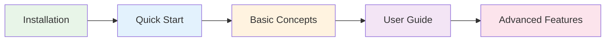

# Getting Started

Welcome to Bytesize! This section will help you quickly get up to speed with this powerful storage unit library.

## 🎯 Learning Path

Follow this sequence to master Bytesize core features in 30 minutes:



## 📋 Prerequisites

- Python 3.9 or higher
- Basic Python programming knowledge
- Understanding of storage unit concepts (KB, MB, GB, etc.)

## 🚀 Quick Start Steps

### 1. Install Bytesize
Choose your preferred installation method:

=== "pip"
    ```bash
    pip install bytesize
    ```

=== "uv"
    ```bash
    uv add bytesize
    ```

=== "poetry"
    ```bash
    poetry add bytesize
    ```

### 2. Verify Installation
```python
from bytesize import Storage, StorageUnit
print("Bytesize installed successfully!")
```

### 3. First Example
```python
# Create a 1GB storage object
storage = Storage(1, StorageUnit.GB)
print(f"Storage size: {storage}")  # Output: Storage size: 1.0 GB

# Convert to other units
print(f"Convert to MB: {storage.convert_to_mb()}")  # Output: Convert to MB: 1000.0 MB
```

## 📖 What's Next?

<div class="grid cards" markdown>

-   [:material-flash: **Quick Start**](quick-start.md)
    
    5-minute tutorial to quickly learn core features

-   [:material-school: **Basic Concepts**](concepts.md)
    
    Understand storage units and Bytesize design philosophy

-   [:material-book: **User Guide**](../user-guide/index.md)
    
    Deep dive into all features and functionality

-   [:material-code-json: **Examples**](../examples/index.md)
    
    Real-world scenarios and best practices

</div>

## 💡 Tips

!!! tip "Learning Recommendations"
    - Start with [Quick Start](quick-start.md) to quickly experience Bytesize's main features
    - If you're new to storage unit concepts, read [Basic Concepts](concepts.md) first
    - When facing issues, check the [Examples](../examples/index.md) for similar use cases

!!! note "Version Compatibility"
    Bytesize supports Python 3.9+. We recommend using the latest stable version for optimal performance.

## 🤝 Need Help?

If you encounter problems during usage:

- Check the [Best Practices](../user-guide/best-practices.md)
- Browse [Examples](../examples/index.md)
- Submit a [GitHub Issue](https://github.com/your-username/bytesize/issues)