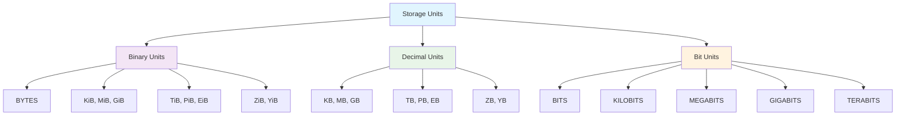
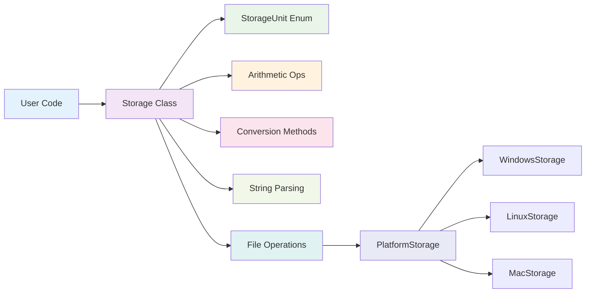

<center><h1>📏 FileSizeLib</h1>

A unified storage unit library for Python with cross-platform file size support
</center>

## 🚀 What is FileSizeLib?

FileSizeLib is a powerful and intuitive Python storage unit library that makes it easy to handle calculations, conversions, and operations with various storage sizes. Whether you're working with file sizes, network bandwidth, or storage capacity, FileSizeLib makes these tasks simple and elegant.

## ✨ Core Features

<div class="grid cards" markdown>

-   :material-scale-balance:{ .lg .middle } **🧮 Smart Arithmetic with Unit Preservation**

    ---

    Same-unit operations preserve units (1 GB + 2 GB = 3 GB), different units convert automatically

    [:octicons-arrow-right-24: View arithmetic operations](api/storage.md#arithmetic-operations)

-   :material-format-text:{ .lg .middle } **📝 Flexible String Parsing**

    ---

    Parse multiple string formats with case-insensitive support and various separators

    [:octicons-arrow-right-24: Learn string parsing](api/storage.md#class-methods)

-   :material-harddisk:{ .lg .middle } **🔗 Cross-Platform File Operations**

    ---

    Get file and directory sizes using pathlib with platform-specific optimizations

    [:octicons-arrow-right-24: File operations guide](api/storage.md#file-operations)

-   :material-lightning-bolt:{ .lg .middle } **⚡ Platform Optimizations**

    ---

    Platform-specific performance optimizations for Windows, Linux, and macOS

    [:octicons-arrow-right-24: Platform support details](api/platform-storage.md)

-   :material-shield-check:{ .lg .middle } **🔒 Type Safety**

    ---

    Complete type annotations for better IDE support and code safety

    [:octicons-arrow-right-24: API Reference](api/index.md)

-   :material-package-variant:{ .lg .middle } **🎯 Zero Dependencies**

    ---

    Uses only Python standard library, no external dependencies required

    [:octicons-arrow-right-24: Quick Start](getting-started/quick-start.md)

</div>

## 🎯 Quick Example

```python
from filesizelib import Storage, StorageUnit, FileSizeLib

# Create storage values (Storage and FileSizeLib are identical)
file_size = Storage(1.5, StorageUnit.GB)
backup_size = FileSizeLib.parse("2.5 GB")  # FileSizeLib alias

# Smart arithmetic - same units preserve unit!
same_unit_total = file_size + backup_size
print(f"Same unit: {same_unit_total}")  # Output: 4.0 GB

# Configure decimal precision (eliminates scientific notation)
Storage.set_decimal_precision(5)
small_value = Storage(1.23456789e-5, StorageUnit.TB)
print(f"Precise: {small_value}")  # Output: 0.00001 TB (no scientific notation!)

# Convenient conversion methods
print(f"File size (MB): {file_size.convert_to_mb()}")  # 1500.0 MB
print(f"Backup size (GiB): {backup_size.convert_to_gib()}")  # 2.33 GiB

# File operations
dir_size = Storage.get_size_from_path("/path/to/directory")
print(f"Directory size: {dir_size.auto_scale()}")

# Reset precision to default
Storage.set_decimal_precision(20)
```

## 🛠️ Supported Unit Types



## 🌟 Why Choose FileSizeLib?

### Simple to Use
FileSizeLib's API is designed to be intuitive and follows Python best practices. You can accomplish complex storage unit operations with minimal code.

### Performance Optimized
Built-in platform-specific optimizations ensure optimal performance across different operating systems.

### Type Safe
Complete type annotation support makes your code more reliable and provides better IDE support.

### Zero Dependencies
No third-party dependencies reduce project complexity and potential security risks.

## 🔄 Architecture Overview



## 📚 Next Steps

<div class="grid cards" markdown>

-   [:material-rocket-launch: **Quick Start**](getting-started/quick-start.md)
    
    Learn FileSizeLib basics in 5 minutes

-   [:material-book-open-page-variant: **User Guide**](user-guide/index.md)
    
    Deep dive into all features and best practices

-   [:material-code-tags: **API Reference**](api/index.md)
    
    Complete API documentation and method reference

-   [:material-lightbulb-on: **Examples**](examples/index.md)
    
    Real-world scenarios and code examples

</div>

---

**Start your FileSizeLib journey** [Install Now :material-download:](getting-started/installation.md){ .md-button .md-button--primary }