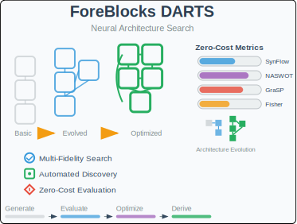
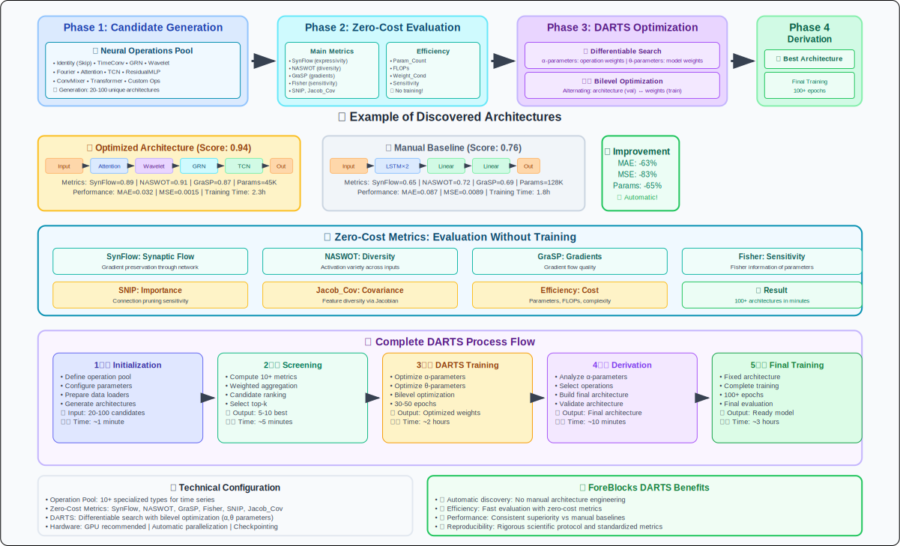

# ForeBlocks DARTS: Neural Architecture Search for Time Series



**ForeBlocks DARTS** is an advanced Neural Architecture Search (NAS) module that automatically discovers optimal neural network architectures for time series forecasting. It combines DARTS (Differentiable Architecture Search) with zero-cost metrics for efficient architecture evaluation using a comprehensive `DARTSTrainer` class.

---

## 🎯 Overview

This module implements a multi-fidelity architecture search strategy through the `DARTSTrainer` class that:
- **Generates** diverse neural architectures automatically
- **Evaluates** architectures using zero-cost metrics (no training required)
- **Optimizes** promising candidates with differentiable search
- **Derives** final high-performance architectures
- **Visualizes** architecture evolution and final structures
- 



### Key Features

| Feature | Description |
|---------|-------------|
| **🚀 Zero-Cost Evaluation** | Screen architectures without training using 10+ metrics |
| **🔍 Multi-Fidelity Search** | Progressive refinement from zero-cost to full training |
| **🧩 Modular Operations** | Attention, Spectral, Convolution, and MLP components |
| **⚡ Efficient Screening** | Evaluate 100+ architectures in minutes |
| **🎯 Automated Discovery** | No manual architecture engineering required |
| **📊 Comprehensive Metrics** | 10+ zero-cost indicators for architecture quality |
| **🎨 Architecture Visualization** | Beautiful diagrams of discovered architectures |
| **📈 Training Progress Tracking** | Comprehensive training history and progress visualization |

---

## 🚀 Quick Start

```python
from foreblocks.darts import DARTSTrainer
import torch

# Initialize the DARTS trainer
trainer = DARTSTrainer(
    input_dim=5,                    # Number of input features
    hidden_dims=[32, 64, 128],      # Hidden layer sizes to explore
    forecast_horizon=24,            # Steps to predict ahead
    seq_length=48,                  # Input sequence length
    device="cuda"                   # Training device
)

# Your data loaders
train_loader = ...  # Your training DataLoader
val_loader = ...    # Your validation DataLoader
test_loader = ...   # Your test DataLoader

# Run multi-fidelity architecture search
results = trainer.multi_fidelity_search(
    train_loader=train_loader,
    val_loader=val_loader,
    test_loader=test_loader,
    num_candidates=20,              # Architectures to evaluate
    search_epochs=30,               # DARTS training epochs
    final_epochs=100,               # Final model training epochs
    top_k=5                         # Top candidates to train with DARTS
)

# Get the best discovered architecture
best_model = results['final_model']

# Save the best model
trainer.save_best_model("my_best_model.pth")
```

---

## 📖 Architecture Search Process

The `DARTSTrainer` implements a comprehensive 5-phase search process:

### Phase 1: Candidate Generation
The search begins by generating diverse neural architectures from our comprehensive operation library:

```python
# Available operations for time series
operations = [
    "Identity",       # Skip connection
    "TimeConv",       # Temporal convolution
    "GRN",           # Gated Residual Network
    "Wavelet",       # Wavelet transform
    "Fourier",       # Fourier transform
    "Attention",     # Self-attention
    "TCN",           # Temporal Convolutional Network
    "ResidualMLP",   # Residual MLP block
    "ConvMixer",     # ConvMixer block
    "Transformer"    # Full transformer encoder
]
```

### Phase 2: Zero-Cost Evaluation
Each candidate is evaluated using multiple metrics **without training**:

```python
# Evaluate with zero-cost metrics
metrics = trainer.evaluate_zero_cost_metrics(
    model=candidate_model,
    dataloader=val_loader,
    max_samples=32,
    num_batches=2
)
# Returns: synflow, naswot, grasp, fisher, jacob_cov, etc.
```

### Phase 3: Top Candidate Selection
Candidates are ranked by their zero-cost scores and the top-k are selected for DARTS training.

### Phase 4: DARTS Optimization
Top candidates undergo differentiable architecture search:

```python
search_results = trainer.train_darts_model(
    model=candidate_model,
    train_loader=train_loader,
    val_loader=val_loader,
    epochs=30,
    arch_learning_rate=3e-4,
    model_learning_rate=1e-3,
    use_swa=True  # Stochastic Weight Averaging
)
```

### Phase 5: Final Training
The best architecture is derived and trained extensively:

```python
final_results = trainer.train_final_model(
    model=derived_model,
    train_loader=train_loader,
    val_loader=val_loader,
    test_loader=test_loader,
    epochs=100,
    use_onecycle=True,  # OneCycle learning rate scheduler
    swa_start_ratio=0.33  # Start SWA at 33% of training
)
```

---

## 🎨 Visualization Features

### Architecture Visualization
Automatically generate beautiful architecture diagrams:

```python
# Visualize candidate architectures
for i, candidate in enumerate(top_candidates):
    trainer.plot_architecture(
        candidate=candidate,
        save_path=f"candidate_{i+1}_architecture.png"
    )
```

### Training Progress Visualization
Track and visualize training progress:

```python
# Plot training curves
trainer._plot_training_curve(
    train_losses=final_results['train_losses'],
    val_losses=final_results['val_losses'],
    title="Final Model Training Progress",
    save_path='final_model_training.png'
)

# Plot alpha parameter evolution during DARTS search
trainer.plot_alpha_evolution(
    alpha_values=search_results['alpha_values'],
    save_path="alpha_evolution.png"
)
```

---

## 🔧 Zero-Cost Metrics

The module uses 10+ zero-cost metrics to evaluate architecture quality:

### Core Metrics

| Metric | Description | What it Measures |
|--------|-------------|------------------|
| **SynFlow** | Synaptic flow preservation | Network expressivity |
| **NASWOT** | Neural Architecture Search Without Training | Activation diversity |
| **GraSP** | Gradient Signal Preservation | Gradient flow quality |
| **Fisher** | Fisher Information | Parameter sensitivity |
| **SNIP** | Connection sensitivity | Pruning importance |
| **Jacob_Cov** | Jacobian covariance | Feature diversity |
| **Sensitivity** | Input perturbation response | Model robustness |
| **Weight_Cond** | Weight matrix conditioning | Optimization landscape |
| **Param_Count** | Parameter efficiency | Model complexity |
| **FLOPs** | Computational cost | Inference efficiency |

### Metric Configuration

```python
# Configure zero-cost evaluation
trainer = DARTSTrainer(
    input_dim=10,
    hidden_dims=[64, 128],
    forecast_horizon=24,
    seq_length=48
)

# Custom evaluation parameters
metrics = trainer.evaluate_zero_cost_metrics(
    model=model,
    dataloader=val_loader,
    max_samples=64,    # More samples for stable estimates
    num_batches=3      # Multiple batches for averaging
)
```

---

## ⚙️ DARTSTrainer Configuration

### Initialization Parameters

```python
trainer = DARTSTrainer(
    input_dim=3,                    # Input feature dimension
    hidden_dims=[32, 64, 128],      # Hidden dimensions to explore
    forecast_horizon=12,            # Forecast steps
    seq_length=24,                  # Input sequence length
    device="cuda",                  # Training device
    all_ops=None                    # Custom operation list (optional)
)
```

### Multi-Fidelity Search Configuration

```python
# Basic search configuration
results = trainer.multi_fidelity_search(
    train_loader=train_loader,
    val_loader=val_loader,
    test_loader=test_loader,
    num_candidates=10,              # Number of architectures to generate
    search_epochs=20,               # DARTS training epochs
    final_epochs=50,                # Final model training epochs
    top_k=3                         # Top candidates for DARTS training
)

# Advanced search configuration
results = trainer.multi_fidelity_search(
    train_loader=train_loader,
    val_loader=val_loader,
    test_loader=test_loader,
    num_candidates=50,              # Extensive search
    search_epochs=50,               # Longer DARTS training
    final_epochs=200,               # Thorough final training
    max_samples=64,                 # More samples for zero-cost metrics
    top_k=10                        # More candidates for DARTS
)
```

### DARTS Training Configuration

```python
# Custom DARTS training
search_results = trainer.train_darts_model(
    model=model,
    train_loader=train_loader,
    val_loader=val_loader,
    epochs=50,
    arch_learning_rate=3e-4,        # Architecture parameter LR
    model_learning_rate=1e-3,       # Model weight LR
    arch_weight_decay=1e-3,         # Architecture regularization
    model_weight_decay=1e-4,        # Model regularization
    patience=10,                    # Early stopping patience
    loss_type="huber",              # Loss function
    use_swa=True                    # Stochastic Weight Averaging
)
```

### Final Model Training Configuration

```python
# Comprehensive final training
final_results = trainer.train_final_model(
    model=model,
    train_loader=train_loader,
    val_loader=val_loader,
    test_loader=test_loader,
    epochs=100,
    learning_rate=1e-3,
    weight_decay=1e-5,
    patience=15,
    loss_type="huber",
    use_onecycle=True,              # OneCycle LR scheduler
    swa_start_ratio=0.33,           # SWA starting point
    grad_clip_norm=1.0              # Gradient clipping
)
```

---

## 📊 Understanding Results

### Search Results Structure

```python
results = {
    'final_model': model,              # Best discovered architecture
    'candidates': [...],               # All evaluated architectures
    'top_candidates': [...],           # Top performers from zero-cost
    'trained_candidates': [...],       # DARTS-optimized models
    'best_candidate': {...},           # Selected best architecture
    'final_results': {...},            # Final training results
    'search_config': {...}             # Search configuration
}
```

### Training Results Structure

```python
training_results = {
    'model': model,                    # Trained model
    'train_losses': [...],             # Training loss history
    'val_losses': [...],               # Validation loss history
    'alpha_values': [...],             # Architecture parameter evolution
    'best_val_loss': 0.123,            # Best validation loss
    'training_time': 123.45,           # Training time in seconds
    'final_metrics': {...},            # Comprehensive metrics
    'training_info': {...}             # Training metadata
}
```

### Final Metrics

```python
final_metrics = {
    'mse': 0.001234,                   # Mean Squared Error
    'rmse': 0.035123,                  # Root Mean Squared Error
    'mae': 0.028456,                   # Mean Absolute Error
    'mape': 2.34,                      # Mean Absolute Percentage Error
    'r2_score': 0.9876                 # R² Score
}
```

---

## 🎯 Advanced Features

### Training History and Monitoring

```python
# Get comprehensive search summary
search_summary = trainer.get_search_summary()
print(search_summary)

# Get training session summary
training_summary = trainer.get_training_summary()
print(training_summary)

# Access search history
for i, search in enumerate(trainer.search_history):
    print(f"Search {i+1}: RMSE = {search['final_results']['final_metrics']['rmse']:.6f}")
```

### Model Persistence

```python
# Save the best model
trainer.save_best_model("my_best_darts_model.pth")

# Load a saved model
checkpoint = trainer.load_model("my_best_darts_model.pth", model_class=TimeSeriesDARTS)
```

### Custom Operation Sets

```python
# Define custom operations
custom_ops = [
    "Identity",
    "Attention",
    "Wavelet",
    "GRN",
    "Fourier"
]

# Initialize trainer with custom operations
trainer = DARTSTrainer(
    input_dim=5,
    hidden_dims=[64, 128],
    forecast_horizon=24,
    seq_length=48,
    all_ops=custom_ops
)
```

### Loss Function Selection

```python
# Available loss functions
loss_functions = ["huber", "mse", "mae", "smooth_l1"]

# Configure in training methods
search_results = trainer.train_darts_model(
    model=model,
    train_loader=train_loader,
    val_loader=val_loader,
    loss_type="huber"  # Robust to outliers
)

final_results = trainer.train_final_model(
    model=model,
    train_loader=train_loader,
    val_loader=val_loader,
    test_loader=test_loader,
    loss_type="mse"    # Standard regression loss
)
```

---

## 🧩 Neural Building Blocks

ForeBlocks DARTS includes a comprehensive library of neural operations specifically designed for time series forecasting. Each operation captures different temporal patterns and can be automatically combined during the search process.

### Temporal Operations

| Operation | Description | Best For |
|-----------|-------------|----------|
| **TimeConv** | Standard 1D temporal convolution | Local temporal patterns |
| **TCN** | Temporal Convolutional Network with dilation | Multi-scale temporal dependencies |
| **ConvMixer** | Depthwise + pointwise convolution | Efficient feature mixing |

### Attention Mechanisms

| Operation | Description | Best For |
|-----------|-------------|----------|
| **Attention** | Self-attention with multi-head support | Long-range dependencies |
| **Transformer** | Full transformer encoder block | Complex sequential patterns |

### Spectral Analysis

| Operation | Description | Best For |
|-----------|-------------|----------|
| **Wavelet** | Multi-scale analysis via dilated convolutions | Multi-resolution temporal features |
| **Fourier** | Frequency domain analysis with FFT | Periodic and cyclical patterns |

### Advanced Neural Blocks

| Operation | Description | Best For |
|-----------|-------------|----------|
| **GRN** | Gated Residual Network with sophisticated gating | Complex feature transformations |
| **ResidualMLP** | MLP with skip connections | Non-linear feature mapping |
| **Identity** | Simple projection or skip connection | Preserving input information |

---

## 🚨 Troubleshooting

### Common Issues

<details>
<summary><strong>🔴 CUDA Out of Memory</strong></summary>

**Problem**: GPU memory exhaustion during search

**Solutions**:
- Reduce `num_candidates`
- Use smaller `hidden_dims`
- Decrease batch size in data loaders
- Reduce `max_samples` in zero-cost evaluation

```python
# Memory-efficient configuration
trainer = DARTSTrainer(
    input_dim=3,
    hidden_dims=[32, 64],           # Smaller models
    forecast_horizon=12,
    seq_length=24
)

results = trainer.multi_fidelity_search(
    num_candidates=10,              # Reduced candidates
    max_samples=16,                 # Fewer samples
    # Use smaller batch sizes in your loaders
)
```
</details>

<details>
<summary><strong>🟡 Zero-Cost Metric Errors</strong></summary>

**Problem**: Metrics return -1.0 (error sentinel)

**Solutions**:
- Check model architecture compatibility
- Ensure proper input/target shapes
- Verify device consistency
- Reduce batch size for evaluation

```python
# Debug zero-cost metrics
try:
    metrics = trainer.evaluate_zero_cost_metrics(
        model=model,
        dataloader=val_loader,
        max_samples=16,             # Start small
        num_batches=1               # Single batch for debugging
    )
    print(f"Metrics computed successfully: {metrics['aggregate_score']}")
except Exception as e:
    print(f"Zero-cost evaluation failed: {e}")
```
</details>

<details>
<summary><strong>🟠 Architecture Search Convergence</strong></summary>

**Problem**: Search doesn't find good architectures

**Solutions**:
- Increase `num_candidates`
- Use more `search_epochs`
- Expand operation pool
- Increase `top_k` for more DARTS training

```python
# Enhanced search configuration
results = trainer.multi_fidelity_search(
    num_candidates=30,              # More exploration
    search_epochs=50,               # Longer DARTS training
    final_epochs=150,               # Longer final training
    top_k=8                         # More candidates for DARTS
)
```
</details>

---

## 📈 Performance Tips

### Efficient Search Strategy
- Start with 10-20 candidates for initial exploration
- Use multiple `hidden_dims` to explore model sizes
- Enable mixed precision training (automatic in the trainer)
- Use Stochastic Weight Averaging for final models

### Zero-Cost Metric Optimization
- Evaluate on representative validation batches
- Use multiple batches (`num_batches=2-3`) for stable estimates
- Increase `max_samples` for better metric reliability
- Monitor correlation between metrics and actual performance

### Memory Management
- Use gradient checkpointing for large models (built into trainer)
- Clear GPU cache between evaluations
- Process candidates in smaller batches
- Reduce batch sizes if memory issues persist

### Training Optimization
- Use OneCycle learning rate scheduler for faster convergence
- Enable SWA for better generalization
- Use appropriate gradient clipping
- Monitor training with progress bars and logging

---

## 🔬 Research Extensions

### Custom Metrics
Add domain-specific zero-cost metrics by extending the evaluation:

```python
# Extend the trainer's evaluation method
class CustomDARTSTrainer(DARTSTrainer):
    def evaluate_zero_cost_metrics(self, model, dataloader, **kwargs):
        # Get standard metrics
        metrics = super().evaluate_zero_cost_metrics(model, dataloader, **kwargs)

        # Add your custom metric
        custom_score = your_custom_metric(model, dataloader)
        metrics['custom_metric'] = custom_score

        # Recompute aggregate score with your metric
        weights = {'custom_metric': 0.2, 'synflow': 0.2, 'naswot': 0.2, ...}
        metrics['aggregate_score'] = sum(
            metrics.get(metric, 0) * weight
            for metric, weight in weights.items()
        )

        return metrics
```

### Multi-Objective Search
Optimize for multiple objectives:

```python
# Custom scoring that balances performance and efficiency
class MultiObjectiveDARTSTrainer(DARTSTrainer):
    def _score_candidate(self, metrics):
        performance_score = metrics['aggregate_score']
        efficiency_score = 1.0 / (metrics.get('param_count', 1e6) + 1e-6)

        # Weighted combination
        return 0.7 * performance_score + 0.3 * efficiency_score
```

### Progressive Search
Implement progressive architecture refinement:

```python
# Stage 1: Coarse search
trainer = DARTSTrainer(input_dim=5, hidden_dims=[32, 64], ...)
initial_results = trainer.multi_fidelity_search(
    num_candidates=50,
    search_epochs=20,
    final_epochs=50
)

# Stage 2: Refine best architecture
best_arch_config = initial_results['best_candidate']['candidate']
refined_trainer = DARTSTrainer(
    input_dim=5,
    hidden_dims=[best_arch_config['hidden_dim']],
    all_ops=best_arch_config['selected_ops']
)

refined_results = refined_trainer.multi_fidelity_search(
    num_candidates=20,
    search_epochs=50,
    final_epochs=150
)
```

---

## 📚 References

This implementation builds upon several key research papers:

- **DARTS**: Liu et al. "DARTS: Differentiable Architecture Search" (ICLR 2019)
- **Zero-Cost NAS**: Mellor et al. "Neural Architecture Search without Training" (ICML 2021)
- **SynFlow**: Tanaka et al. "Pruning neural networks without any data" (NeurIPS 2020)
- **GraSP**: Wang et al. "Picking Winning Tickets Before Training" (ICLR 2020)

---

## 🤝 Contributing

Contributions are welcome! Areas for improvement:

- 🔧 Additional zero-cost metrics
- 🏗️ New neural operations for time series
- 📊 Enhanced visualization tools
- ⚡ Performance optimizations
- 📝 Documentation improvements
- 🎨 Better architecture visualization

---

## 📄 License

This module is part of ForeBlocks and follows the same MIT License.