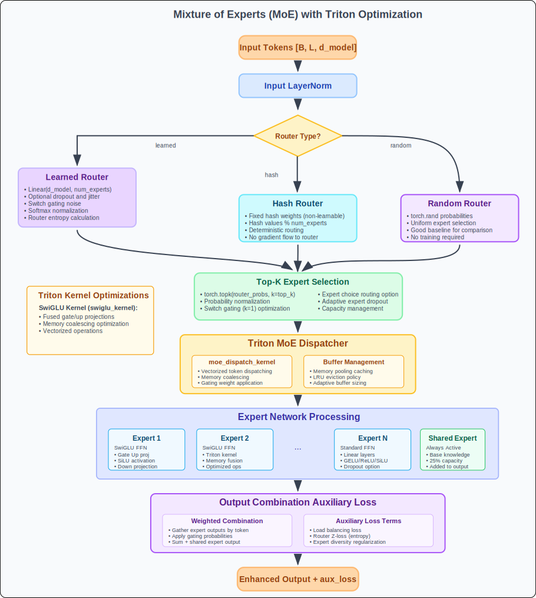

# Mixture of Experts (MoE) Architecture

## Overview

This implementation provides a state-of-the-art Mixture of Experts (MoE) system with advanced routing strategies, Triton-optimized kernels, and comprehensive load balancing mechanisms. The MoE architecture enables conditional computation by routing tokens to specialized expert networks, dramatically scaling model capacity while maintaining constant per-token computation.

## Core Architecture

### MoE Computational Flow



---

## Router Strategies

### 1. Learned Router (Default)
- **Trainable weights** for optimal token-expert assignment
- **Switch gating** with noise injection for exploration
- **Cosine similarity** routing for improved generalization

### 2. Hash Router
- **Deterministic routing** based on hash functions
- **No trainable parameters** - purely algorithmic
- **Consistent assignment** across forward passes

### 3. Random Router
- **Stochastic routing** for baseline comparisons
- **Uniform distribution** across experts
- **Training-free** routing mechanism

---

## Expert Networks

### SwiGLU Expert (Recommended)

```
         Input [tokens, d_model]
                  |
                  v
        +-------------------+
        | Gate-Up Projection |  ← Linear(d_model, 2*d_ff)
        | Weight: [d_model,  |
        |         2*d_ff]    |
        +-------------------+
                  |
         +--------+--------+
         |                 |
         v                 v
   +----------+      +----------+
   |   Gate   |      |    Up    |
   | [tok,ff] |      | [tok,ff] |
   +----------+      +----------+
         |                 |
         v                 |
   +----------+            |
   |   SiLU   |            |
   | σ(gate)  |            |
   +----------+            |
         |                 |
         +--------+--------+
                  |
                  v
            +----------+
            | Element  |  ← gate_silu * up
            | Multiply |
            +----------+
                  |
                  v
        +-------------------+
        | Down Projection   |  ← Linear(d_ff, d_model)
        +-------------------+
                  |
                  v
         Output [tokens, d_model]
```

### Standard FFN Expert

```
         Input [tokens, d_model]
                  |
                  v
        +-------------------+
        | Linear 1          |  ← Linear(d_model, d_ff)
        +-------------------+
                  |
                  v
        +-------------------+
        | Activation        |  ← GELU/ReLU/SiLU
        +-------------------+
                  |
                  v
        +-------------------+
        | Dropout (training)|
        +-------------------+
                  |
                  v
        +-------------------+
        | Linear 2          |  ← Linear(d_ff, d_model)
        +-------------------+
                  |
                  v
         Output [tokens, d_model]
```

---

## Advanced Routing Mechanisms

### Token Choice vs Expert Choice

| Strategy | Description | Benefits | Use Case |
|----------|-------------|----------|----------|
| **Token Choice** | Each token selects top-k experts | Standard approach, well-tested | General purpose |
| **Expert Choice** | Each expert selects top-k tokens | Better load balancing | Large-scale training |
| **Switch Gating** | Top-1 routing with noise | Simplified, faster | Efficiency-focused |

### Adaptive Capacity Management

```
Capacity Planning:
+------------------+
| Fixed Capacity   |  ← capacity_factor * tokens / num_experts
+------------------+
         |
         v
+------------------+
| Adaptive Adjust  |  ← Monitor usage patterns
| • High usage     |     → Increase capacity
| • Low usage      |     → Decrease capacity
+------------------+
         |
         v
+------------------+
| Min Capacity     |  ← Enforce minimum threshold
| Protection       |
+------------------+
```

---

## Triton Optimization Layer

### SwiGLU Kernel Optimization

**Memory Access Pattern:**
```
Traditional Approach:     Triton Optimized:
x → gate_proj → gate      x → fused_gate_up → gate, up
x → up_proj → up          gate → silu(gate) * up → hidden
gate → silu → activated   hidden → down_proj → output
activated * up → hidden
hidden → down_proj → out  Memory Transfers: 3 → 1
                         Kernel Launches: 4 → 1
```

**Performance Benefits:**
- **3-4x fewer memory transfers**
- **Fused operations** reduce intermediate storage
- **Vectorized memory access** for better bandwidth utilization
- **Adaptive block sizing** based on problem dimensions

### MoE Dispatch Optimization

**Token Distribution:**
```
CPU Fallback:             Triton Kernel:
for token in tokens:      Parallel dispatch:
  for k in top_k:         ├── Program 0: tokens[0:64]
    expert = route[k]     ├── Program 1: tokens[64:128]
    buffer[expert] +=     ├── ...
      token * weight      └── Program N: tokens[...]

Serial: O(tokens*k)       Parallel: O(tokens/cores)
```

---

## Load Balancing & Auxiliary Losses

### Load Balancing Loss

**Objective:** Ensure uniform expert utilization

```
expert_usage = count(tokens_per_expert) / total_tokens
router_probs = mean(router_probabilities, dim=tokens)

load_loss = dot_product(expert_usage, router_probs) * num_experts

Goal: Minimize correlation between usage and routing probability
```

### Router Z-Loss

**Objective:** Prevent router collapse

```
z_loss = mean(logsumexp(router_logits, dim=-1)^2)

Effect: Encourages router to maintain entropy and avoid
        overconfident predictions
```

### Expert Diversity Loss

**Objective:** Encourage specialization

```
prob_std = std(router_probs, dim=tokens)
diversity_loss = -mean(prob_std)

Effect: Rewards experts that show clear preferences
        for different token types
```

---

## Advanced Features

### Expert Dropout Strategies

| Strategy | Mechanism | Benefits |
|----------|-----------|----------|
| **Random** | Drop random expert per batch | Simple, baseline |
| **Balanced** | Drop overused experts | Prevent expert dominance |
| **Adaptive** | Drop based on confidence | Dynamic load balancing |

### Shared Expert Integration

```
Standard MoE:           Shared + Routed:
Input → Router          Input → Router + Shared
     ↓                       ↓           ↓
   Top-K Experts         Top-K Experts  Always-On Expert
     ↓                       ↓           ↓
   Weighted Sum           Weighted Sum + Shared Output
     ↓                            ↓
   Output                    Combined Output

Benefits: Base knowledge + Specialized routing
```

### Memory Management

**Buffer Pooling:**
```
Buffer Cache Strategy:
┌─────────────────────────────────────┐
│ LRU Cache: {size → tensor}          │
│ ├── (1024, 512) → cached_buffer_1   │
│ ├── (2048, 512) → cached_buffer_2   │
│ └── (4096, 512) → cached_buffer_3   │
└─────────────────────────────────────┘

Benefits:
• Reduce allocation overhead
• Reuse memory across batches
• Automatic cleanup on size limits
```

---

## Configuration Examples

### High-Performance Setup
```python
moe = MoEFeedForward(
    d_model=1024,
    d_ff=4096,
    num_experts=16,
    top_k=2,

    # Optimization features
    use_swiglu=True,
    use_mixed_precision=True,
    use_gradient_checkpointing=True,

    # Advanced routing
    router_type="learned",
    use_switch_gating=True,
    use_cosine_router=True,

    # Load balancing
    load_balancing_loss_weight=1e-2,
    z_loss_weight=1e-3,
    use_adaptive_capacity=True,

    # Expert configuration
    use_shared_expert=True,
    shared_expert_ratio=0.25,
    expert_dropout=0.1,
    expert_dropout_strategy="adaptive"
)
```

### Research Configuration
```python
moe = MoEFeedForward(
    d_model=512,
    d_ff=2048,
    num_experts=32,
    top_k=4,

    # Experimental features
    use_expert_choice=True,
    expert_choice_k=8,
    router_type="hash",  # For reproducibility

    # Regularization
    use_expert_regularization=True,
    expert_diversity_weight=1e-4,
    use_auxiliary_loss_scheduling=True,

    # Analysis features
    use_router_z_loss=True,
    normalize_router_weights=True
)
```

### Efficiency-Focused Setup
```python
moe = MoEFeedForward(
    d_model=256,
    d_ff=1024,
    num_experts=8,
    top_k=1,  # Switch transformer style

    # Speed optimizations
    use_switch_gating=True,
    use_shared_expert=False,
    use_gradient_checkpointing=False,

    # Minimal auxiliary losses
    load_balancing_loss_weight=1e-3,
    z_loss_weight=0.0,
    use_capacity_factor=False
)
```

---

## Performance Characteristics

### Scaling Properties

| Metric | Standard Transformer | MoE Transformer |
|--------|---------------------|-----------------|
| **Parameters** | O(layers × d_model × d_ff) | O(layers × experts × d_ff) |
| **Computation** | O(tokens × d_model × d_ff) | O(tokens × k × d_ff) |
| **Memory** | Linear with d_ff | Linear with experts |
| **Communication** | Minimal | Expert-dependent |

### Optimization Impact

| Feature | Memory Reduction | Speed Improvement | Quality Impact |
|---------|------------------|-------------------|----------------|
| **Triton SwiGLU** | 30-40% | 2-3x | Neutral |
| **Triton Dispatch** | 20-30% | 1.5-2x | Neutral |
| **Buffer Pooling** | 15-25% | 1.2-1.5x | Neutral |
| **Mixed Precision** | 50% | 1.3-1.8x | Slight ↑ |
| **Gradient Checkpointing** | 60-80% | 0.7-0.8x | Neutral |

---

## Training Considerations

### Convergence Patterns
- **Warm-up period:** Experts learn specialization (1000-5000 steps)
- **Auxiliary loss scheduling:** Gradual increase from 10% to 100%
- **Capacity adaptation:** Monitor and adjust based on usage patterns

### Common Issues & Solutions

| Issue | Symptom | Solution |
|-------|---------|----------|
| **Expert Collapse** | Few experts used | Increase load balancing weight |
| **Routing Instability** | High loss variance | Add router z-loss |
| **Memory Explosion** | OOM errors | Enable gradient checkpointing |
| **Load Imbalance** | Some experts unused | Tune capacity factor |

### Monitoring Metrics
- **Expert utilization:** Track usage distribution
- **Router entropy:** Monitor decision diversity
- **Auxiliary losses:** Balance primary and auxiliary objectives
- **Memory usage:** Track buffer allocation patterns

---

## API Reference

### Core Methods

```python
# Forward pass with auxiliary loss
output, aux_loss = moe(input_tensor, return_aux_loss=True)

# Reset internal caches (between epochs)
moe.reset_cache()

# Get current auxiliary loss
current_aux_loss = moe.get_aux_loss()

# Check expert utilization
utilization = moe.expert_utilization.cpu().numpy()
```

### Dispatcher Interface

```python
# Manual dispatch (for custom routing)
expert_input, row_indices = moe.dispatcher.dispatch(
    tokens, router_probs, expert_indices
)

# Cleanup buffers (memory management)
moe.dispatcher.cleanup_buffers()
```
