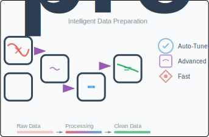
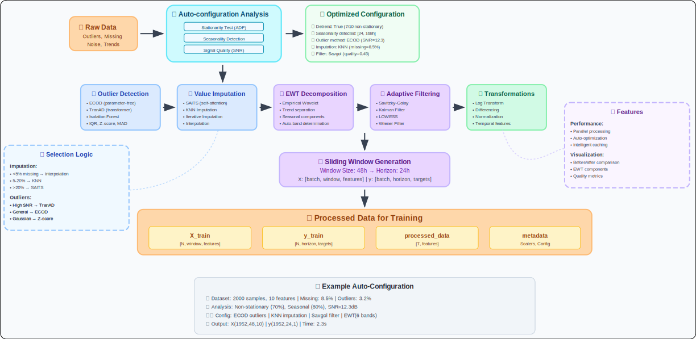

# pre_foreblock: TimeSeriesPreprocessor Guide



**Advanced, self-tuning preprocessing for time series forecasting with state-of-the-art techniques**

---

## 📋 Table of Contents

- [Overview](#-overview)
- [Installation](#-installation)
- [Key Features](#-key-features)
- [Quick Start](#-quick-start)
- [Auto-Configuration](#-auto-configuration)
- [Advanced Techniques](#-advanced-techniques)
- [Integration Examples](#-integration-examples)
- [Complete Workflow](#-complete-workflow)
- [Troubleshooting](#-troubleshooting)

---

## 🌟 Overview

The `TimeSeriesPreprocessor` class provides **comprehensive, intelligent preprocessing** for time series data using advanced statistical analysis and machine learning techniques. It automatically detects data characteristics and applies appropriate transformations to maximize forecasting model performance.



### Why TimeSeriesPreprocessor?

- **🤖 Self-Tuning**: Automatically configures preprocessing based on data statistics
- **🔧 Advanced Techniques**: EWT, adaptive filtering, intelligent imputation
- **⚡ High Performance**: Parallelized processing for large datasets
- **🎯 Model-Ready**: Seamless integration with ForeBlocks models
- **📊 Visualization**: Built-in comparison plots for validation

---

## 📦 Installation

### Core Dependencies
```bash
pip install numpy pandas matplotlib scikit-learn scipy statsmodels
```

### Advanced Features
```bash
# For outlier detection
pip install pyod

# For Empirical Wavelet Transform
pip install PyEWT

# For advanced imputation
pip install fancyimpute

# For visualization enhancements
pip install tabulate tqdm
```

### Optional Dependencies
```bash
# For Kalman filtering
pip install pykalman

# For Empirical Mode Decomposition
pip install PyEMD
```

---

## ✨ Key Features

### 🧠 Intelligent Auto-Configuration

| Analysis | Purpose | Output |
|----------|---------|---------|
| **Stationarity Testing** | ADF test for trend detection | Determines detrending need |
| **Seasonality Detection** | Welch PSD + ACF analysis | Identifies seasonal patterns |
| **Signal Quality** | Spectral flatness + SNR | Selects optimal filtering |
| **Missing Pattern Analysis** | Coverage + correlation | Chooses imputation strategy |
| **Distribution Analysis** | Skewness + kurtosis | Decides transformations |

### 🔧 Advanced Processing Techniques

| Technique | Methods Available | Use Case |
|-----------|------------------|----------|
| **Outlier Detection** | IQR, Z-score, MAD, Isolation Forest, LOF, ECOD, TranAD | Robust anomaly removal |
| **Missing Value Imputation** | Interpolation, KNN, Iterative, SAITS | Handle missing data |
| **Signal Decomposition** | EWT (Empirical Wavelet Transform) | Trend/seasonality separation |
| **Adaptive Filtering** | Savitzky-Golay, Kalman, LOWESS, Wiener | Noise reduction |
| **Transformations** | Log, differencing, normalization | Stationarity & scaling |

---

## 🚀 Quick Start

### Basic Usage

```python
import numpy as np
import pandas as pd
from foreblocks.preprocessing import TimeSeriesPreprocessor

# Generate sample data
dates = pd.date_range(start='2023-01-01', periods=1000, freq='H')
data = np.sin(np.linspace(0, 4*np.pi, 1000)) + np.random.normal(0, 0.1, 1000)
data = data.reshape(-1, 1)

# Create preprocessor with auto-tuning
preprocessor = TimeSeriesPreprocessor(
    self_tune=True,           # Enable intelligent configuration
    window_size=24,           # 24-hour windows
    horizon=12,               # 12-hour forecast
    generate_time_features=True
)

# Fit and transform
X, y, processed_data = preprocessor.fit_transform(data, time_stamps=dates)

print(f"Input sequences: {X.shape}")
print(f"Target sequences: {y.shape}")
print(f"Processed data: {processed_data.shape}")
```

### Manual Configuration

```python
# Fine-tuned manual setup
preprocessor = TimeSeriesPreprocessor(
    normalize=True,
    remove_outliers=True,
    outlier_method="ecod",
    outlier_threshold=3.5,
    apply_imputation=True,
    impute_method="saits",
    apply_ewt=True,
    ewt_bands=5,
    detrend=True,
    apply_filter=True,
    filter_method="savgol",
    log_transform=False,
    differencing=False
)
```

---

## 🤖 Auto-Configuration

The self-tuning system performs comprehensive data analysis to determine optimal preprocessing:

### 📊 Statistical Analysis Pipeline

```python
def analyze_my_data():
    # The preprocessor automatically performs:

    # 1. Basic Statistics
    coverage, means, stds, skews, kurts = compute_basic_stats(data)

    # 2. Stationarity Testing (ADF test)
    pvals = detect_stationarity(data, n_features)

    # 3. Seasonality Detection (Welch PSD + ACF)
    seasonal_flags, periods = detect_seasonality(data, n_features)

    # 4. Signal Quality Analysis
    flatness_scores, snr_scores = analyze_signal_quality(data, n_features)

    # 5. Temporal Structure (PACF analysis)
    pacf_scores = score_pacf(data, n_features)

    # 6. EWT Band Estimation (Entropy-based)
    band_estimates = estimate_ewt_bands(data, n_features)
```

### 🎯 Configuration Output Example

```
📊 [Self-Tuning Configuration]
→ Low quality features: 2/10
→ Log transform features: 3/10
→ Non-stationary features: 7/10 → Detrend: ✅
→ Seasonal features: 8/10 → Seasonality: ✅
→ Detected periods: [24, 168, 8760]
→ Signal quality: Flatness=0.45, SNR=12.3 → Filter: savgol
→ Temporal structure: 4.2, Missing rate: 0.085 → Impute: knn
→ Wavelet decomposition bands: 6
→ Outlier detection method: ecod
→ Outlier threshold: 4.2
```

### 🧮 Intelligent Method Selection

#### Imputation Strategy Selection
```python
# Auto-selection logic based on missing rate and temporal structure
if missing_rate < 0.05:
    method = "interpolate" if temporal_score > 2 else "mean"
elif missing_rate < 0.15:
    method = "knn" if temporal_score < 3 else "interpolate"
elif missing_rate < 0.3:
    method = "iterative" if temporal_score > 1.5 else "knn"
else:
    method = "saits"  # Advanced deep learning imputation
```

#### Outlier Detection Selection
```python
# Scoring system for outlier method selection
scores = {
    "ecod": 2.0,  # Parameter-free, robust
    "tranad": 2.5 if high_snr else 0,  # For high-quality signals
    "isolation_forest": 1.5 if large_dataset else 0,
    "lof": 1.0 if high_dimensionality else 0,
    "zscore": 1.0 if high_skew else 0,
    "mad": 1.2 if heavy_tails else 0
}
```

---

## 🔧 Advanced Techniques

### 1. **Outlier Detection Methods**

#### Available Methods
| Method | Description | Best For |
|--------|-------------|----------|
| **ECOD** | Empirical Cumulative Outlier Detection | General purpose, parameter-free |
| **TranAD** | Transformer-based Anomaly Detection | High-quality temporal signals |
| **Isolation Forest** | Tree-based isolation mechanism | Large datasets, multivariate |
| **LOF** | Local Outlier Factor | High-dimensional data |
| **IQR** | Interquartile Range | Simple, interpretable |
| **Z-Score** | Standard deviation based | Gaussian-distributed data |
| **MAD** | Median Absolute Deviation | Heavy-tailed distributions |

#### Implementation
```python
# Parallelized outlier removal
def remove_outliers_example():
    preprocessor = TimeSeriesPreprocessor(
        remove_outliers=True,
        outlier_method="ecod",      # Auto-selected method
        outlier_threshold=3.5       # Adaptive threshold
    )

    # The preprocessor uses parallel processing for efficiency
    cleaned_data = preprocessor._parallel_outlier_clean(data)
```

### 2. **Missing Value Imputation**

#### SAITS (Self-Attention Imputation)
*State-of-the-art deep learning imputation*

```python
# Advanced SAITS imputation
preprocessor = TimeSeriesPreprocessor(
    apply_imputation=True,
    impute_method="saits",
    epochs=500,                 # Training epochs for SAITS
    window_size=24              # Sequence length for attention
)
```

#### Adaptive Imputation
*Automatically selects best method per column*

```python
# Auto-imputation with parallel processing
def adaptive_imputation_example():
    # Different strategies based on missing rate:
    # < 5%: Interpolation
    # 5-20%: KNN Imputation
    # 20-30%: Iterative Imputation
    # > 30%: SAITS or forward/backward fill

    preprocessor = TimeSeriesPreprocessor(
        impute_method="auto"  # Automatic method selection
    )
```

### 3. **Empirical Wavelet Transform (EWT)**

#### Signal Decomposition
```python
# EWT for trend/seasonality separation
preprocessor = TimeSeriesPreprocessor(
    apply_ewt=True,
    ewt_bands=5,               # Auto-determined from entropy
    detrend=True,              # Remove trend component
    trend_imf_idx=0            # Usually the first IMF contains trend
)

# Access decomposed components
ewt_components = preprocessor.get_ewt_components()
trend_component = preprocessor.get_trend_component()
```

#### Parallel EWT Processing
```python
# The implementation uses parallel processing for multiple features
def ewt_parallel_example():
    # Each feature processed independently
    output, ewt_components, boundaries, trends = apply_ewt_and_detrend_parallel(
        data,
        n_bands=5,
        detrend=True,
        trend_idx=0
    )
```

### 4. **Adaptive Filtering**

#### Available Filters
| Filter | Description | Best For |
|--------|-------------|----------|
| **Savitzky-Golay** | Polynomial smoothing | Preserving peaks/features |
| **Kalman** | State-space filtering | Missing data, noisy signals |
| **LOWESS** | Locally weighted regression | Non-linear trends |
| **Wiener** | Optimal linear filtering | Stationary noise |
| **EMD** | Empirical Mode Decomposition | Non-linear, non-stationary |

```python
# Filter selection based on signal characteristics
def filter_selection_example():
    if missing_rate > 0.2:
        filter_method = "kalman"
    elif flatness < 0.4 and n_samples > 500:
        filter_method = "savgol"
    elif flatness < 0.5:
        filter_method = "lowess"
    else:
        filter_method = "wiener"
```

### 5. **Log Transformation**

#### Selective Log Transform
```python
# Automatic log transform for skewed features
def log_transform_example():
    # Applied only to features with |skewness| > 1.0
    log_flags = (np.abs(skews) > 1.0).tolist()

    # Handles negative values automatically
    transformed, offsets = apply_log_transform(data, log_flags)
```

---

## 🔗 Integration Examples

### Integration with TimeSeriesSeq2Seq

```python
from foreblocks import TimeSeriesSeq2Seq, ModelConfig, TrainingConfig
import torch

# Complete preprocessing + training pipeline
def complete_pipeline_example():
    # 1. Load and preprocess data
    preprocessor = TimeSeriesPreprocessor(self_tune=True)
    X, y, processed = preprocessor.fit_transform(raw_data, time_stamps=dates)

    # 2. Create model
    model_config = ModelConfig(
        model_type="lstm",
        input_size=X.shape[2],
        output_size=y.shape[2],
        hidden_size=64,
        target_len=12
    )

    model = TimeSeriesSeq2Seq(model_config=model_config)

    # 3. Create DataLoader
    from torch.utils.data import TensorDataset, DataLoader
    dataset = TensorDataset(
        torch.tensor(X, dtype=torch.float32),
        torch.tensor(y, dtype=torch.float32)
    )
    dataloader = DataLoader(dataset, batch_size=32, shuffle=True)

    # 4. Train model
    history = model.train_model(dataloader)

    # 5. Make predictions and inverse transform
    predictions = model.predict(X_test)
    original_scale_preds = preprocessor.inverse_transform(predictions)

    return model, preprocessor, original_scale_preds
```

### Built-in Preprocessing Method

```python
# Use the model's built-in preprocessing (uses TimeSeriesPreprocessor internally)
model = TimeSeriesSeq2Seq(model_config=model_config)

X_train, y_train, processed_data = model.preprocess(
    raw_data,
    self_tune=True,           # Enable auto-configuration
    window_size=48,
    horizon=24,
    remove_outliers=True,
    apply_imputation=True
)
```

---

## 📈 Complete Workflow

### Real-World Example with Synthetic Data

```python
import numpy as np
import pandas as pd
import matplotlib.pyplot as plt
from foreblocks.preprocessing import TimeSeriesPreprocessor

# 1. Generate complex synthetic time series
def generate_complex_data():
    np.random.seed(42)
    n_samples = 2000
    timestamps = pd.date_range(start='2023-01-01', periods=n_samples, freq='H')

    # Create multi-component signal
    t = np.linspace(0, 8*np.pi, n_samples)
    trend = 0.1 * t                           # Linear trend
    seasonal_daily = 2 * np.sin(t)            # Daily pattern
    seasonal_weekly = 1 * np.sin(t/24)        # Weekly pattern
    noise = np.random.normal(0, 0.5, n_samples)

    # Combine components
    data = (trend + seasonal_daily + seasonal_weekly + noise).reshape(-1, 1)

    # Add outliers (5% of data)
    outlier_indices = np.random.choice(n_samples, int(0.05 * n_samples), replace=False)
    data[outlier_indices] += 5 * np.random.randn(len(outlier_indices), 1)

    # Add missing values (10% of data)
    missing_indices = np.random.choice(n_samples, int(0.1 * n_samples), replace=False)
    data[missing_indices] = np.nan

    return data, timestamps

# 2. Apply comprehensive preprocessing
def preprocess_data():
    data, timestamps = generate_complex_data()

    # Create self-tuning preprocessor
    preprocessor = TimeSeriesPreprocessor(
        self_tune=True,                    # Enable intelligent configuration
        window_size=48,                    # 48-hour input sequences
        horizon=24,                        # 24-hour predictions
        generate_time_features=True,       # Add calendar features
        epochs=300                         # For SAITS imputation
    )

    # Fit and transform
    print("🔄 Starting preprocessing...")
    X, y, processed_data = preprocessor.fit_transform(data, time_stamps=timestamps)

    return X, y, processed_data, preprocessor, data, timestamps

# 3. Visualization and analysis
def analyze_results():
    X, y, processed, prep, original, timestamps = preprocess_data()

    # Plot comparison
    fig, axes = plt.subplots(4, 1, figsize=(15, 12))

    # Original vs processed
    axes[0].plot(timestamps, original, alpha=0.7, label='Original (with outliers/missing)')
    axes[0].set_title('Original Data')
    axes[0].legend()
    axes[0].grid(True)

    axes[1].plot(timestamps, processed[:, 0], label='Processed', color='green')
    axes[1].set_title('After Preprocessing')
    axes[1].legend()
    axes[1].grid(True)

    # EWT components (if available)
    ewt_components = prep.get_ewt_components()
    if ewt_components:
        for i, component in enumerate(ewt_components[0][:3].T):  # First 3 components
            axes[2].plot(timestamps, component, label=f'EWT Component {i}')
        axes[2].set_title('EWT Decomposition')
        axes[2].legend()
        axes[2].grid(True)

    # Trend component
    trend = prep.get_trend_component()
    if trend is not None:
        axes[3].plot(timestamps, trend[:, 0], label='Extracted Trend', color='red')
        axes[3].set_title('Trend Component')
        axes[3].legend()
        axes[3].grid(True)

    plt.tight_layout()
    plt.show()

    # Print statistics
    print(f"\n📊 Preprocessing Results:")
    print(f"Original shape: {original.shape}")
    print(f"Processed shape: {processed.shape}")
    print(f"Input sequences: {X.shape}")
    print(f"Target sequences: {y.shape}")
    print(f"Missing values removed: {np.isnan(original).sum()}")
    print(f"Features generated: {processed.shape[1] - original.shape[1]}")

# Run the complete workflow
if __name__ == "__main__":
    analyze_results()
```

### Production Deployment Example

```python
class ProductionPreprocessor:
    """Production-ready preprocessing pipeline"""

    def __init__(self, config_path=None):
        self.preprocessor = None
        self.is_fitted = False

    def fit(self, historical_data, timestamps=None):
        """Fit preprocessor on historical data"""
        self.preprocessor = TimeSeriesPreprocessor(
            self_tune=True,
            window_size=24,
            horizon=12,
            remove_outliers=True,
            apply_imputation=True,
            generate_time_features=True
        )

        # Fit and store configuration
        _, _, self.processed_reference = self.preprocessor.fit_transform(
            historical_data, time_stamps=timestamps
        )
        self.is_fitted = True

    def transform_new_data(self, new_data, timestamps=None):
        """Transform new incoming data"""
        if not self.is_fitted:
            raise ValueError("Preprocessor must be fitted first")

        return self.preprocessor.transform(new_data, time_stamps=timestamps)

    def inverse_transform_predictions(self, predictions):
        """Convert predictions back to original scale"""
        return self.preprocessor.inverse_transform(predictions)
```

---

## 🔄 Inverse Transformation

### Complete Inverse Pipeline

```python
def inverse_transform_example():
    # The inverse transformation applies operations in reverse order:

    # 1. Denormalization (if normalize=True)
    if preprocessor.normalize and preprocessor.scaler:
        predictions = preprocessor.scaler.inverse_transform(predictions)

    # 2. Inverse differencing (if differencing=True)
    if preprocessor.differencing and preprocessor.diff_values:
        # Cumulative sum to restore original scale
        predictions = restore_from_differences(predictions, preprocessor.diff_values)

    # 3. Add back trend (if detrend=True)
    if preprocessor.detrend and preprocessor.trend_component:
        predictions = add_trend_back(predictions, preprocessor.trend_component)

    # 4. Inverse log transform (if log_transform=True)
    if preprocessor.log_transform and preprocessor.log_offset:
        predictions = inverse_log_transform(predictions, preprocessor.log_offset)

    return predictions

# Usage
original_scale_predictions = preprocessor.inverse_transform(model_predictions)
```

---

## 🛠️ Troubleshooting

### Common Issues & Solutions

<details>
<summary><strong>🔴 Missing Dependencies</strong></summary>

**Problem**: ImportError for optional packages

**Solution**:
```python
# The preprocessor gracefully handles missing dependencies
try:
    from PyEWT import EWT1D
    ewt_available = True
except ImportError:
    print("⚠️ PyEWT not available, skipping EWT decomposition")
    ewt_available = False

# Install missing packages
pip install PyEWT pyod fancyimpute pykalman PyEMD
```
</details>

<details>
<summary><strong>🟡 Memory Issues with Large Datasets</strong></summary>

**Problem**: Out of memory errors with large time series

**Solutions**:
```python
# 1. Disable memory-intensive operations
preprocessor = TimeSeriesPreprocessor(
    apply_ewt=False,           # Skip EWT for very large datasets
    outlier_method="iqr",      # Use simpler outlier detection
    impute_method="interpolate" # Avoid complex imputation
)

# 2. Process in chunks
def process_large_dataset(data, chunk_size=10000):
    results = []
    for i in range(0, len(data), chunk_size):
        chunk = data[i:i+chunk_size]
        processed_chunk = preprocessor.transform(chunk)
        results.append(processed_chunk)
    return np.concatenate(results)
```
</details>

<details>
<summary><strong>🟠 Poor Preprocessing Results</strong></summary>

**Problem**: Preprocessed data doesn't improve model performance

**Solutions**:
```python
# 1. Start with auto-tuning
preprocessor = TimeSeriesPreprocessor(self_tune=True)

# 2. Validate each preprocessing step
def validate_preprocessing():
    # Compare before/after for each step
    steps = ['imputation', 'outlier_removal', 'filtering', 'normalization']
    for step in steps:
        # Apply single step and evaluate
        single_step_preprocessor = TimeSeriesPreprocessor(**{step: True})
        # Test model performance...

# 3. Use domain knowledge
# For financial data
preprocessor = TimeSeriesPreprocessor(
    log_transform=True,        # Financial data often log-normal
    differencing=True,         # Remove non-stationarity
    outlier_method="mad"       # Robust to fat tails
)
```
</details>

<details>
<summary><strong>🔵 Inverse Transformation Issues</strong></summary>

**Problem**: Predictions don't match original scale

**Solutions**:
```python
# 1. Ensure preprocessor is fitted before inverse transform
if not hasattr(preprocessor, 'scaler') or preprocessor.scaler is None:
    raise ValueError("Preprocessor not fitted")

# 2. Handle prediction shape mismatches
def safe_inverse_transform(predictions):
    # Ensure predictions have correct shape
    if predictions.ndim == 2:
        predictions = predictions.reshape(-1, predictions.shape[-1])

    return preprocessor.inverse_transform(predictions)

# 3. Debug step-by-step
def debug_inverse_transform():
    print("Inverse transform steps:")
    if preprocessor.normalize: print("✓ Denormalization")
    if preprocessor.differencing: print("✓ Undifferencing")
    if preprocessor.detrend: print("✓ Trend restoration")
    if preprocessor.log_transform: print("✓ Inverse log transform")
```
</details>

### 💡 Best Practices

#### 1. **Data Quality Validation**
```python
def validate_data_quality(data):
    """Validate data before preprocessing"""
    # Check for sufficient data
    if len(data) < 100:
        warnings.warn("Very small dataset, consider simpler preprocessing")

    # Check missing rate
    missing_rate = np.isnan(data).mean()
    if missing_rate > 0.5:
        warnings.warn(f"High missing rate: {missing_rate:.1%}")

    # Check for flat signals
    for i in range(data.shape[1]):
        if np.std(data[:, i]) < 1e-6:
            warnings.warn(f"Feature {i} appears to be constant")
```

#### 2. **Cross-Validation for Preprocessing**
```python
from sklearn.model_selection import TimeSeriesSplit

def validate_preprocessing_config(data, configs):
    """Validate different preprocessing configurations"""
    tscv = TimeSeriesSplit(n_splits=5)
    results = {}

    for config_name, config in configs.items():
        scores = []
        for train_idx, val_idx in tscv.split(data):
            train_data = data[train_idx]
            val_data = data[val_idx]

            # Apply preprocessing
            preprocessor = TimeSeriesPreprocessor(**config)
            X_train, y_train, _ = preprocessor.fit_transform(train_data)
            X_val = preprocessor.transform(val_data)

            # Train simple model and evaluate
            # ... model training and evaluation ...
            scores.append(score)

        results[config_name] = np.mean(scores)

    return results
```

#### 3. **Monitoring in Production**
```python
class PreprocessingMonitor:
    """Monitor preprocessing performance in production"""

    def __init__(self, preprocessor):
        self.preprocessor = preprocessor
        self.baseline_stats = None

    def compute_baseline(self, reference_data):
        """Compute baseline statistics from reference data"""
        self.baseline_stats = {
            'mean': np.nanmean(reference_data, axis=0),
            'std': np.nanstd(reference_data, axis=0),
            'missing_rate': np.isnan(reference_data).mean(axis=0)
        }

    def check_drift(self, new_data, threshold=0.1):
        """Check for data drift"""
        if self.baseline_stats is None:
            return False

        current_stats = {
            'mean': np.nanmean(new_data, axis=0),
            'std': np.nanstd(new_data, axis=0),
            'missing_rate': np.isnan(new_data).mean(axis=0)
        }

        # Check for significant changes
        drift_detected = False
        for stat in ['mean', 'std', 'missing_rate']:
            relative_change = np.abs(
                (current_stats[stat] - self.baseline_stats[stat]) /
                (self.baseline_stats[stat] + 1e-8)
            )
            if np.any(relative_change > threshold):
                print(f"⚠️ Drift detected in {stat}")
                drift_detected = True

        return drift_detected
```

---

## 🎯 Summary

The **TimeSeriesPreprocessor** provides a comprehensive, intelligent preprocessing solution that:

- **🤖 Automatically configures** preprocessing based on data characteristics
- **⚡ Processes efficiently** using parallel computation
- **🔧 Applies advanced techniques** like EWT, SAITS imputation, and adaptive filtering
- **🎯 Integrates seamlessly** with ForeBlocks forecasting models
- **📊 Provides transparency** with built-in visualization and monitoring

**Key Advantages**:
- Reduces manual parameter tuning
- Handles complex preprocessing pipelines automatically
- Scales to large datasets with parallel processing
- Maintains full reversibility for predictions
- Provides production-ready monitoring capabilities

Start with `self_tune=True` for automatic configuration, then fine-tune based on domain knowledge and validation results!
