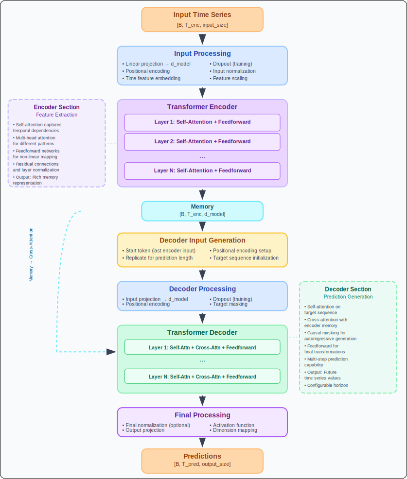
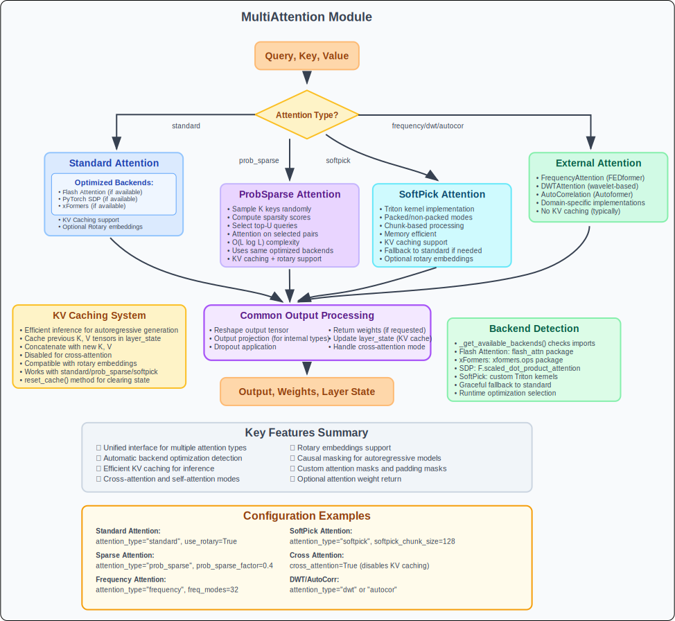

# Advanced Transformer Architecture

## Overview

This implementation features a modern, highly configurable transformer architecture with state-of-the-art components including Mixture of Experts (MoE), advanced attention mechanisms, adaptive normalization, and optimized feedforward networks.

## Core Architecture Components

### BaseTransformerLayer Structure

```
BaseTransformerLayer
├── Normalization Strategy (Pre-norm/Post-norm)
├── Feedforward Block (Standard/MoE)
├── Dropout & Residual Connections
└── Auxiliary Loss Management
```

**Key Features:**
- **Pre-norm vs Post-norm**: Configurable normalization placement for training stability
- **Adaptive Normalization**: Supports LayerNorm, RMSNorm, and custom adaptive variants
- **MoE Integration**: Optional Mixture of Experts for conditional computation
- **Memory Optimization**: Reduced allocations in feedforward passes

---

## Transformer Model



### Multi-Attention Modele



---

## Advanced Feature Matrix

### Attention Mechanisms
| Type | Description | Use Case |
|------|-------------|----------|
| `standard` | Traditional scaled dot-product | General purpose |
| `xformer` | Memory-efficient attention | Large sequences |
| `flash` | FlashAttention implementation | Speed optimization |
| `frequency` | Frequency domain attention | Time series patterns |

### Normalization Options
| Type | Description | Benefits |
|------|-------------|----------|
| `layer` | Standard LayerNorm | Stable, well-tested |
| `rms` | Root Mean Square LayerNorm | Faster, similar performance |
| `adaptive` | Learnable normalization | Task-specific adaptation |

### Feedforward Configurations
| Component | Options | Impact |
|-----------|---------|--------|
| **Activation** | `gelu`, `relu`, `swish` | Nonlinearity choice |
| **Gating** | SwiGLU (default) | Improved expressivity |
| **Scaling** | Standard MLP or MoE | Conditional computation |
| **Experts** | MoE with top-k routing | Sparse expert activation |


---

## Incremental Decoding (Inference Optimization)

```
Inference State Management:

Time Step t=1:
+---------------+    +---------------+
| Input:[B,1,D] | -> | Self-Attn KV  |
| Token 1       |    | Cache:[B,1,D] |
+---------------+    +---------------+

Time Step t=2:
+---------------+    +---------------+
| Input:[B,1,D] | -> | Self-Attn KV  |
| Token 2       |    | Cache:[B,2,D] |
+---------------+    +---------------+

Time Step t=T:
+---------------+    +---------------+
| Input:[B,1,D] | -> | Self-Attn KV  |
| Token T       |    | Cache:[B,T,D] |
+---------------+    +---------------+

Incremental State Structure:
{
  "layers": [
    {  # Layer 0
      "self_attn": {"key": Tensor, "value": Tensor},
      "cross_attn": {"key": Tensor, "value": Tensor}
    },
    ...  # Additional layers
  ]
}
```

---

## Configuration Examples

### High-Performance Time Series Model
```python
encoder = TransformerEncoder(
    input_size=7,                    # Number of features
    d_model=512,                    # Model dimension
    nhead=8,                        # Attention heads
    num_layers=6,                   # Encoder depth
    att_type="xformer",            # Memory-efficient attention
    use_swiglu=True,               # Gated activation
    norm_strategy="pre_norm",       # Stable training
    use_adaptive_ln="rms",         # Faster normalization
    use_gradient_checkpointing=True # Memory efficiency
)
```

### Large-Scale Configuration
```python
decoder = TransformerDecoder(
    input_size=7,
    output_size=1,
    d_model=1024,
    num_layers=12,
    nhead=16,                      # More attention heads
    dim_feedforward=4096,          # Larger feedforward
    use_gradient_checkpointing=True
)
```

### Inference-Optimized Setup
```python
model = TransformerDecoder(
    input_size=10,
    output_size=5,
    share_layers=True,             # Parameter sharing
    use_final_norm=False,          # Skip final norm
    use_gradient_checkpointing=False  # Full speed inference
)

# Incremental generation
incremental_state = {}
for step in range(pred_length):
    output, incremental_state = model.forward_one_step(
        tgt=current_input,
        memory=encoder_output,
        incremental_state=incremental_state
    )
```

---

## Performance Optimizations

### Memory Efficiency
- **Gradient Checkpointing**: Trade computation for memory
- **Shared Layers**: Reduce parameter count
- **Incremental Decoding**: Cache attention states
- **Pre-norm Architecture**: Stable training with lower precision

### Computational Efficiency
- **XFormer Attention**: O(n) memory complexity
- **SwiGLU Gating**: Better parameter efficiency
- **MoE Sparsity**: Conditional computation when enabled
- **Adaptive Normalization**: Faster than LayerNorm

### Training Stability
- **Pre-normalization**: Gradient flow improvement
- **Custom Weight Initialization**: Layer-specific strategies
- **Dropout Strategies**: Training vs inference modes

