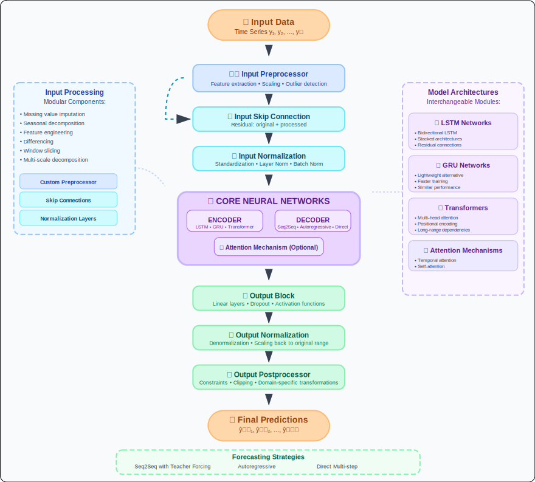

# ForeBlocks Architecture & Custom Blocks Guide

**A comprehensive guide to understanding and customizing ForeBlocks' modular architecture**

---

## 🏗️ Design Philosophy

ForeBlocks is built on four core principles:

| Principle | Description |
|-----------|-------------|
| **🧩 Modularity** | All components can be replaced or customized independently |
| **🔍 Transparency** | Clear, traceable data flow between all components |
| **🔄 Flexibility** | Multiple forecasting strategies in a unified framework |
| **📈 Extensibility** | Easy addition of new components and architectures |

---

## 🔧 Custom Processing Blocks

ForeBlocks uses a pipeline of customizable processing blocks that transform data at different stages:

### 📋 Block Overview

| Block | Stage | Purpose | Default |
|-------|-------|---------|---------|
| `input_preprocessor` | Pre-Encoder | Transform input features (e.g., CNN, FFT) | `nn.Identity()` |
| `input_normalization` | Pre-Encoder | Standardize input data | `nn.Identity()` |
| `input_skip_connection` | Pre-Encoder | Add residual connection | `False` |
| `output_block` | Post-Decoder | Additional output transformations | `nn.Identity()` |
| `output_normalization` | Post-Decoder | Normalize decoder outputs | `nn.Identity()` |
| `output_postprocessor` | Final | Final prediction transformations | `nn.Identity()` |

---

## 🌊 Data Flow Architecture



---

## 📝 Detailed Block Explanations

### Input Processing Flow

#### 1. **input_preprocessor**
- **Purpose**: Transform input features before the encoder
- **Examples**: Convolutional layers, fully connected layers, specialized time series preprocessing
- **Use Cases**: Feature extraction, dimensionality reduction, frequency domain analysis

#### 2. **input_skip_connection**
- **Purpose**: Add residual connection (preprocessed + original)
- **Benefits**: Preserves original information, improves gradient flow
- **When to use**: When preprocessor might lose important original features
- **Implementation**: `preprocessed_input + original_input`

#### 3. **input_normalization**
- **Purpose**: Standardize input data for stable training
- **Types**: Standardization (zero mean, unit variance) or min-max scaling (0-1)
- **Benefits**: Faster convergence, prevents numerical issues
- **Applied**: After preprocessing and skip connection

### Output Processing Flow

#### 1. **output_block**
- **Purpose**: Additional transformations before normalization
- **Examples**: Activation functions, dropout, custom transformations
- **Applied**: To decoder output before normalization

#### 2. **output_normalization**
- **Purpose**: Standardize decoder outputs
- **Benefits**: Stabilizes training with varying output ranges
- **Similar to**: Input normalization but for outputs

#### 3. **output_postprocessor**
- **Purpose**: Final transformation of forecasting results
- **Examples**: Scaling back to original range, applying constraints, quantization
- **Applied**: After all other processing steps

---

## 📈 Forecasting Strategies

### 1. 🔁 Seq2Seq (Default)
*Best for complex temporal patterns*

```python
def _forward_seq2seq(self, src, targets, epoch):
    # Full encoder-decoder with step-wise decoding
````

**Highlights**:

* ✅ Scheduled sampling
* ✅ Attention & bidirectional support
* ✅ VAE-compatible
* ✅ Fully block-aware

---

### 2. 🔄 Autoregressive

*Best when each prediction depends on previous outputs*

```python
def _forward_autoregressive(self, src, targets, epoch):
    # Feedback loop decoder-only approach
```

**Highlights**:

* ⚡ Fast
* 🔁 Feedback loop
* 📉 Less error propagation than seq2seq

---

### 3. 🚀 Direct Multi-Step

*Best for parallel, error-free multi-step outputs*

```python
def _forward_direct(self, src):
    # One-pass prediction for all time steps
```

**Highlights**:

* ⚡ Fastest
* ❌ No recursion
* 🎯 Low complexity

---

### 4. ⚡ Transformer Seq2Seq

*Best for long sequences and attention-heavy problems*

```python
def _forward_transformer_seq2seq(self, src, targets, epoch):
    # Step-wise decoding with efficient caching
```

**Highlights**:

* 🔄 Incremental state caching
* 🧠 Self-attention
* 📏 Dynamic input-output shape management

---

### 5. 📡 Informer-Style

*Best for long-range parallel forecasting*

```python
def _forward_transformer_informer(self, src, targets, epoch):
    # Fully parallel decoder with no recursion
```

**Highlights**:

* 🚀 Fastest Transformer mode
* 🧮 Parallel decoding
* 🔁 Ideal for high-horizon tasks

---

## 🔀 Multi-Encoder-Decoder Architecture

> Enables feature-wise encoders and decoders when `multi_encoder_decoder=True`

```
Feature_i -> Encoder_i -> Decoder_i -> Output_i
                                      |
                   ... Aggregator --> Final Prediction
```

**Advantages**:

* 🔍 Per-feature specialization
* ⚙️ Better with heterogeneous input features

---

## 🧠 Attention Mechanisms

### Types Available

| Type | Description | Use Case |
|------|-------------|----------|
| **Dot Product** | `query ⋅ key` attention scores | Fast, general purpose |
| **General** | Learned weight matrix attention | More flexible |
| **Additive** | Feed-forward network scoring | Complex relationships |

### 💻 Implementation

```python
# Attention usage in sequence generation
if self.use_attention:
    query = self._get_attention_query(decoder_output, decoder_hidden)
    context, attention_weights = self.attention_module(query, encoder_outputs)
    decoder_output = self.output_layer(torch.cat((decoder_output, context), dim=-1))
```

**Integration**: Works seamlessly with all forecasting strategies except direct mode.

---

## 🛠️ Custom Block Examples

### 1. **CNN Input Preprocessor**
*For extracting local patterns from time series*

```python
class CNNPreprocessor(nn.Module):
    def __init__(self, input_size, hidden_size, kernel_size=3):
        super().__init__()
        self.conv1 = nn.Conv1d(input_size, hidden_size, kernel_size, padding=1)
        self.conv2 = nn.Conv1d(hidden_size, hidden_size, kernel_size, padding=1)
        self.relu = nn.ReLU()
        self.dropout = nn.Dropout(0.1)

    def forward(self, x):
        # x shape: [batch_size, seq_len, input_size]
        x = x.transpose(1, 2)  # [batch_size, input_size, seq_len]
        x = self.relu(self.conv1(x))
        x = self.dropout(x)
        x = self.relu(self.conv2(x))
        return x.transpose(1, 2)  # [batch_size, seq_len, hidden_size]

# Usage
model = TimeSeriesSeq2Seq(
    model_config=model_config,
    input_preprocessor=CNNPreprocessor(input_size=5, hidden_size=64),
    input_skip_connection=True  # Preserve original features
)
```

### 2. **Fourier Feature Preprocessor**
*For capturing frequency domain patterns*

```python
class FourierPreprocessor(nn.Module):
    def __init__(self, input_size, num_frequencies=10):
        super().__init__()
        self.num_frequencies = num_frequencies
        self.frequencies = nn.Parameter(torch.randn(num_frequencies) * 0.1)

    def forward(self, x):
        # x shape: [batch_size, seq_len, input_size]
        batch_size, seq_len, input_size = x.shape

        # Create time indices
        t = torch.arange(seq_len, device=x.device).float().unsqueeze(-1)

        # Generate fourier features
        fourier_features = []
        for freq in self.frequencies:
            fourier_features.append(torch.sin(2 * torch.pi * freq * t))
            fourier_features.append(torch.cos(2 * torch.pi * freq * t))

        # Concatenate and expand to match batch size
        fourier = torch.cat(fourier_features, dim=-1)
        fourier = fourier.expand(batch_size, -1, -1)

        # Combine with original features
        return torch.cat([x, fourier], dim=-1)

# Usage
model = TimeSeriesSeq2Seq(
    model_config=model_config,
    input_preprocessor=FourierPreprocessor(input_size=3, num_frequencies=5)
)
```

### 3. **Constrained Output Postprocessor**
*For applying constraints to predictions*

```python
class ConstrainedOutputPostprocessor(nn.Module):
    def __init__(self, min_value=0, max_value=100, apply_sigmoid=False):
        super().__init__()
        self.min_value = min_value
        self.max_value = max_value
        self.apply_sigmoid = apply_sigmoid

    def forward(self, x):
        if self.apply_sigmoid:
            x = torch.sigmoid(x)
            return x * (self.max_value - self.min_value) + self.min_value
        else:
            return torch.clamp(x, min=self.min_value, max=self.max_value)

# Usage
model = TimeSeriesSeq2Seq(
    model_config=model_config,
    output_postprocessor=ConstrainedOutputPostprocessor(min_value=0, max_value=100)
)
```

### 4. **Advanced Output Block**
*With dropout and activation functions*

```python
class AdvancedOutputBlock(nn.Module):
    def __init__(self, hidden_size, dropout=0.1):
        super().__init__()
        self.layers = nn.Sequential(
            nn.Dropout(dropout),
            nn.ReLU(),
            nn.Linear(hidden_size, hidden_size),
            nn.Dropout(dropout),
            nn.Tanh()
        )

    def forward(self, x):
        return self.layers(x)

# Usage
model = TimeSeriesSeq2Seq(
    model_config=model_config,
    output_block=AdvancedOutputBlock(hidden_size=64, dropout=0.1)
)
```

### 5. **VAE-Compatible Processing**
*The architecture supports VAE-style encoders with KL divergence*

```python
# The ForecastingModel automatically handles VAE encoders
# that return (z, mu, logvar) tuples
class VAEEncoder(nn.Module):
    def forward(self, x):
        # ... encoding logic ...
        return z, mu, logvar  # Model will automatically handle this

# Access KL divergence for loss computation
model = TimeSeriesSeq2Seq(model_config=model_config)
outputs = model(src, targets)
kl_loss = model.forecasting_model.get_kl()  # Returns KL divergence if available
```

---

## 🔄 Core Architecture Implementation

### ForecastingModel Class Structure

The `ForecastingModel` is the core class that orchestrates all components:

```python
class ForecastingModel(nn.Module):
    """
    A flexible sequence-to-sequence forecasting model supporting multiple architectures
    and forecasting strategies including seq2seq, autoregressive, and transformer approaches.
    """

    VALID_STRATEGIES = ["seq2seq", "autoregressive", "direct", "transformer_seq2seq"]
    VALID_MODEL_TYPES = ["lstm", "transformer", "informer-like"]

    def __init__(self,
                 encoder=None,
                 decoder=None,
                 target_len=5,
                 forecasting_strategy="seq2seq",
                 input_preprocessor=None,
                 output_postprocessor=None,
                 attention_module=None,
                 teacher_forcing_ratio=0.5,
                 scheduled_sampling_fn=None,
                 # ... additional parameters
                ):
        # Validation and setup logic
        self._validate_initialization(forecasting_strategy, model_type)
        self._setup_preprocessing_modules(...)
        self._setup_encoder_decoder(...)
        self._setup_output_layers()
```

### Key Setup Methods

#### Multi-Encoder-Decoder Setup
```python
def _setup_encoder_decoder(self, encoder, decoder, multi_encoder_decoder, input_processor_output_size):
    """Setup encoder and decoder architecture."""
    if multi_encoder_decoder:
        self.encoder = nn.ModuleList([
            self._clone_module(encoder)
            for _ in range(input_processor_output_size)
        ])
        self.decoder = nn.ModuleList([
            self._clone_module(decoder)
            for _ in range(input_processor_output_size)
        ])
        self.decoder_aggregator = nn.Linear(input_processor_output_size, 1, bias=False)
    else:
        self.encoder = encoder
        self.decoder = decoder
```

#### VAE Encoder Support
```python
def _process_encoder_hidden(self, encoder_hidden):
    """Process encoder hidden state, handling VAE and bidirectional encoders."""
    # Check if this is a VAE style encoder with (z, mu, logvar)
    if isinstance(encoder_hidden, tuple) and len(encoder_hidden) == 3:
        z, mu, logvar = encoder_hidden
        kl_div = -0.5 * torch.sum(1 + logvar - mu.pow(2) - logvar.exp()) / mu.size(0)
        return (z,), kl_div

    # Otherwise, prepare regular hidden state
    return self._prepare_decoder_hidden(encoder_hidden), None
```

---

## 🎛️ Configuration Integration

### Integration with TimeSeriesSeq2Seq

```python
# Define configurations using dataclasses
model_config = ModelConfig(
    model_type="lstm",
    input_size=10,
    output_size=5,
    hidden_size=64,
    target_len=24,
    strategy="seq2seq",
    teacher_forcing_ratio=0.5,
    multi_encoder_decoder=False
)

training_config = TrainingConfig(
    num_epochs=100,
    learning_rate=0.001,
    patience=10
)

# Create model with custom components
model = TimeSeriesSeq2Seq(
    model_config=model_config,
    training_config=training_config,
    input_preprocessor=custom_preprocessor,
    attention_module=attention_layer,
    output_postprocessor=custom_postprocessor,
    input_skip_connection=True,
    device="cuda"
)

# Train with built-in trainer
model.train_model(train_loader, val_loader)
```

### Supported Model Types & Strategies

| Model Type | Strategies | Key Features |
|------------|------------|--------------|
| `lstm` | `seq2seq`, `autoregressive`, `direct` | LSTM-based encoder-decoder |
| `transformer` | `transformer_seq2seq` | Self-attention with efficient caching |
| `informer-like` | `transformer_seq2seq` | Parallel prediction, no autoregression |

---

## 💡 Implementation Notes & Best Practices

### 🔧 Key Implementation Details

1. **Default Blocks**: If not specified, each block defaults to `nn.Identity()` (pass-through)
2. **Skip Connection**: When `input_skip_connection=True`, original input is added to preprocessed input
3. **Model Type**: Determines architecture details and behavior of certain functions
4. **Teacher Forcing**: `teacher_forcing_ratio` controls ground truth usage during training
5. **Scheduled Sampling**: `scheduled_sampling_fn` can gradually decrease teacher forcing ratio

### 🎯 Strategy Selection Guide

| Use Case | Recommended Strategy | Rationale |
|----------|---------------------|-----------|
| **Short sequences (< 50 steps)** | `seq2seq` | Best balance of performance and complexity |
| **Long sequences (> 100 steps)** | `transformer_seq2seq` | Handles long-range dependencies |
| **Real-time inference** | `direct` | Fastest single-pass prediction |
| **Strong sequential dependencies** | `autoregressive` | Each step informs the next |
| **Parallel computation preferred** | `informer-like` | No sequential bottlenecks |

### 🛠️ Customization Tips

1. **Always use `input_skip_connection=True`** when adding input preprocessing
2. **For VAE models**, access KL divergence with `model.forecasting_model.get_kl()`
3. **For transformer models**, decoder supports efficient incremental decoding
4. **Multi-encoder-decoder** works best when features have different patterns
5. **Scheduled sampling** helps bridge training-inference gap

---

## 🚀 Performance Optimizations

The core implementation includes several optimizations:

- **Incremental State Caching**: Transformer decoders cache attention states
- **Smart Initialization**: Decoder input initialized from encoder output
- **Automatic Dimension Handling**: Padding/projection for mismatched dimensions
- **Efficient Memory Usage**: Reuses tensors where possible
- **Flexible Architecture**: Supports both sequential and parallel generation
- **VAE Integration**: Automatic KL divergence computation and handling
- **Bidirectional Support**: Smart handling of bidirectional encoder outputs

---

## 🎓 Conclusion

The ForecastingModel's architecture provides a robust, flexible framework for implementing different time series forecasting approaches with fully customizable processing blocks. This modular design makes it easy to experiment with various model configurations while maintaining a consistent, high-performance interface that scales from simple LSTM models to complex transformer architectures with advanced features like VAE integration and multi-encoder processing.

**Key Strengths**:
- 🔧 **Modular Design**: Every component can be customized
- 🎯 **Multiple Strategies**: Five different forecasting approaches
- 🧠 **Advanced Features**: VAE, attention, multi-encoder support
- ⚡ **Optimized Performance**: Efficient implementations with caching
- 📈 **Easy Extension**: Simple to add new components and strategies
