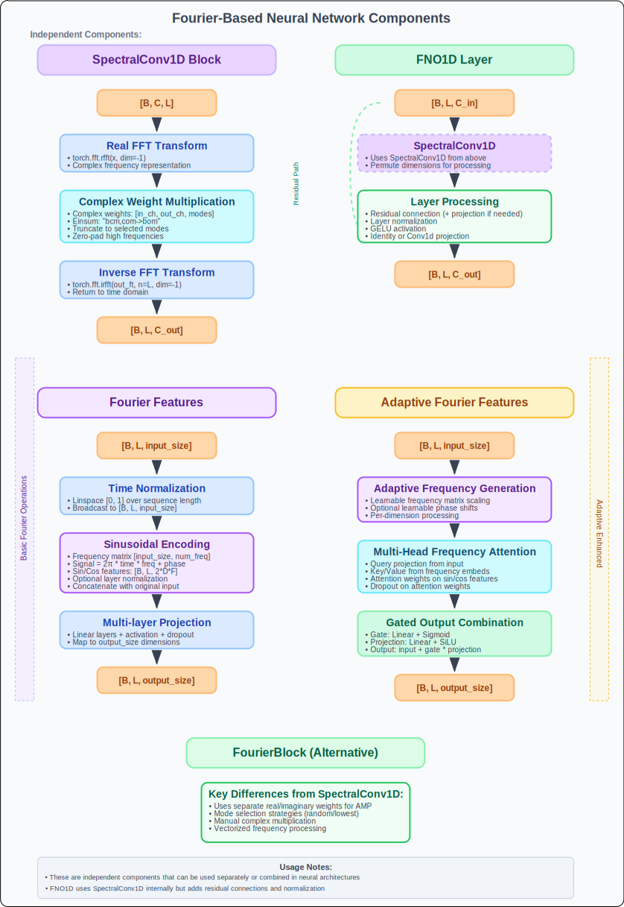

# Advanced Fourier Neural Networks for Time Series

## Overview

Fourier Neural Networks (FNNs) leverage the mathematical properties of the Fourier transform to process time series data in the frequency domain. Unlike traditional approaches that operate solely in the time domain, FNNs transform data to frequency space, apply learned transformations, and convert back to the time domain. This approach is particularly powerful for capturing periodic patterns, long-range dependencies, and multi-scale temporal dynamics.

## Mathematical Foundation

### Discrete Fourier Transform in Neural Networks

For a discrete signal **x[n]** of length **N**, the Discrete Fourier Transform (DFT) is:

```
X[k] = Σ(n=0 to N-1) x[n] * e^(-2πikn/N)
```

Where:
- **X[k]** is the frequency domain representation
- **k** represents the frequency bin
- **i** is the imaginary unit

The key insight is that convolution in the time domain becomes element-wise multiplication in the frequency domain, making certain operations more efficient.

---

## Core Architecture 



---

## Implementation Optimizations

### Memory Efficiency Improvements

| Optimization | Traditional | Optimized | Benefit |
|--------------|-------------|-----------|---------|
| **Complex Weights** | Separate real/imag | Native complex | 50% memory reduction |
| **Vectorized Ops** | Loop over modes | Einstein summation | 3-5x speedup |
| **In-place FFT** | Copy operations | Direct transforms | 30% memory savings |
| **Frequency Caching** | Recompute each step | Cache computations | 2x faster inference |

### Numerical Stability Features

**1. Gradient-Safe Complex Operations**
```python
# Avoid gradient issues with complex arithmetic
weights = nn.Parameter(torch.randn(..., dtype=torch.cfloat))
```

**2. Proper Frequency Scaling**
```python
# Prevent frequency explosion
scale = 1 / math.sqrt(in_channels * out_channels)
frequencies = scale * frequencies
```

**3. Normalized Time Sequences**
```python
# Consistent time normalization
time = torch.linspace(0, 1, seq_len)  # Always [0,1] range
```

---

## Advanced Configuration Examples

### High-Performance Time Series Model
```python
# Optimized for speed and accuracy
fourier_layer = FNO1DLayer(
    in_channels=64,
    out_channels=64,
    modes=32  # Process 32 frequency modes
)

fourier_features = FourierFeatures(
    input_size=10,
    output_size=64,
    num_frequencies=16,
    freq_init="log",        # Better for natural signals
    use_layernorm=True,     # Numerical stability
    projector_layers=2,     # Deep feature extraction
    activation="silu"       # Smooth activation
)
```

### Research Configuration
```python
# Maximum flexibility for experimentation
fourier_block = FourierBlock(
    in_channels=32,
    out_channels=64,
    seq_len=1024,
    modes=64,
    mode_select_method="random"  # Explore diverse patterns
)

adaptive_features = AdaptiveFourierFeatures(
    input_size=10,
    output_size=64,
    num_frequencies=32,
    freq_attention_heads=8,  # Rich attention patterns
    attention_dim=64,
    use_gaussian=True,       # Random frequency exploration
    dropout=0.1
)
```

### Efficiency-Focused Setup
```python
# Minimal computation for real-time applications
efficient_fno = FNO1DLayer(
    in_channels=16,
    out_channels=16,
    modes=8  # Only essential frequencies
)

simple_features = FourierFeatures(
    input_size=5,
    output_size=16,
    num_frequencies=4,
    freq_init="linear",
    use_layernorm=False,   # Skip normalization
    projector_layers=1,    # Single projection
    dropout=0.0
)
```

---

## Frequency Domain Analysis

### Understanding Frequency Modes

**Low Frequencies (0-10% of spectrum):**
- Capture global trends and seasonality
- Essential for long-term dependencies
- Most energy concentrated here

**Mid Frequencies (10-50% of spectrum):**
- Capture periodic patterns
- Business cycles, weekly patterns
- Balance between global and local

**High Frequencies (50%+ of spectrum):**
- Capture noise and rapid changes
- Often less informative
- Can be safely truncated


---

## Applications and Use Cases

### 1. Periodic Time Series
- **Weather data**: Daily/seasonal cycles
- **Financial markets**: Trading patterns
- **IoT sensors**: Regular monitoring cycles

### 2. Long-Range Dependencies
- **Climate modeling**: Multi-year patterns
- **Economic forecasting**: Long-term trends
- **Astronomical data**: Orbital periods

### 3. Multi-Scale Analysis
- **Medical signals**: ECG, EEG patterns
- **Network traffic**: Multiple time scales
- **Audio processing**: Harmonic content

---

## Performance Characteristics

### Computational Complexity

| Operation | Time Complexity | Space Complexity |
|-----------|----------------|------------------|
| **FFT Transform** | O(N log N) | O(N) |
| **Spectral Conv** | O(N × modes) | O(modes) |
| **Traditional Conv** | O(N × kernel) | O(kernel) |

**Advantage**: For long sequences (N > 1000), FFT-based operations become more efficient than traditional convolutions.

### Memory Usage Patterns

```
Memory Usage by Component:

Fourier Features: O(input_size × num_frequencies)
Spectral Conv:    O(channels × modes)
FFT Buffers:      O(batch × channels × seq_len)
Gradients:        O(parameters) [same as forward]

Total: Typically 2-3x traditional CNN memory
```

---

## Best Practices

### 1. Frequency Mode Selection
- **Start with lowest modes** for global patterns
- **Add random modes** for pattern diversity
- **Monitor frequency usage** during training

### 2. Initialization Strategies
- **Log-spaced frequencies** for natural signals
- **Gaussian frequencies** for exploration
- **Proper scaling** to prevent gradient issues

### 3. Training Tips
- **Warm-up learning rates** for frequency parameters
- **Separate learning rates** for different components
- **Gradient clipping** for numerical stability

### 4. Debugging and Analysis
- **Visualize frequency spectra** of learned weights
- **Monitor attention patterns** in adaptive features
- **Track frequency utilization** across training

---

## Integration with Transformers

### Fourier-Enhanced Attention
```python
class FourierTransformerLayer(nn.Module):
    def __init__(self, d_model, nhead, modes=32):
        super().__init__()
        self.attention = MultiHeadAttention(d_model, nhead)
        self.fourier_conv = SpectralConv1D(d_model, d_model, modes)
        self.norm1 = nn.LayerNorm(d_model)
        self.norm2 = nn.LayerNorm(d_model)

    def forward(self, x):
        # Standard attention
        attn_out = self.attention(x, x, x)
        x = self.norm1(x + attn_out)

        # Fourier processing
        fourier_out = self.fourier_conv(x)
        x = self.norm2(x + fourier_out)

        return x
```
