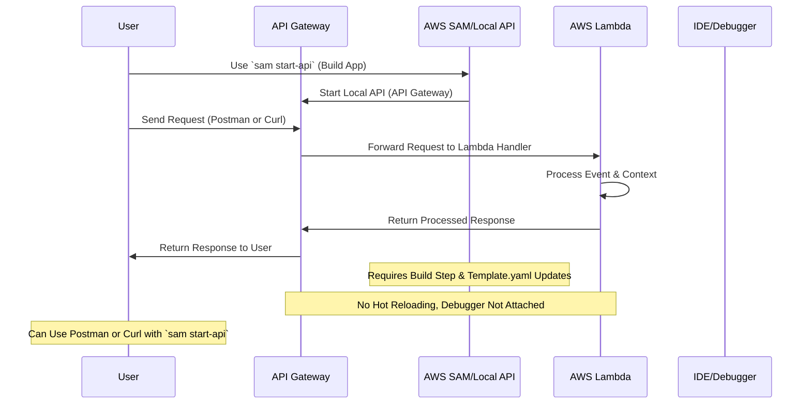
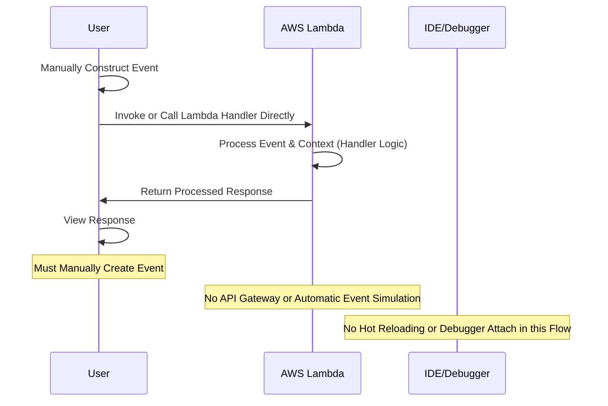
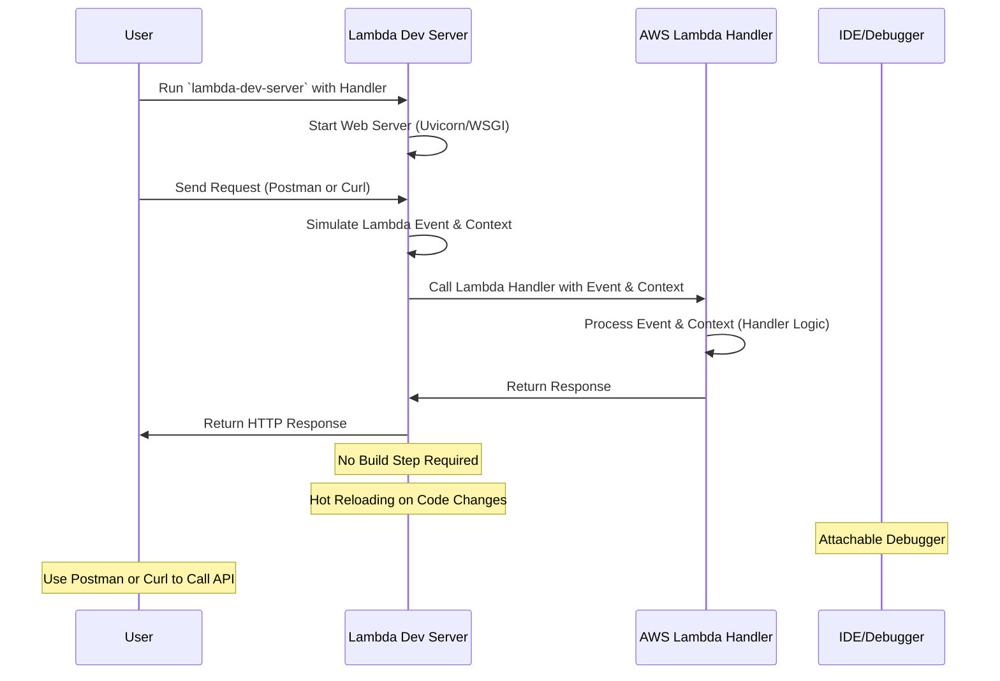

# lambda-dev-server

[](https://pypi.org/project/lambda-dev-server)
[](https://pypi.org/project/lambda-dev-server)

-----

A lightweight development server for AWS Lambda, `lambda-dev-server` emulates the Lambda environment locally by creating events and contexts for any app handler. It processes requests, generates Lambda events, and returns parsed responses—ideal for development and debugging, with hot-reloading for rapid iteration. Not intended for production use. This has been tested with lambdas that use `aws-lambda-powertools` as well with lambdas that return in the shape of `{"statusCode": 200, "body": "Hello World"}`.

## Table of Contents

- [lambda-dev-server](#lambda-dev-server)
  - [Table of Contents](#table-of-contents)
  - [Installation](#installation)
  - [Usage](#usage)
  - [Debugging](#debugging)
  - [1. Traditional Development Flow (Without `lambda-dev-server`)](#1-traditional-development-flow-without-lambda-dev-server)
    - [Drawbacks:](#drawbacks)
  - [2. Invoke/Direct Handler Call Flow (Without `lambda-dev-server`)](#2-invokedirect-handler-call-flow-without-lambda-dev-server)
    - [Drawbacks:](#drawbacks-1)
  - [3. Improved Flow with `lambda-dev-server`](#3-improved-flow-with-lambda-dev-server)
    - [Benefits:](#benefits)
  - [Conclusion](#conclusion)
  - [License](#license)

## Installation

To install `lambda-dev-server`, use pip:

```sh
pip install lambda-dev-server
```

## Usage

```bash
# Given a Lambda handler named handler in app.py
lambda-dev-server app.handler
```

## Debugging

You can configure your debugger in Visual Studio Code (VSCode) with the following `launch.json` configuration:

```json
{
  "version": "0.2.0",
  "configurations": [
    {
      "name": "Python Debugger: Module",
      "type": "debugpy",
      "request": "launch",
      "module": "lambda_dev_server",
      "args": ["app.handler"]
    }
  ]
}
```

## 1. Traditional Development Flow (Without `lambda-dev-server`)

This diagram illustrates the development flow when using `sam start-api` or manually invoking the Lambda handler. While `sam start-api` allows using tools like Postman or curl.



### Drawbacks:
- **Manual event preparation**: When calling the Lambda handler directly via `invoke`, users must manually create events.
- **Requires `sam start-api`**: Using `sam start-api` requires building the application and maintaining a `template.yaml` file.
- **No hot reloading**: Code changes require restarting the local API, making iteration slower.
- **No debugger attachment**: Debugging during development is more complex.

---

## 2. Invoke/Direct Handler Call Flow (Without `lambda-dev-server`)

This flow demonstrates the manual process involved when invoking or calling the Lambda handler directly. Users must manually construct the event before sending it to the Lambda function.



### Drawbacks:
- **Manual event construction**: The user has to manually create the event, which is error-prone and cumbersome.
- **No API Gateway**: The flow lacks the built-in API Gateway to handle routing and automatic event creation.
- **No hot reloading or debugger**: Users cannot easily attach a debugger or take advantage of hot reloading in this flow.

---

## 3. Improved Flow with `lambda-dev-server`

This flow illustrates the seamless experience provided by `lambda-dev-server`. With no build steps, hot reloading, and easy event simulation, development becomes faster and easier.



### Benefits:
- **No build step**: Directly run the Lambda handler through a web server, bypassing the need to build the application.
- **Hot-reloading**: Changes to the code are reflected immediately, speeding up the development process.
- **Debugger attachment**: Easily attach a debugger to the running server for troubleshooting.
- **Automatic event simulation**: The server handles event creation and Lambda context simulation, saving time.
- **Seamless interaction**: Use tools like Postman or curl to test the handler just like a regular REST API.

---

## Conclusion

`lambda-dev-server` significantly improves the AWS Lambda development experience by allowing you to:
- Avoid the need for build steps and maintaining `template.yaml`.
- Use Postman or curl just like in regular REST API development.
- Enjoy hot reloading and easy debugging for rapid iteration.


## License

`lambda-dev-server` is distributed under the terms of the [MIT](https://spdx.org/licenses/MIT.html) license.
