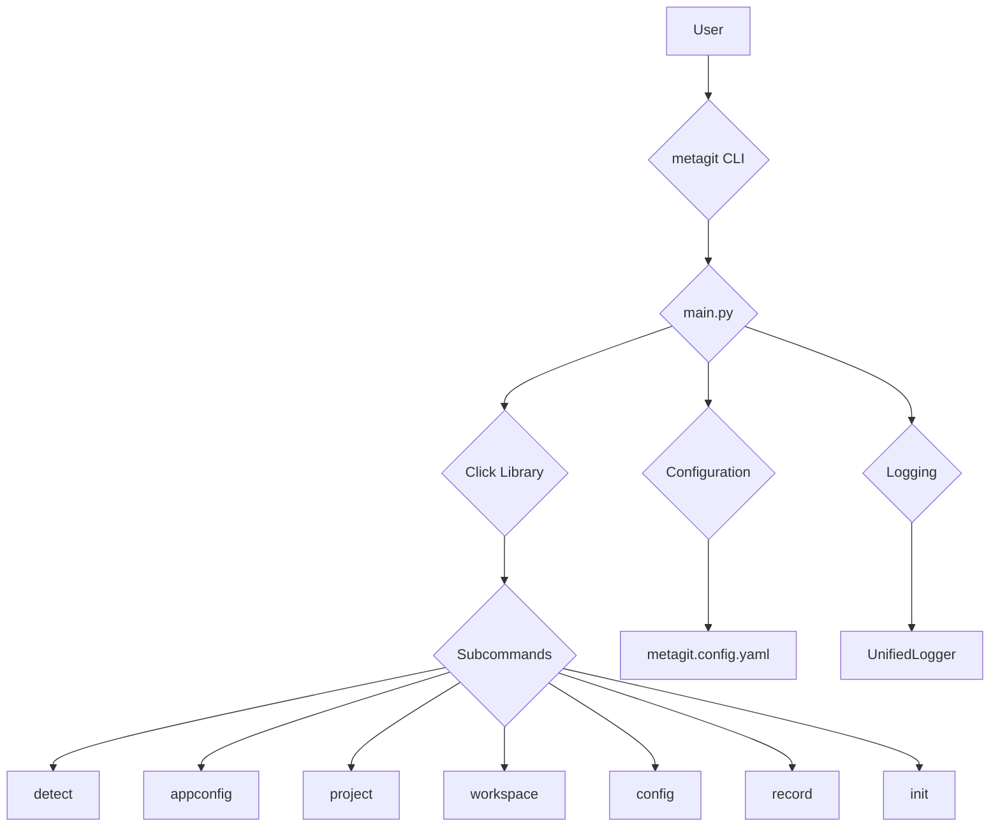

# Metagit CLI Application Logic

This document outlines the architecture and logic of the Metagit CLI application. It includes a Mermaid diagram to visualize the interaction between different components.

## Core Components

The application is built around a few core components:

*   **CLI (Click):** The command-line interface is implemented using the `click` library. The main entry point is in `src/metagit/cli/main.py`, which defines the main `cli` group and subcommands.
*   **Configuration:** The application uses a YAML-based configuration file (`metagit.config.yaml`) to manage settings. The schema for this file is defined in `schemas/metagit_config.schema.json`.
*   **Logging:** A unified logging system is implemented in `src/metagit/core/utils/logging.py` to provide consistent logging across the application.
*   **Subcommands:** The application is organized into several subcommands, each with its own module in `src/metagit/cli/commands`.

## Mermaid Diagram

## Component Interaction

1.  The user interacts with the application through the `metagit` command-line interface.
2.  The `main.py` script is the entry point, which initializes the `click` CLI application.
3.  The `click` library parses the command-line arguments and invokes the appropriate subcommand.
4.  Each subcommand has its own dedicated module that contains the logic for that command.
5.  The application loads its configuration from `metagit.config.yaml`.
6.  Logging is handled by the `UnifiedLogger` class, which provides a consistent logging format.