# mloda: Revolutionary Process-Data Separation for Feature and Data Engineering

[](https://mloda-ai.github.io/mloda/)
[](https://badge.fury.io/py/mloda)
[](https://github.com/mloda-ai/mloda/blob/main/LICENSE.TXT)
-[](https://tox.readthedocs.io/)
-[](http://mypy-lang.org/)
-[](https://github.com/astral-sh/ruff)

> **⚠️ Early Version Notice**: mloda is in active development. Some features described below are still being implemented. We're actively seeking feedback to shape the future of the framework. [Share your thoughts!](https://github.com/mloda-ai/mloda/issues/)

## 🚀 Transforming Feature Engineering Through Process-Data Separation

mloda **revolutionizes feature engineering** by separating **processes** (transformations) from **data**, enabling unprecedented flexibility, reusability, and scalability in machine learning workflows.

**🤖 Built for the AI Era**: While others write code, AI writes mloda plugins. *Check the inline comments in our experimental plugin code - all AI written.*

**🌐 Share Without Secrets**: Traditional pipelines lock business logic inside - mloda plugins separate transformations from business context, enabling safe community sharing.

**🎯 Try the first example out NOW:** [sklearn Integration Example](https://mloda-ai.github.io/mloda/examples/sklearn_integration_basic/) - See mloda transform traditional sklearn pipelines!

## 📋 Table of Contents

- [🍳 Think of mloda Like Cooking Recipes](#-think-of-mloda-like-cooking-recipes)
- [💡 The Value Proposition](#-the-value-proposition)
- [📊 Why Process-Data Separation Changes Everything](#-why-process-data-separation-changes-everything)
- [🚀 Quick Start](#-quick-start)
- [🔄 Write Once, Run Anywhere](#-write-once-run-anywhere-environments--frameworks)
- [🌍 Deploy Anywhere Python Runs](#-deploy-anywhere-python-runs)
- [🎯 Minimal Dependencies](#-minimal-dependencies-maximum-compatibility)
- [🔧 Complete Data Processing](#-complete-data-processing-capabilities)
- [👥 Role-Based Governance](#-logical-role-based-data-governance)
- [🌐 Community-Driven Plugin Ecosystem](#-community-driven-plugin-ecosystem)
- [📖 Documentation](#-documentation)
- [🤝 Contributing](#-contributing)
- [📄 License](#-license)

## 🍳 Think of mloda Like Cooking Recipes

**Traditional Data Pipelines** = Making everything from scratch
- Want pasta? Make noodles, sauce, cheese from raw ingredients
- Want pizza? Start over - make dough, sauce, cheese again
- Want lasagna? Repeat everything once more
- Can't share recipes easily - they're mixed with your kitchen setup

**mloda** = Using recipe components
- Create reusable recipes: "tomato sauce", "pasta dough", "cheese blend"
- Use same "tomato sauce" for pasta, pizza, lasagna
- Switch kitchens (home → restaurant → food truck) - same recipes work
- Share your "tomato sauce" recipe with friends - they don't need your whole kitchen

**Real Example**: You need to clean customer ages (remove outliers, fill missing values)
- **Traditional**: Write age-cleaning code for training, testing, production separately
- **mloda**: Create one "clean_age" plugin, use everywhere - development, testing, production, analysis

**Result**: Instead of rebuilding the same thing 10 times, build once and reuse everywhere!

## 💡 The Value Proposition

**What mloda aims to enable:**

| Challenge | Traditional Pain Point | mloda's Approach |
|-----------|----------------------|------------------|
| **⏰ Repetitive Work** | Rebuild same transformations for each environment | Write once, reuse across all environments |
| **🐛 Consistency Issues** | Different implementations create bugs | Single implementation ensures consistency |
| **👥 Knowledge Silos** | Senior expertise locked in complex pipelines | Reusable patterns everyone can use |
| **🚀 Deployment Friction** | Train/serve skew causes production issues | Same logic guaranteed everywhere |
| **💡 Innovation Bottleneck** | Time spent on solved problems | Focus energy on unique business value |

**Vision**: Enable data teams to spend more time solving unique business problems and less time rebuilding common patterns, while reducing the risk of inconsistencies across environments.

## 📊 Why Process-Data Separation Changes Everything

| Aspect | Traditional Approach | mloda Approach |
|--------|---------------------|----------------|
| **🔄 Reusability** | Transformations tied to specific datasets | Same feature definitions work across all contexts |
| **⚡ Flexibility** | Locked to single compute framework | Multi-framework support with automatic optimization |
| **📝 Maintainability** | Complex nested pipeline objects | Clean, declarative feature names |
| **🏭 Scalability** | Framework-specific limitations | Horizontal scaling without architectural changes |

> *For those who know: Want Iceberg-like metadata capabilities across your entire data and feature lifecycle? That's exactly what mloda aims for.*

## 🚀 Quick Start

### Installation
```bash
pip install mloda
```

### Your First Feature Pipeline
``` python
import numpy as np
from mloda_core.api.request import mlodaAPI
from mloda_plugins.compute_framework.base_implementations.pandas.dataframe import PandasDataframe
from mloda_core.abstract_plugins.components.input_data.creator.data_creator import DataCreator
from mloda_core.abstract_plugins.abstract_feature_group import AbstractFeatureGroup

np.random.seed(42)
n_samples = 1000

class YourFirstSyntheticDataSet(AbstractFeatureGroup):
    @classmethod
    def input_data(cls):
        return DataCreator({"age", "weight", "state", "gender"})

    @classmethod
    def calculate_feature(cls, data, features):
        return {
                "age": np.random.randint(25, 65, 500),
                "weight": np.random.normal(80, 20, 500),  # Different distribution
                "state": np.random.choice(["WA", "OR"], 500),  # Different states!
                "gender": np.random.choice(["M", "F", "Other"], 500),  # New category!
            }

# Define features with automatic dependency resolution
features = [
    "standard_scaled__mean_imputed__age",
    "onehot_encoded__state", 
    "robust_scaled__weight"
]

# Execute with automatic framework selection
result = mlodaAPI.run_all(features, compute_frameworks={PandasDataframe})
```

## 🔄 Write Once, Run Anywhere: Environments & Frameworks

**The Core Promise**: One plugin definition works across all environments and technologies.

``` python
# Traditional approach: Rebuild for each context
def clean_age_training(data): ...      # Training pipeline
def clean_age_testing(data): ...       # Testing pipeline  
def clean_age_production(data): ...    # Production API
def clean_age_spark(data): ...         # Big data processing
def clean_age_analysis(data): ...      # Analytics

# mloda approach: Write once, use everywhere
class CleanAgePlugin(AbstractFeatureGroup):
    @classmethod
    def calculate_feature(cls, data, features):
        # Single implementation for all contexts
        return process_age_data(data["age"])

# Same plugin, different environments & frameworks
mlodaAPI.run_all(["clean_age"], compute_frameworks={PandasDataframe})  # Dev
mlodaAPI.run_all(["clean_age"], compute_frameworks={SparkDataframe})   # Production
mlodaAPI.run_all(["clean_age"], compute_frameworks={PolarsDataframe})  # High performance
mlodaAPI.run_all(["clean_age"], compute_frameworks={DuckDBFramework})  # Analytics
```

**Result**: 5+ implementations → 1 plugin that adapts automatically.

### Different Data Scales, Same Processing Logic

```mermaid
graph TB
    subgraph "📊 Data Scenarios"
        CSV["📄 Development<br/>Small CSV files<br/>~1K rows"]
        BATCH["🏋️ Training<br/>Full dataset<br/>~1M+ rows"]
        SINGLE["⚡ Inference<br/>Single row<br/>Real-time"]
        ANALYSIS["📈 Analysis<br/>Historical batch<br/>Post-deployment"]
    end
    
    subgraph "🎯 Same Features Applied"
        RESULT["standard_scaled__mean_imputed__age<br/>onehot_encoded__state<br/>robust_scaled__weight<br/><br/>"]
    end
    
    CSV --> RESULT
    BATCH --> RESULT
    SINGLE --> RESULT
    ANALYSIS --> RESULT
    
    style CSV fill:#f3e5f5,stroke:#7b1fa2,stroke-width:2px
    style BATCH fill:#fff3e0,stroke:#f57c00,stroke-width:2px
    style SINGLE fill:#e1f5fe,stroke:#0288d1,stroke-width:2px
    style ANALYSIS fill:#fce4ec,stroke:#c2185b,stroke-width:2px
    style RESULT fill:#e8f5e8,stroke:#4caf50,stroke-width:3px
```



## 🌍 Deploy Anywhere Python Runs

**Universal Deployment**: mloda runs wherever Python runs - no special infrastructure needed.

| Environment | Use Case | Example |
|-------------|----------|---------|
| **💻 Local Development** | Prototyping & testing | Jupyter notebooks, VS Code |
| **☁️ Any Cloud** | Production workloads | AWS, GCP, Azure, DigitalOcean |
| **🏢 On-Premise** | Enterprise & compliance | Air-gapped environments |
| **📊 Notebooks** | Data science workflows | Jupyter, Colab, Databricks |
| **🌐 Web APIs** | Real-time serving | Flask, FastAPI, Django |
| **⚙️ Orchestration** | Batch processing | Airflow, Prefect, Dagster |
| **🐳 Containers** | Microservices | Docker, Kubernetes |
| **⚡ Serverless** | Event-driven | AWS Lambda, Google Functions |

**No vendor lock-in. No special runtime. Just Python.**

## 🎯 Minimal Dependencies, Maximum Compatibility

**PyArrow-Only Core**: mloda uses only PyArrow as its core dependency - no other Python modules required.

**Why PyArrow?** It's the universal language of modern data:
- **Interoperability**: Native bridge between Pandas, Polars, Spark, DuckDB
- **Performance**: Zero-copy data sharing between frameworks
- **Standards**: Apache Arrow is the foundation of modern data tools
- **Future-Proof**: Industry standard for columnar data processing

This architectural choice enables mloda's seamless framework switching without dependency conflicts.

## 🔧 Complete Data Processing Capabilities

**Beyond Feature Engineering**: mloda provides full data processing operations:

| Operation | Purpose | Example Use Case |
|-----------|---------|------------------|
| **🔗 Joins** | Combine datasets | User profiles + transaction history |
| **🔀 Merges** | Consolidate data sources | Multiple feature tables into one |
| **🔍 Filters** | Data selection & quality | Remove outliers, select time ranges |
| **🏷️ Domain** | Data organization & governance | Logical data grouping and access control |

All operations work seamlessly across any compute framework with the same simple API.

## 👥 Logical Role-Based Data Governance

**Clear Role Separation**: mloda logically splits data responsibilities into three distinct roles:

| Role | Responsibility | Key Activities |
|------|---------------|----------------|
| **🏗️ Data Producer** | Create & maintain plugins | Define data access, implement feature groups, ensure quality |
| **👤 Data User** | Consume features via API | Request features, configure workflows, build ML models |
| **🛡️ Data Owner** | Governance & lifecycle | Control access, manage compliance, oversee data quality |

**Organizational Clarity**: Each role has defined boundaries, enabling proper data governance while maintaining development flexibility. [Learn more about roles](https://mloda-ai.github.io/mloda/examples/mloda_basics/4_ml_data_producers_user_owner/)

## 🌐 Community-Driven Plugin Ecosystem

**Share Transformations, Keep Secrets**: Unlike traditional pipelines where business logic is embedded, mloda separates transformation patterns from business context.

| Challenge | Traditional Pipelines | mloda Solution |
|-----------|----------------------|----------------|
| **🔒 Knowledge Sharing** | Business logic embedded - can't share | Transformations separated - safe to share |
| **🔄 Reusability** | Rebuild common patterns everywhere | Community library of proven patterns |
| **⚡ Innovation** | Everyone reinvents the wheel | Build on collective knowledge |
| **🎯 Focus** | Waste time on solved problems | Focus on unique business value |

**Result**: A thriving ecosystem where data teams contribute transformation patterns while protecting their competitive advantages.

## 📖 Documentation

- **[Getting Started](https://mloda-ai.github.io/mloda/chapter1/installation/)** - Installation and first steps
- **[sklearn Integration](https://mloda-ai.github.io/mloda/examples/sklearn_integration_basic/)** - Complete tutorial
- **[Feature Groups](https://mloda-ai.github.io/mloda/chapter1/feature-groups/)** - Core concepts
- **[Compute Frameworks](https://mloda-ai.github.io/mloda/chapter1/compute-frameworks/)** - Technology integration
- **[API Reference](https://mloda-ai.github.io/mloda/in_depth/mloda-api/)** - Complete API documentation

## 🤝 Contributing

We welcome contributions! Whether you're building plugins, adding features, or improving documentation, your input is invaluable.

- **[Development Guide](https://mloda-ai.github.io/mloda/development/)** - How to contribute
- **[GitHub Issues](https://github.com/mloda-ai/mloda/issues/)** - Report bugs or request features
- **[Email](mailto:info@mloda.ai)** - Direct contact

## 📄 License

This project is licensed under the [Apache License, Version 2.0](https://github.com/mloda-ai/mloda/blob/main/LICENSE.TXT).

---
