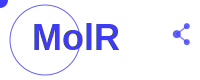

# MolR - Molecular Realm for Spatial Indexed Structures

A high-performance Python package that creates a spatial realm for molecular structures, providing lightning-fast neighbor searches, geometric queries, and spatial operations through integrated KDTree indexing.



## Features

### 🚀 **High-Performance Structure Representation**
- **NumPy-based Structure class** with Structure of Arrays (SoA)
- **Efficient spatial indexing** with scipy KDTree integration for O(log n) neighbor queries
- **Memory-efficient trajectory handling** with StructureEnsemble
- **Lazy initialization** of optional annotations to minimize memory usage

### 🔗 **Comprehensive Bond Detection**
- **Hierarchical bond detection** with multiple providers:
  - File-based bonds from PDB CONECT records and mmCIF data
  - Template-based detection using standard residue topologies
  - Chemical Component Dictionary (CCD) lookup for ligands
  - Distance-based detection with Van der Waals radii
- **Intelligent fallback system** ensures complete bond coverage
- **Partial processing support** for incremental bond detection

### 🎯 **Powerful Selection Language**
- **MDAnalysis/VMD-inspired syntax** for complex atom queries
- **Spatial selections** with `within`, `around`, and center-of-geometry queries
- **Boolean operations** (and, or, not) for combining selections
- **Residue-based selections** with `byres` modifier

### 📁 **Multi-Format I/O Support**
- **PDB format** with multi-model support and CONECT record parsing
- **mmCIF format** with chemical bond information extraction
- **Auto-detection** of single structures vs. trajectories
- **String-based parsing** for in-memory structure creation

## Installation

```bash
pip install molr
```

For development installation:
```bash
git clone https://github.com/abhishektiwari/molr.git
cd molr
pip install -e .[dev]
```

## Quick Start

### Basic Structure Loading and Analysis

```python
import molr

# Load structure from PDB file
structure = molr.Structure.from_pdb("protein.pdb")
print(f"Loaded {structure.n_atoms} atoms")

# Detect bonds automatically
bonds = structure.detect_bonds()
print(f"Detected {len(bonds)} bonds")

# Use selection language
ca_atoms = structure.select("name CA")
active_site = structure.select("within 5.0 of (resname HIS)")
protein_backbone = structure.select("protein and backbone")
```

### Spatial Queries and Neighbor Finding

```python
# Fast spatial queries with built-in KDTree indexing
neighbors = structure.get_neighbors_within(atom_idx=100, radius=5.0)
atoms_in_sphere = structure.get_atoms_within_sphere([10, 15, 20], radius=8.0)

# Center of geometry-based selections
ligand = structure.select("resname LIG")
nearby = structure.get_atoms_within_cog_sphere(ligand, radius=10.0)

# Inter-selection contacts
protein = structure.select("protein")
contacts = structure.get_atoms_between_selections(protein, ligand, max_distance=4.0)
```

### Bond Detection and Analysis

```python
from molr import BondDetector

# Configure bond detection
detector = BondDetector(
    enable_residue_templates=True,
    enable_ccd_lookup=True,
    enable_distance_detection=True,
    vdw_factor=0.75
)

# Detect bonds with detailed statistics
bonds, stats = detector.detect_bonds_with_stats(structure)
print(f"Bond detection stats: {stats}")

# Access different bond sources
file_bonds = structure.file_bonds  # From PDB CONECT records
all_bonds = structure.bonds        # Complete bond set
```

### Multi-Model Trajectories

```python
# Load trajectory from multi-model PDB
ensemble = molr.StructureEnsemble.from_pdb("trajectory.pdb")
print(f"Loaded {ensemble.n_models} models with {ensemble.n_atoms} atoms each")

# Access individual frames
first_frame = ensemble[0]  # Returns Structure object
last_frame = ensemble[-1]

# Analyze trajectory
centers = [model.get_center() for model in ensemble]
```

## Advanced Usage

### Custom Bond Detection

```python
from molr.bond_detection import (
    ResidueBondProvider,
    CCDBondProvider, 
    DistanceBondProvider
)

# Create custom detection pipeline
providers = [
    ResidueBondProvider(),      # Standard residues first
    CCDBondProvider(),          # CCD lookup for ligands  
    DistanceBondProvider(vdw_factor=0.8)  # Distance fallback
]

# Apply in sequence
final_bonds = BondList()
for provider in providers:
    if provider.is_applicable(structure):
        bonds = provider.detect_bonds(structure, existing_bonds=final_bonds)
        final_bonds.extend(bonds)
```

### Structure Manipulation

```python
# Subset structures
protein_only = structure[structure.select("protein")]
chain_a = structure[structure.chain_id == "A"]

# Coordinate transformations  
structure.translate([10.0, 0.0, 0.0])
structure.center_at_origin()

# Add custom annotations
structure.add_annotation("custom_prop", dtype=np.float32, default_value=1.0)
```

## Performance

- **Spatial indexing**: O(log n) neighbor queries vs O(n²) brute force
- **Memory efficient**: SoA design minimizes memory overhead
- **Vectorized operations**: NumPy-based computations throughout
- **Lazy evaluation**: Optional data loaded only when needed

## API Reference

### Core Classes
- `Structure`: Single molecular structure with spatial indexing
- `StructureEnsemble`: Multi-model trajectory representation  
- `BondList`: Efficient bond storage and manipulation
- `BondDetector`: Configurable hierarchical bond detection

### I/O Parsers
- `PDBParser`: PDB format with CONECT record support
- `mmCIFParser`: mmCIF format with bond information

### Selection System
- `select()`: Parse and evaluate selection expressions
- Spatial expressions: `within`, `around`, `cog`
- Boolean operators: `and`, `or`, `not`

## Requirements

- Python ≥3.8
- NumPy ≥1.20.0
- SciPy ≥1.7.0 (for spatial indexing)
- pyparsing ≥3.0.0 (for selection language)

## License

MIT License - see LICENSE file for details.

## Contributing

Contributions welcome! Please see CONTRIBUTING.md for guidelines. 