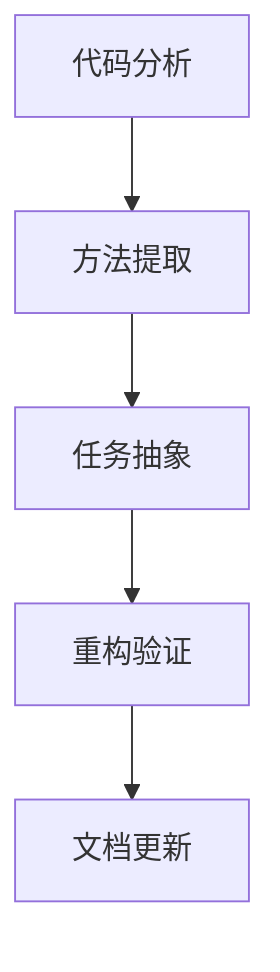

# MX-RMQ消息队列代码重构需求文档

## 1. 产品概述

本项目旨在重构MX-RMQ消息队列系统中`queue.py`文件的重复代码，主要针对`start_dispatch_consuming()`和`_run_background_services()`方法存在的大量代码重复问题。

通过采用职责分离的设计模式，提取公共方法并优化代码结构，将代码重复率从约80%降低到接近0%，显著提升代码的可维护性、可测试性和可读性。

## 2. 核心功能

### 2.1 用户角色

| 角色 | 使用方式 | 核心权限 |
|------|----------|----------|
| 开发者 | 直接调用API | 可以使用重构后的消息队列接口，享受更清晰的代码结构 |
| 系统管理员 | 部署和监控 | 可以更容易地理解和维护系统代码 |

### 2.2 功能模块

我们的重构需求包含以下主要功能模块：

1. **代码重构页面**：核心重构逻辑实现，包括方法提取和职责分离
2. **测试验证页面**：确保重构后功能完整性，包括单元测试和集成测试
3. **文档更新页面**：更新相关技术文档和API说明

### 2.3 页面详情

| 页面名称 | 模块名称 | 功能描述 |
|----------|----------|----------|
| 代码重构页面 | 方法提取模块 | 提取`_prepare_for_consuming()`方法，统一处理初始化检查和处理器注册逻辑 |
| 代码重构页面 | 任务管理模块 | 提取`_create_and_run_tasks()`方法，统一创建和管理异步任务 |
| 代码重构页面 | 任务定义模块 | 创建`_get_task_definitions()`方法，抽象任务创建逻辑 |
| 代码重构页面 | 错误处理模块 | 统一异常处理和资源清理逻辑 |
| 测试验证页面 | 单元测试模块 | 验证提取的公共方法功能正确性 |
| 测试验证页面 | 集成测试模块 | 验证重构后整体功能完整性 |
| 文档更新页面 | API文档模块 | 更新方法签名和使用说明 |

## 3. 核心流程

重构流程主要包括以下步骤：

1. **代码分析**：分析现有重复代码，识别可提取的公共逻辑
2. **方法提取**：按照方案1提取`_prepare_for_consuming()`和`_create_and_run_tasks()`方法
3. **任务抽象**：实现任务定义抽象，提高代码复用性
4. **重构验证**：通过测试确保重构后功能完整性
5. **文档更新**：更新相关技术文档

## 4. 用户界面设计

### 4.1 设计风格

- **主色调**：保持原有代码风格，使用标准Python代码格式
- **代码风格**：遵循PEP 8规范，使用清晰的方法命名
- **注释风格**：使用中文注释，保持与现有代码一致
- **结构风格**：采用模块化设计，职责分离明确
- **错误处理**：统一的异常处理机制

### 4.2 页面设计概览

| 页面名称 | 模块名称 | UI元素 |
|----------|----------|--------|
| 代码重构页面 | 方法提取模块 | 清晰的方法签名，详细的参数说明，统一的返回值处理 |
| 代码重构页面 | 任务管理模块 | 标准化的任务创建流程，统一的任务生命周期管理 |
| 测试验证页面 | 测试模块 | 完整的测试用例覆盖，清晰的测试结果输出 |

### 4.3 响应性

本重构项目主要针对后端代码，不涉及前端界面。重构后的代码将保持与现有API的兼容性，确保平滑迁移。