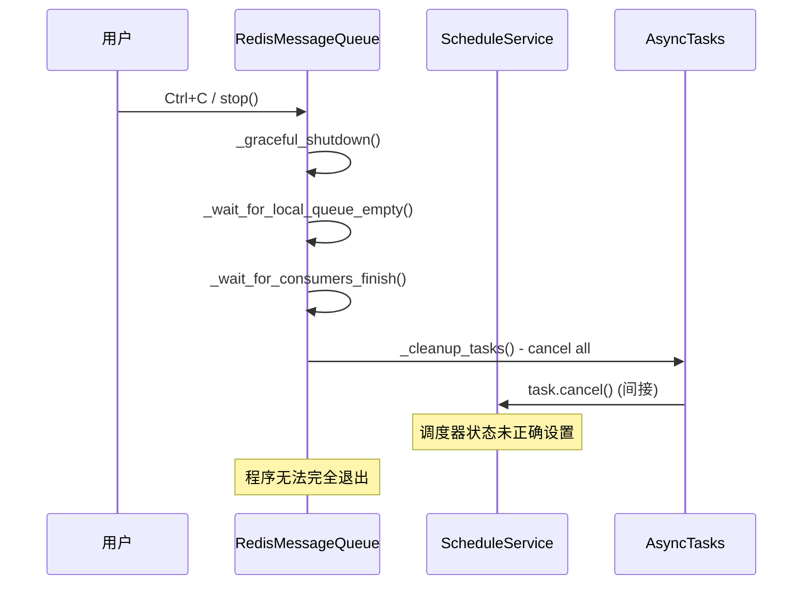
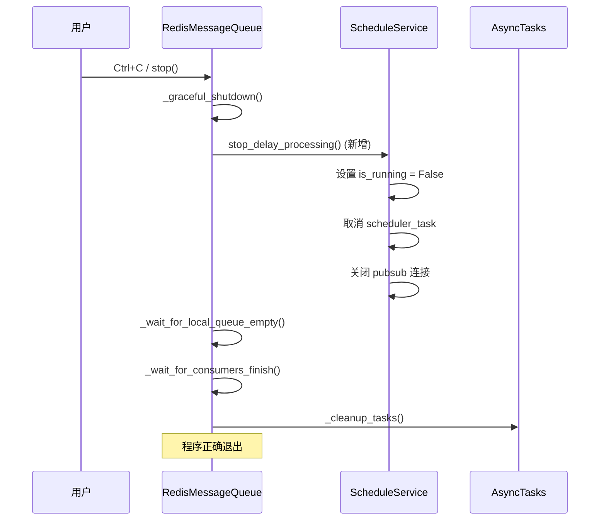
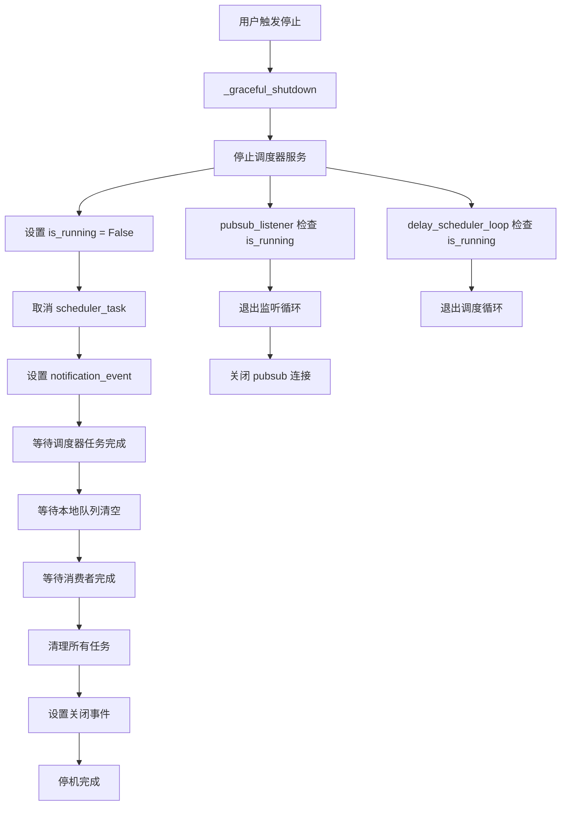

# 技术设计：修复优雅停机流程中调度器停止问题

## 设计概述

本设计旨在修复 `RedisMessageQueue` 优雅停机流程中调度器无法正确停止的问题。核心思路是在 `_graceful_shutdown()` 方法中添加显式的调度器停止逻辑，确保所有相关服务按正确顺序停止。

## 问题分析

### 当前停机流程



### 问题根因

1. **缺少显式调度器停止**：`_graceful_shutdown()` 没有调用 `ScheduleService.stop_delay_processing()`
2. **状态不一致**：调度器的 `is_running` 状态没有被正确设置为 `False`
3. **资源清理不完整**：pubsub 连接等资源可能没有被正确关闭

## 解决方案设计

### 修复后的停机流程



## 详细设计

### 1. 修改 `_graceful_shutdown()` 方法

**文件**: `src/mx_rmq/queue.py`

在 `_graceful_shutdown()` 方法中添加调度器停止逻辑：

```python
async def _graceful_shutdown(self) -> None:
    """优雅停机"""
    if not self._context or self._context.shutting_down:
        return

    self._logger.info("开始优雅停机...")
    self._context.shutting_down = True

    try:
        # 1. 停止调度器服务 (新增)
        self._logger.info("【stop】停止调度器服务...")
        if hasattr(self, '_monitor_service') and self._monitor_service:
            await self._monitor_service.stop_delay_processing()
        
        # 2. 停止接收新消息
        self._logger.info("【stop】停止消息分发...")

        # 3. 等待本地队列消息处理完成
        self._logger.info("【stop】等待本地队列消息处理完成...")
        await self._wait_for_local_queue_empty()

        # 4. 等待所有消费协程完成当前任务
        self._logger.info("【stop】等待活跃消费者完成...")
        await self._wait_for_consumers_finish()

        # 5. 取消所有后台任务
        self._logger.info("【stop】取消后台任务...")
        await self._cleanup_tasks()

        # 6. 设置关闭事件
        self._context.shutdown_event.set()
        self._logger.info("【stop】优雅停机完成")

    except Exception as e:
        self.log_error("【stop】优雅停机过程中出错", e)
```

### 2. 增强 `ScheduleService.stop_delay_processing()` 方法

**文件**: `src/mx_rmq/core/schedule.py`

确保停止方法的健壮性：

```python
async def stop_delay_processing(self) -> None:
    """优雅地停止延时消息处理"""
    if not self.is_running:
        self.context.log_debug("延时任务调度器未在运行")
        return
        
    self.is_running = False
    self.context.log_debug("开始停止延时任务调度器...")

    try:
        # 取消主调度任务
        if self.scheduler_task and not self.scheduler_task.done():
            self.scheduler_task.cancel()
        
        # 设置事件，确保如果调度器正在等待中，能被立即唤醒并检查到 is_running == False
        self.notification_event.set()

        # 等待任务完成取消
        if self.scheduler_task:
            try:
                await asyncio.wait_for(self.scheduler_task, timeout=5.0)  # 添加超时保护
            except (asyncio.CancelledError, asyncio.TimeoutError):
                pass  # 预期内的异常
            except Exception as e:
                self.context.log_error("停止调度器任务时出错", e)

        self.context.log_debug("延时任务调度器已停止")
        
    except Exception as e:
        self.context.log_error("停止延时任务调度器时出错", e)
    finally:
        # 确保状态被重置
        self.scheduler_task = None
```

### 3. 改进 `pubsub_listener()` 停止逻辑

**文件**: `src/mx_rmq/core/schedule.py`

确保 pubsub 连接能够快速响应停止信号：

```python
async def pubsub_listener(self) -> None:
    """监听pubsub通道 - 逻辑已大大简化"""
    retry_delay = 1
    pubsub = None
    consecutive_failures = 0
    max_consecutive_failures = 5
    
    while self.is_running:
        try:
            # 创建新的pubsub连接
            if pubsub is None:
                pubsub = self.context.redis.pubsub()
                channel = self.context.get_global_key(GlobalKeys.DELAY_PUBSUB_CHANNEL)
                await pubsub.subscribe(channel)
                self.context._logger.info(f"开始监听延时任务通知, channel={channel}")
                retry_delay = 1  # 重置重试延迟
                consecutive_failures = 0  # 重置失败计数

            # 添加连接状态检查
            last_ping = asyncio.get_event_loop().time()
            ping_interval = 30  # 30秒ping一次检查连接状态

            async for message in pubsub.listen():
                if not self.is_running:  # 快速响应停止信号
                    break

                # 定期ping检查连接状态
                current_time = asyncio.get_event_loop().time()
                if current_time - last_ping > ping_interval:
                    try:
                        await self.context.redis.ping()
                        last_ping = current_time
                    except Exception as ping_error:
                        self.context.log_error("Redis连接检查失败", ping_error)
                        raise ping_error

                if message["type"] == "message":
                    try:
                        notified_time = int(message["data"])
                        self.context._logger.debug(f"收到延时任务通知: {notified_time}")
                        
                        # --- 核心改变：只设置事件，不处理任何复杂逻辑 ---
                        self.notification_event.set()

                    except Exception as e:
                        self.context.log_error("处理延时通知错误", e)

        except Exception as e:
            consecutive_failures += 1
            self.context.log_error("Pubsub监听器错误", e, consecutive_failures=consecutive_failures)
            
            # 清理损坏的连接
            if pubsub:
                try:
                    await pubsub.close()
                except Exception:
                    pass
                pubsub = None
            
            # 如果系统正在关闭，直接退出
            if not self.is_running:
                break
            
            # 如果连续失败次数过多，增加等待时间
            if consecutive_failures >= max_consecutive_failures:
                retry_delay = min(retry_delay * 2, 60)
                self.context._logger.warning(f"Pubsub连续失败过多，延长重连间隔, consecutive_failures={consecutive_failures}, retry_delay={retry_delay}")
            else:
                # 快速重连
                retry_delay = min(retry_delay * 1.5, 10)
            
            self.context._logger.warning(f"Pubsub连接断开，等待重连, retry_delay={retry_delay}, consecutive_failures={consecutive_failures}")
            
            # 在等待重连时也要检查停止状态
            for _ in range(int(retry_delay * 10)):  # 分成小段检查
                if not self.is_running:
                    break
                await asyncio.sleep(0.1)
    
    # 确保资源清理
    if pubsub:
        try:
            await pubsub.close()
            self.context._logger.info("Pubsub连接已关闭")
        except Exception as e:
            self.context.log_error("关闭Pubsub连接失败", e)
```

### 4. 改进 `delay_scheduler_loop()` 停止响应

**文件**: `src/mx_rmq/core/schedule.py`

确保主调度循环能够快速响应停止信号：

```python
async def delay_scheduler_loop(self) -> None:
    """核心调度循环（状态机）"""
    self.context.log_debug("延时调度主循环已启动")
    
    # 首次启动时，短暂延时后立即触发一次调度检查
    await asyncio.sleep(0.2)
    self.context.log_debug("进程启动，初始化延时任务调度")
    
    while self.is_running:
        try:
            # 在每次循环开始时检查停止状态
            if not self.is_running:
                break
                
            # ... 现有的调度逻辑 ...
            
            # 3. 等待：要么超时，要么被外部事件唤醒
            try:
                # 清除旧信号，准备接收新信号
                self.notification_event.clear()
                # 🔧 关键修复：将毫秒转换为秒数
                wait_seconds = wait_milliseconds / 1000.0 if wait_milliseconds is not None else None
                
                # 如果等待时间过长，分段等待以便快速响应停止信号
                if wait_seconds is None or wait_seconds > 5.0:
                    # 长时间等待时，每5秒检查一次停止状态
                    remaining_time = wait_seconds
                    while self.is_running and (remaining_time is None or remaining_time > 0):
                        check_interval = min(5.0, remaining_time) if remaining_time else 5.0
                        try:
                            await asyncio.wait_for(
                                self.notification_event.wait(), timeout=check_interval
                            )
                            break  # 收到通知，退出等待循环
                        except asyncio.TimeoutError:
                            if remaining_time:
                                remaining_time -= check_interval
                            continue  # 继续等待
                else:
                    # 短时间等待，直接等待
                    await asyncio.wait_for(
                        self.notification_event.wait(), timeout=wait_seconds
                    )
                
                # 如果代码执行到这里，说明是 notification_event 被触发了
                if self.is_running:  # 再次检查状态
                    self.context._logger.debug("收到外部通知，重新评估调度计划...")

            except asyncio.TimeoutError:
                # 如果代码执行到这里，说明是 wait_for 超时了，定时器自然到期
                if self.is_running:  # 检查状态后再处理
                    self.context._logger.debug("定时器到期，开始处理过期任务...")
                    await self.try_process_expired_tasks()
            
        except asyncio.CancelledError:
            self.context._logger.warning("调度主循环被取消，正在退出...")
            break  # 退出循环
        except Exception as e:
            if self.is_running:  # 只有在运行状态下才记录错误
                self.context.log_error("调度主循环发生未知错误，暂停后重试", e)
                await asyncio.sleep(1)
            else:
                break  # 如果已停止，直接退出

    self.context._logger.warning("延时调度主循环已退出")
```

## 数据流图



## 错误处理策略

### 1. 超时保护
- 调度器停止操作添加 5 秒超时
- 整体停机过程保持 30 秒超时
- 超时后强制退出并记录警告

### 2. 异常处理
- 每个停止步骤都有独立的异常处理
- 异常不会阻止后续停止步骤的执行
- 记录详细的错误信息用于调试

### 3. 状态一致性
- 确保 `is_running` 状态在所有情况下都能正确设置
- 使用 `finally` 块确保关键状态重置

## 性能考虑

1. **停机时间**：预期停机时间从无限期缩短到 5-10 秒
2. **资源占用**：停机过程中内存和 CPU 占用保持最低
3. **网络连接**：确保所有 Redis 连接在停机时正确关闭

## 测试策略

### 单元测试
- 测试 `stop_delay_processing()` 方法的各种场景
- 测试 `_graceful_shutdown()` 的修改逻辑
- 模拟各种异常情况的处理

### 集成测试
- 测试完整的停机流程
- 测试信号处理（SIGINT、SIGTERM）
- 测试有延时任务时的停机行为

### 压力测试
- 高负载下的停机测试
- 连续启停测试
- 异常情况下的停机测试

## 向后兼容性

本修复完全向后兼容，不会影响现有的 API 接口和使用方式。所有修改都是内部实现的改进，对外部用户透明。