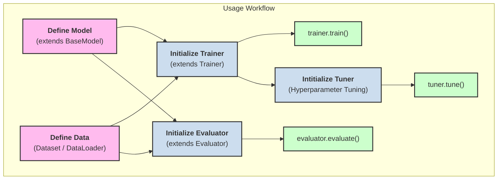

## My Pytorch Toolkit
Userful pytorch toolkit for training models, replacing boilerplate code.
Provides functions for training, modeling and evaluating models.

## Installation
### From PyPI

```bash
pip install my-pytorch-kit
```

### From source
Clone this repo and run `pip install .`.  
Then, you can import the module `my_pytorch_kit`.

## Usage

This package revolves around the `BaseModel`, `Trainer` and `Evaluator` classes, which are extended to model, train and evaluate a model respectively.  


For a **detailed** guide, see the `examples/example.py` file :)


## Development
Clone this repo and run `pip install -e .[dev]`.  
Run pytest in the root directory to run tests.  

