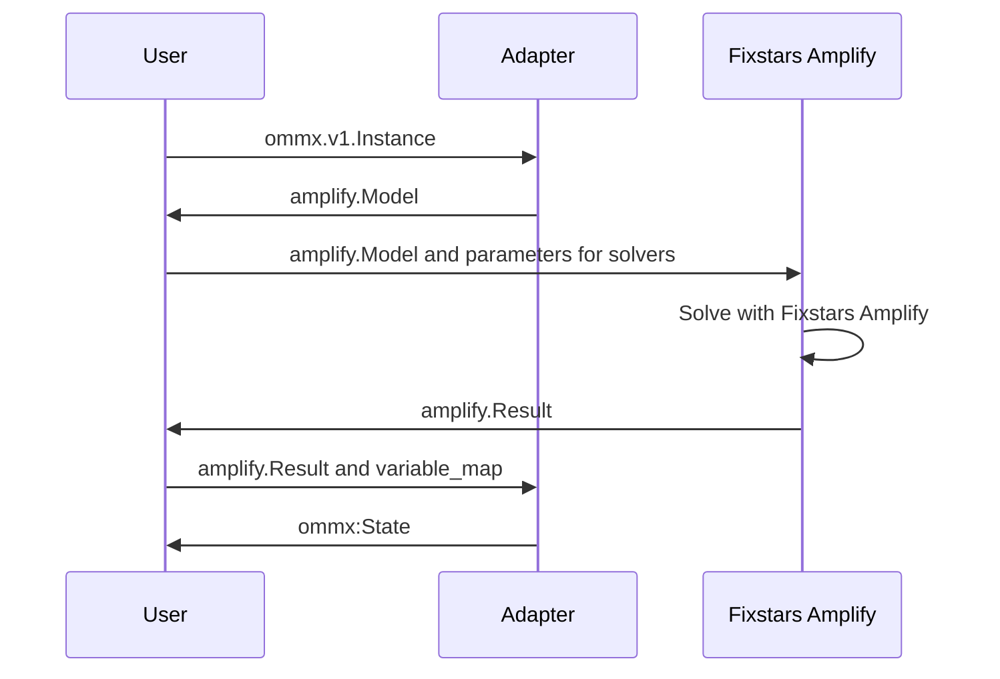
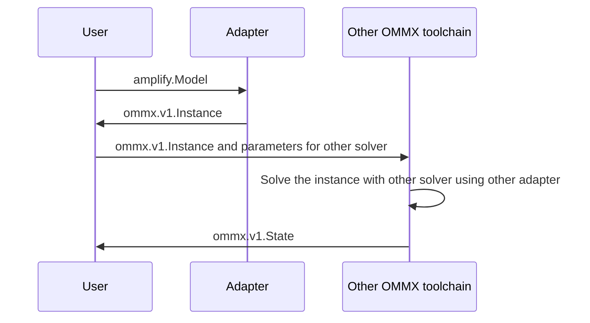

# OMMX adapter for Fixstars Amplify

[](https://pypi.org/project/ommx-fixstars-amplify-adapter/) 
[](https://jij-inc.github.io/ommx-fixstars-amplify-adapter/)


This package provides an adapter for the [Fixstars Amplify SDK](https://amplify.fixstars.com/ja/docs/amplify/v1/index.html) from/to [OMMX](https://github.com/Jij-Inc/ommx).

## How to install

The `ommx-fixstars-amplify-adapter` can be installed from PyPI as follows:

```bash
pip install ommx-fixstars-amplify-adapter
```

## Solve problems formulated in OMMX with Fixstars Amplify

The `ommx-fixstars-amplify-adapter` allows problems formulated in OMMX to be solved in Fixstars Amplify.



For example, the following problem formulated in OMMX can be solved using Fixstars Amplify.

```python
import amplify
from ommx.v1 import Instance, DecisionVariable
from ommx_fixstars_amplify_adapter import OMMXFixstarsAmplifyAdapter

q_0 = DecisionVariable.binary(id=0, name="q_0")
q_1 = DecisionVariable.binary(id=1, name="q_1")

ommx_instance = Instance.from_components(
    decision_variables=[q_0, q_1],
    objective=q_0 * q_1 + q_0 - q_1 + 1,
    constraints=[q_0 + q_1 == 1],
    sense=Instance.MAXIMIZE,
)

token = "***FIXSTARS AMPLIFY TOKEN***"
solution = OMMXFixstarsAmplifyAdapter.solve(ommx_instance, amplify_token=token)
print(solution)
```

## Solve problems formulated in Fixstars Amplify SDK with other solvers

The `ommx-fixstars-amplify-adapter` allows problems formulated in Fixstars Amplify SDK to be solved in other solvers.



For example, the following mixed integer programming problem formulated in Fixstars Amplify SDK can be solved using PythonMIP.

```python
import amplify
from ommx_fixstars_amplify_adapter import model_to_instance
from ommx_python_mip_adapter import OMMXPythonMIPAdapter

UPPER = float("inf")
LOWER = 0.0

gen = amplify.VariableGenerator()
x = gen.scalar("Integer", bounds=(LOWER, UPPER), name="x")
y = gen.scalar("Real", bounds=(LOWER, UPPER), name="y")

model = amplify.Model()
model += -10 * x - y
model += amplify.less_equal(x, 1)
model += amplify.less_equal(20 * x + y, 100)

ommx_instance = model_to_instance(model)
solution = OMMXPythoMIPAdapter.solve(ommx_instance)
print(solution)
```

> [!NOTE]
> Currently, the `model_to_instance` function does not support Ising variables. Therefore, if your model contains Ising variables, you must convert them to binary variables. The following function can be used for this conversion.
> ```python
> import typing
> import amplify
> 
> def ising_to_binary(
>     model: amplify.Model
> ) -> typing.Tuple[amplify.Model, amplify.Result.ModelConversion.IntermediateMapping]:
>     ising_to_binary_settings = {
>         amplify.VariableType.Binary: amplify.Degree.HighOrder,
>         amplify.VariableType.Ising: amplify.Degree.Zero,
>         amplify.VariableType.Integer: amplify.Degree.HighOrder,
>         amplify.VariableType.Real: amplify.Degree.HighOrder,
>     }
>     return model.to_intermediate_model(
>         amplify.AcceptableDegrees(
>             objective=ising_to_binary_settings,  # type: ignore
>             equality_constraints=ising_to_binary_settings,  # type: ignore
>             inequality_constraints=ising_to_binary_settings,  # type: ignore
>         )
>     )
> ```

## For Developer

The packages required for development can be installed as follows:

```bash
pip install ".[dev]"
```

Use the following commands to test, lint and format.

```bash
python -m pytest
python -m ruff check
python -m ruff format
```
