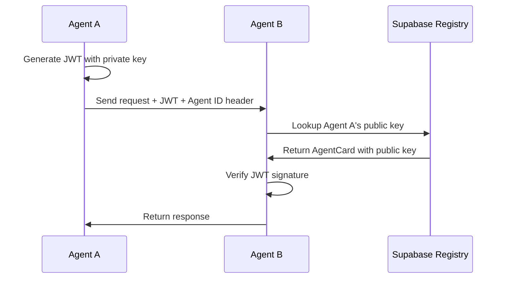

<div align="center">
  

  # Phlow

  **JWT authentication middleware for AI agents with Supabase integration**
</div>

<div align="center">

[](https://pypi.org/project/phlow/)
[](https://opensource.org/licenses/MIT)

</div>

## 🎯 What is Phlow?

Phlow is authentication middleware for AI agents that's evolving into the **Agent Marketplace Platform** - enabling agents to discover, authenticate, and monetize their capabilities.

**Current: A2A Protocol + Supabase • JWT Auth • Middleware**
**Vision: The "App Store for AI Agents"**

### 🌟 Our Evolution Path

```
Phase 1: Authentication Middleware (Current)
   ↓
Phase 2: Agent Discovery & Registry
   ↓
Phase 3: Agent Marketplace Platform
```

We're building the foundational trust layer that will enable agents to securely discover, interact with, and monetize their capabilities - creating the first true marketplace for AI agent services.

## ⚡ Quick Start

```bash
pip install phlow
```

### Python Example

```python
from phlow import PhlowMiddleware, AgentCard, PhlowConfig

config = PhlowConfig(
    agent_card=AgentCard(
        name="My Agent",
        description="Agent description",
        service_url="https://my-agent.com",
        skills=["chat", "analysis"],
        metadata={"agent_id": "my-agent-id", "public_key": "public-key-here"}
    ),
    private_key=os.environ["PRIVATE_KEY"],
    supabase_url=os.environ["SUPABASE_URL"],
    supabase_anon_key=os.environ["SUPABASE_ANON_KEY"]
)

phlow = PhlowMiddleware(config)
```

### FastAPI Middleware

```python
# Use A2A authentication with Supabase features
@app.post("/api/chat")
async def chat_endpoint(context: PhlowContext = Depends(auth_required)):
    # Access agent info and Supabase client
    agent = context.agent
    return {"message": f"Hello from {agent.name}"}
```

[Full Setup Guide →](docs/getting-started.md)

## 🚀 Features

- **🔐 JWT Authentication** - Verify A2A Protocol JWT tokens
- **📋 Agent Storage** - Store and retrieve agent cards in Supabase
- **🛡️ RLS Helpers** - Generate basic Supabase Row Level Security policies
- **📊 Basic Audit** - Log authentication events to Supabase
- **🌐 Python Package** - Pure Python implementation
- **🔧 FastAPI Integration** - Complete middleware with dependency injection


## How It Works



## 📦 What's Included

```
phlow/
├── src/phlow/              # Python authentication library
├── tests/                  # Test suite
├── examples/               # Example implementations
└── docs/                   # Documentation
    ├── getting-started.md      # Quick setup guide
    ├── a2a-compatibility.md    # A2A Protocol integration
    └── api-reference.md        # API documentation
```

## 🏗️ How It Works

Phlow is a lightweight middleware that connects A2A Protocol JWT authentication with Supabase storage:

1. **JWT Verification** - Validates A2A Protocol tokens
2. **Agent Lookup** - Retrieves agent cards from Supabase
3. **Context Creation** - Provides agent info and Supabase client to your app
4. **Basic Logging** - Optionally logs auth events

See [Getting Started](docs/getting-started.md) for setup instructions.


## 🔧 Setup

1. **Install**: `pip install phlow`
2. **Configure**: Set up Supabase project and environment variables
3. **Initialize**: Register your agent card in Supabase
4. **Authenticate**: Add Phlow middleware to your A2A agent

[Detailed Setup Instructions →](docs/getting-started.md)

## 💡 Example: A2A Agent with Phlow Auth

```python
# A2A + Phlow Integration
from phlow import PhlowMiddleware, AgentCard, PhlowConfig

config = PhlowConfig(
    agent_card=AgentCard(
        name="My Agent",
        description="A2A-compatible agent",
        service_url="https://my-agent.com",
        skills=["chat", "analysis"],
        metadata={"agent_id": "my-agent-id", "public_key": "public-key-here"}
    ),
    private_key=os.environ["PRIVATE_KEY"],
    supabase_url=os.environ["SUPABASE_URL"],
    supabase_anon_key=os.environ["SUPABASE_ANON_KEY"]
)

phlow = PhlowMiddleware(config)

# Use with FastAPI
from phlow.integrations.fastapi import create_phlow_dependency
auth_required = create_phlow_dependency(phlow)

@app.post("/api/a2a/message")
async def handle_message(context: PhlowContext = Depends(auth_required)):
    # Process A2A message using phlow context
    return {"status": "received"}
```

## 📚 Documentation

- **[Getting Started](docs/getting-started.md)** - Quick setup guide
- **[A2A Compatibility](docs/a2a-compatibility.md)** - A2A Protocol integration
- **[API Reference](docs/api-reference.md)** - Complete API docs

## 🌐 Language Support

| Language | Package | Framework Support |
|----------|---------|------------------|
| Python | `phlow` | FastAPI |

## 🚀 Roadmap & Vision

### Phase 1: Authentication Middleware (Current)
- ✅ JWT authentication for A2A Protocol
- ✅ Agent card storage in Supabase
- ✅ Basic middleware for FastAPI
- 🔄 Enhanced security and testing

### Phase 2: Agent Discovery & Registry (Next 6 months)
- 🎯 Central agent registry with search capabilities
- 🎯 Agent capability matching and discovery
- 🎯 Enhanced agent profiles and metadata
- 🎯 Agent network visualization

### Phase 3: Agent Marketplace Platform (6-18 months)
- 🎯 Agent monetization and billing
- 🎯 Usage analytics and performance metrics
- 🎯 Agent rating and reputation systems
- 🎯 Developer tools and SDK ecosystem

**Our North Star**: Create the first true marketplace where AI agents can discover, authenticate, and monetize their capabilities - making agent-to-agent commerce as simple as an API call.

## Contributing

Pull requests welcome! We're building towards our marketplace vision:

**Current Focus Areas:**
- Authentication middleware improvements
- Supabase integration enhancements
- Agent registry and discovery features
- Developer experience improvements

**Future Contribution Areas:**
- Agent marketplace features
- Monetization and billing systems
- Analytics and metrics
- Community tools and governance

**Scope**: Please keep contributions focused on authentication, agent registry, discovery, and marketplace features. Communication protocols should be contributed to the [A2A Protocol](https://github.com/a2aproject) directly.

### Quick Start
```bash
# Install dependencies
uv sync --dev

# Run all quality checks
uv run task quality

# Run tests
uv run task test

# Run E2E tests (requires Docker)
uv run task test-e2e
```

### Development Commands
```bash
uv sync --dev              # Install all dependencies
uv run task test           # Run all tests with coverage
uv run task test-unit      # Run unit tests only
uv run task test-e2e       # Run end-to-end tests (Docker required)
uv run task lint           # Run linting with auto-fix
uv run task format         # Format code
uv run task type-check     # Run type checking
uv run task quality        # Run all quality checks
uv run task build          # Build distribution packages
uv run task clean          # Clean build artifacts
```

### Testing
- **Unit Tests**: `uv run task test-unit` - Fast, mocked, runs in CI
- **E2E Tests**: `uv run task test-e2e` - Full stack, Docker required

## License

MIT License - see [LICENSE](LICENSE) file for details.

---

**Built with ❤️ for the A2A ecosystem**

[Get Started](docs/getting-started.md) | [A2A Compatibility](docs/a2a-compatibility.md) | [API Reference](docs/api-reference.md)
