<div align="center>

# 🚀 ServiceNow MCP Server - AI-Powered Data Export Tool

[](https://www.python.org/)
[](https://modelcontextprotocol.io/)
[](https://www.servicenow.com/)
[](https://opensource.org/licenses/MIT)
[]()

**🎯 Transform ServiceNow data access with natural language commands**

*Export ServiceNow table data effortlessly using voice commands and AI - no complex APIs needed!*

[🚀 Quick Start](#-quick-start) • [📖 Documentation](#-documentation) • [💡 Examples](#-usage-examples) • [🤝 Contributing](#-contributing)

---

</div>

## 📋 Table of Contents

- [🌟 Overview](#-overview)
- [✨ Key Features](#-key-features)
- [🏗️ Architecture](#️-architecture)
- [⚡ Quick Start](#-quick-start)
- [🔧 Installation](#-installation)
- [⚙️ Configuration](#️-configuration)
- [💡 Usage Examples](#-usage-examples)
- [🎛️ Available Tools](#️-available-tools)
- [📊 Supported Formats](#-supported-formats)
- [🗺️ Table Mappings](#-table-mappings)
- [🔒 Authentication](#-authentication)
- [🐛 Troubleshooting](#-troubleshooting)
- [🤝 Contributing](#-contributing)
- [📄 License](#-license)

## 🌟 Overview

The **ServiceNow MCP Server** is a cutting-edge Model Context Protocol server that revolutionizes how you interact with ServiceNow data. By combining the power of AI with intuitive natural language processing, this tool transforms complex ServiceNow API operations into simple conversational commands.

```mermaid
graph TD
    A[👤 User Voice Command] --> B[🤖 Claude AI]
    B --> C[🔧 MCP Server]
    C --> D[🌐 ServiceNow API]
    D --> E[📊 Data Processing]
    E --> F[📁 File Export]
    F --> G[💾 Downloads Folder]
```

<div align="center">



</div>

### 🎯 Why Choose ServiceNow MCP Server?

- **🗣️ Voice-Controlled**: Use natural language commands instead of complex API calls
- **🧠 AI-Powered**: Intelligent table name resolution from conversational descriptions
- **⚡ Lightning Fast**: Optimized async operations for rapid data retrieval
- **🔒 Secure**: Built-in authentication and error handling
- **📱 Cross-Platform**: Works on Windows, macOS, and Linux
- **🎨 Multiple Formats**: Export to CSV, XML, or both simultaneously

## ✨ Key Features

<table>
<tr>
<td>

### 🎤 Natural Language Interface
- Convert "export server data" to actual table queries
- **NEW: [table_name] bracket syntax support**
- **Command: "Export data from Server[cmdb_ci_server] table"**
- Voice command support through Claude AI integration

</td>
<td>

### 📊 Smart Data Export
- Multiple export formats (CSV, XML, both)
- **XML format as default (per requirements)**
- Automatic file naming with timestamps
- **File attachment support for Claude AI**

</td>
</tr>
<tr>
<td>

### 🔧 Advanced API Support
- **REST API integration (default)**
- **SOAP API support (new)**
- **🚀 UNLIMITED RECORD EXPORT - Handles millions of records**
- **📊 Pagination and chunked processing for memory efficiency**
- Custom query filters with ServiceNow syntax
- Field selection for targeted exports

</td>
<td>

### 🛡️ Enterprise Ready
- Robust error handling and logging
- Secure authentication with environment variables
- Production-ready async architecture
- Cross-platform file handling

</td>
</tr>
</table>

## 🏗️ Architecture

<details>
<summary><strong>🔍 Click to expand architecture details</strong></summary>

### System Components

```
┌─────────────────┐    ┌──────────────────┐    ┌─────────────────┐
│   Claude AI     │───▶│   MCP Server     │───▶│   ServiceNow    │
│                 │    │                  │    │                 │
│ • NL Processing │    │ • Table Mapping  │    │ • REST API      │
│ • Tool Calling  │    │ • Data Export    │    │ • Authentication│
│ • User Interface│    │ • File Generation│    │ • Data Storage  │
└─────────────────┘    └──────────────────┘    └─────────────────┘
                                │
                                ▼
                       ┌──────────────────┐
                       │ Local File System│
                       │                  │
                       │ • Downloads Folder│
                       │ • CSV/XML Files  │
                       │ • Auto Naming    │
                       └──────────────────┘
```

### Data Flow
1. **Input**: User provides natural language command
2. **Processing**: Claude AI interprets and calls appropriate MCP tool
3. **Resolution**: MCP server resolves table names and builds queries
4. **Retrieval**: Secure API calls to ServiceNow instance
5. **Transformation**: Data converted to requested format(s)
6. **Output**: Files saved to Downloads folder with confirmation

</details>

## ⚡ Quick Start

### 🚀 1-Minute Setup with Claude

```bash
# Clone the repository
git clone https://github.com/mallikarjunservicenow/ServiceNow_MCP
cd ServiceNow_MCP

# Install dependencies
pip install -r requirements.txt

# Configure Claude Desktop (see Configuration section)
# Add the servicenow-client configuration to your Claude config

# Restart Claude Desktop
# Start using natural language commands!
```

### 🎯 First Export with Claude

Once configured in Claude Desktop, try these natural language commands:

> **💬 "Export the server table from ServiceNow"**
> 
> **💬 "Get me incident data in XML format"**
> 
> **💬 "Show me all available ServiceNow tables"**
> 
> **💬 "Export users with both CSV and XML formats"**

### 🔄 Workflow Integration


## 🔧 Installation

### Prerequisites

<div align="center">

| Requirement | Version | Purpose |
|-------------|---------|---------|
| Python | 3.8+ | Runtime environment |
| ServiceNow Instance | Any | Data source |
| Claude AI Access | Latest | Natural language interface |

</div>

### Step-by-Step Installation

<details>
<summary><strong>📦 Detailed Installation Guide</strong></summary>

1. **Clone Repository**
   ```bash
   git clone https://github.com/mallikarjunservicenow/ServiceNow_MCP
   cd ServiceNow_MCP
   ```

2. **Create Virtual Environment**
   ```bash
   python -m venv venv
   source venv/bin/activate  # On Windows: venv\Scripts\activate
   ```

3. **Install Dependencies**
   ```bash
   pip install -r requirements.txt
   ```

4. **Environment Setup**
   ```bash
   cp .env.example .env
   ```
   
   Edit `.env` file:
   ```env
   SERVICENOW_INSTANCE=https://your-instance.service-now.com
   SERVICENOW_USERNAME=your_username
   SERVICENOW_PASSWORD=your_password
   ```

5. **Verify Installation**
   ```bash
   python -c "import main; print('✅ Installation successful!')"
   ```

</details>

### Requirements

```python
# Core dependencies
fastmcp>=0.1.0
httpx>=0.24.0
python-dotenv>=1.0.0

# Optional enhancements
rich>=13.0.0        # Better console output
typer>=0.9.0        # CLI interface
pytest>=7.0.0       # Testing framework
```

## ⚙️ Configuration

### Claude Desktop Configuration

To use this MCP server with Claude Desktop, add the following configuration to your Claude config file:

**Location**: 
- **Windows**: `%APPDATA%\Claude\claude_desktop_config.json`
- **macOS**: `~/Library/Application Support/Claude/claude_desktop_config.json`

```json
{
  "mcpServers": {
    "servicenow-client": {
      "command": "servicenow-mcp",
      "args": [],
      "env": {
        "SERVICENOW_INSTANCE": "https://your_instance_id.service-now.com",
        "SERVICENOW_USERNAME": "your_username",
        "SERVICENOW_PASSWORD": "your_password"
      }
    }
  }
}
```

> **⚠️ Security Note**: Replace the example credentials with your actual ServiceNow instance details. For production use, consider using environment variables or secure credential management.

### Environment Variables

| Variable | Description | Example | Required |
|----------|-------------|---------|----------|
| `SERVICENOW_INSTANCE` | Your ServiceNow instance URL | `https://your_instance_id.service-now.com` | ✅ |
| `SERVICENOW_USERNAME` | ServiceNow username | `your_username` | ✅ |
| `SERVICENOW_PASSWORD` | ServiceNow password | `your_password` | ✅ |

### Alternative: Environment File Setup

Create a `.env` file in the project root:

```env
SERVICENOW_INSTANCE=https://your_instance_id.service-now.com
SERVICENOW_USERNAME=your_username
SERVICENOW_PASSWORD=your_password

### 🚀 Claude Integration Quick Start

1. **Install the MCP server** following the installation steps above
2. **Update Claude config** with the servicenow-client configuration
3. **Restart Claude Desktop** to load the new MCP server
4. **Start chatting** with natural language commands like:
   - *"Export the server table from ServiceNow"*
   - *"Get me all incidents in XML format"*
   - *"Show me the available ServiceNow tables"*

### 🔧 Advanced Configuration Options

<details>
<summary><strong>🔍 Click to see advanced settings</strong></summary>

You can customize the MCP server behavior by adding additional environment variables:

```json
{
  "mcpServers": {
    "servicenow-client": {
      "command": "servicenow-mcp",
      "args": ["--verbose", "--max-records=1000"],
      "env": {
        "SERVICENOW_INSTANCE": "https://your-instance.service-now.com",
        "SERVICENOW_USERNAME": "your_username",
        "SERVICENOW_PASSWORD": "your_password",
        "DEBUG": "1",
        "DEFAULT_FORMAT": "xml",
        "DOWNLOAD_PATH": "C:\\Custom\\Downloads"
      }
    }
  }
}
```

**Additional Environment Variables:**
- `DEBUG`: Enable debug logging (set to "1")
- `DEFAULT_FORMAT`: Set default export format ("csv", "xml", "both")
- `DOWNLOAD_PATH`: Custom download directory path
- `MAX_RECORDS`: Default maximum records to export

</details>

## 💡 Usage Examples

### Natural Language Commands

Try these conversational commands with Claude:

```
"Export all incidents from ServiceNow"
"Get me user data in XML format"
"Show available tables in ServiceNow"
"Export server information with both CSV and XML"
"Get cmdb_ci_server table data"
```

### Advanced Queries

```
"Export incidents where state is active"
"Get all users created this month"
"Export server data with specific fields only"
```

## 🎛️ Available Tools

The MCP server provides these tools for Claude AI:

- **`export_servicenow_table`**: Main export functionality
- **`list_available_tables`**: Browse ServiceNow tables
- **`get_table_schema`**: View table structure
- **`test_connection`**: Verify ServiceNow connectivity

## 📊 Supported Formats

- **CSV**: Comma-separated values (Excel compatible)
- **XML**: Structured XML format (ServiceNow native)
- **Both**: Generate both formats simultaneously

## 🗺️ Table Mappings

Common table aliases supported:

| Alias | Actual Table | Description |
|-------|--------------|-------------|
| incidents | incident | Service incidents |
| users | sys_user | System users |
| servers | cmdb_ci_server | Server CIs |
| changes | change_request | Change requests |

## 🔒 Authentication

The server supports ServiceNow basic authentication. Ensure your ServiceNow user has appropriate read permissions for the tables you want to export.

## 🐛 Troubleshooting

**Common Issues:**

1. **Connection failed**: Check ServiceNow instance URL and credentials
2. **Permission denied**: Verify user has table read access
3. **Large exports**: Use pagination for tables with millions of records

---
