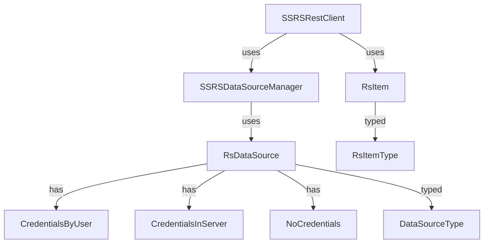

# SSRS Python Tools

A modern Python library to replace the PowerShell ReportingServicesTools module, designed for automation and CI/CD pipelines (e.g., GitLab CI/CD).

**Repository:** [ipierre1/ssrs-powerbi-library](https://github.com/ipierre1/ssrs-powerbi-library)  
**PyPI package:** `ssrs-powerbi-library`

---

## 🚀 Features

- **Full replacement** for PowerShell ReportingServicesTools
- **Native REST API** for SQL Server Reporting Services (SSRS)
- **NTLM authentication** support (Windows credentials)
- **CI/CD integration** (GitLab, GitHub, Azure, etc.)
- **Data source connection testing**
- **Report and catalog item management**
- **Flexible configuration** via environment variables
- **Advanced logging** for debugging and monitoring

---

## 📦 Installation

```bash
# Install from PyPI (recommended)
pip install ssrs-powerbi-library

# Or install from source
git clone https://github.com/ipierre1/ssrs-powerbi-library.git
cd ssrs-powerbi-library
pip install -r requirements.txt
pip install -e .
```

### Requirements

- Python 3.7+
- Access to an SSRS server with REST API enabled
- Credentials for NTLM authentication

---

## 📁 Project Structure

```text
ssrs-powerbi-library/
│
├── ssrs_library/
│   ├── __init__.py
│   ├── ssrs_library.py         # Main client logic
│   ├── datasource_manager.py   # Data source management logic
│   └── types/
│       ├── __init__.py
│       ├── rsitemtype.py       # RsItemType enum
│       ├── datasourcetype.py   # DataSourceType enum
│       ├── rscredentials.py    # Credentials dataclasses
│       ├── rsdatasource.py     # RsDataSource dataclass
│       └── rsitem.py           # RsItem dataclass
│
├── tests/
│   └── ...
├── example_usage.py
├── deploy_reports.py
├── requirements.txt
├── pyproject.toml
└── README.md
```

### Mermaid Diagram



---

## 🔧 Configuration

### Environment Variables (for CI/CD)

Set these variables in your CI/CD environment:

```bash
SSRS_SERVER_URL=http://your-ssrs-server/reports
SSRS_USERNAME=your-username
SSRS_PASSWORD=your-password
SSRS_DOMAIN=your-domain  # Optional
```

### Python Usage Example

```python
from ssrs_library.ssrs_library import SSRSRestClient

client = SSRSRestClient(
    server_url='http://your-server/reports',
    username='your-username',
    password='your-password',
    domain='your-domain'  # optional
)

# Example: List catalog items in root folder
items = client.get_catalog_items('/')
for item in items:
    print(item.name, item.item_type)
```

---

## 🧪 Testing

```bash
pytest tests/
```

---

## 📄 License

MIT License
