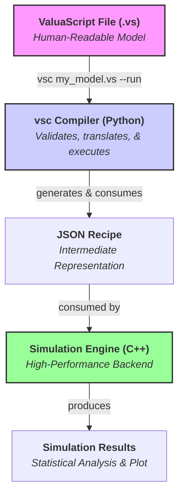

# ValuaScript & The Quantitative Simulation Engine

[](https://github.com/Alessio2704/monte-carlo-simulator/actions)
[](https://opensource.org/licenses/MIT)
[](https://isocpp.org/std/the-standard)
[](https://www.python.org/downloads/)

**A high-performance, multithreaded C++ engine for quantitative financial modeling, driven by ValuaScript—a simple, dedicated scripting language with a smart, validating compiler.**

## 📖 About The Project

This project was born from the need to bridge the gap between the intuitive but slow nature of spreadsheet-based financial modeling and the powerful but often verbose nature of general-purpose programming languages. The goal is to provide a platform that offers the **usability** of a dedicated modeling language with the **raw performance** of compiled, multithreaded C++.

It is designed to execute complex, multi-year, stochastic financial models, running hundreds of thousands of Monte Carlo simulations in seconds—a task that would take minutes or hours in traditional tools.

### Key Features

-   **✨ Simple & Intuitive Language:** Models are defined in **ValuaScript (`.vs`)**, a clean, declarative language with a **familiar, spreadsheet-like formula syntax** using standard mathematical operators (`+`, `-`, `*`, `/`, `^`).
    -   **Ergonomic Syntax:** Includes intuitive bracket syntax (`variable[index]`) for element access, slice-like syntax (`variable[:-1]`) for deleting elements, and numeric separators (`1_000_000`) for enhanced readability.
-   **🚀 High-Performance Backend:** A core engine written in modern C++17, fully multithreaded to leverage all available CPU cores for maximum simulation speed.
    -   **Robust Error Handling:** Features comprehensive static type inference in the compiler and detailed runtime checks in the engine, providing clear and precise error messages for common issues like incorrect function arguments or vector dimension mismatches.
-   **🐍 Smart Validating Compiler:** A robust compiler, `vsc`, transpiles ValuaScript into a JSON recipe. It provides **clear, user-friendly error messages** and performs advanced **static type inference** to catch logical errors before execution.
-   **⚙️ Streamlined Workflow:** A `--run` flag allows for a seamless, one-step compile-and-execute experience.
-   **📊 Instant Visualization:** A `--plot` flag automatically generates a histogram of the simulation output, providing immediate visual analysis.
-   **📈 Data Export:** Natively supports exporting full simulation trial data to CSV files for further analysis with the `@output_file` directive.
-   **🎲 Integrated Monte Carlo Simulation:** Natively supports a rich library of statistical distributions (`Normal`, `Pert`, `Lognormal`, etc.) with fully validated parameters.
-   **🛡️ Robust & Tested:** Comprehensive unit test suite for both the C++ engine (GoogleTest) and the Python compiler (Pytest), ensuring correctness and stability.
-   **🛠️ Professional VS Code Extension:** A full-featured extension providing:
    -   Dynamic, maintainable syntax highlighting.
    -   A comprehensive set of code snippets.
    -   A Python-based Language Server for real-time, as-you-type error diagnostics and **hover-for-help** with function signatures and descriptions.
    -   A **custom file icon** (a stylized distribution curve) for `.vs` files, ensuring a polished editor experience.

## 🏛️ Architecture

The project is cleanly separated into two main components: a Python **compiler** and a C++ **engine**. This modular structure separates the user-facing language tools from the high-performance computation core.

The compilation process now generates a structured JSON recipe with distinct execution phases, making the engine's job clear and scalable.



**Example JSON Recipe Structure:**
The compiler transforms a `.vs` script into a JSON recipe that the C++ engine can execute. This recipe explicitly separates one-time data loading steps from the core per-trial calculations.

```json
{
  "simulation_config": {
    "num_trials": 10000,
    "output_file": "results.csv"
  },
  "output_variable": "final_value",
  "pre_trial_steps": [
    {
      "type": "execution_assignment",
      "result": "assumptions",
      "function": "read_csv_vector",
      "args": [
        { "type": "string_literal", "value": "data.csv" },
        { "type": "string_literal", "value": "GrowthRate" }
      ]
    }
  ],
  "per_trial_steps": [
    {
      "type": "execution_assignment",
      "result": "random_growth",
      "function": "Normal",
      "args": [0.1, 0.02]
    }
  ]
}
```

## 🚀 Installation and Setup (from Source)

This guide walks through building and installing all components of the ValuaScript ecosystem from the source code.

### 1. Install Prerequisites

First, ensure you have the necessary build tools for your operating system.

<details>
<summary><b>macOS Prerequisites</b></summary>

1.  **Install Command Line Tools:** Provides the C++ compiler (Clang).
    ```bash
    xcode-select --install
    ```
2.  **Install Homebrew:** Follow the instructions at [brew.sh](https://brew.sh/).
3.  **Install Core Tools:**
    ```bash
    brew install git cmake python node
    ```
4.  **Install `pipx`:** For isolating the compiler's command-line tool.
    ```bash
    pip install pipx
    ```
5.  **Install `vsce`:** The VS Code extension packager.
    ```bash
    npm install -g @vscode/vsce
    ```

</details>

<details>
<summary><b>Linux (Debian/Ubuntu) Prerequisites</b></summary>

1.  **Install Build Tools:** Provides Git, the C++ compiler (GCC), and CMake.
    ```bash
    sudo apt update
    sudo apt install build-essential cmake git python3-pip python3-venv
    ```
2.  **Install Node.js:** Follow the official installation instructions at [nodejs.org](https://nodejs.org/en/download/package-manager).
3.  **Install `pipx`:**
    ```bash
    sudo apt install pipx
    ```
4.  **Install `vsce`:**
    ```bash
    npm install -g @vscode/vsce
    ```

</details>

<details>
<summary><b>Windows Prerequisites</b></summary>

1.  **Install Visual Studio 2019 or newer:** Download the free "Community" edition from the [Visual Studio website](https://visualstudio.microsoft.com/downloads/). During installation, you **must** select the **"Desktop development with C++"** workload.
2.  **Install Git:** Download and install [Git for Windows](https://git-scm.com/download/win).
3.  **Install CMake:** Download and run the installer from the [CMake website](https://cmake.org/download/). **Important:** During installation, select the option **"Add CMake to the system PATH for all users"** or "...for the current user".
4.  **Install Python:** Download and install a recent version of Python 3 from [python.org](https://www.python.org/downloads/windows/). Ensure the option to "Add Python to PATH" is selected.
5.  **Install Node.js:** Download and install the LTS version from [nodejs.org](https://nodejs.org/).
6.  **Install `pipx` and `vsce`:** Open a new PowerShell or Command Prompt terminal and run:
    ```powershell
    pip install pipx
    npm install -g @vscode/vsce
    ```

</details>

### 2. Clone and Build the Project

Once the prerequisites are installed, you can build and install the components.

```bash
# 1. Clone the repository
git clone https://github.com/Alessio2704/monte-carlo-simulator.git
cd monte-carlo-simulator

# 2. Configure and build the C++ engine
cmake -B build
cmake --build build
# This creates the `vse` executable inside the `build/bin/` directory.

# 3. Install the Python compiler globally using pipx
pipx install ./compiler
# The `vsc` command is now available system-wide.

# 4. Package the VS Code Extension
cd extension
npm install
vsce package
# This creates a `valuascript-x.x.x.vsix` file in the 'extension' directory.
```

After these steps, you will have the `vse` executable, the `vsc` command-line tool, and a `.vsix` file for the VS Code extension. You can install the extension by opening VS Code, navigating to the Extensions view, clicking the `...` menu, and selecting **"Install from VSIX..."**.

---

## ⚙️ Configuration (One-Time Setup)

To use the tools seamlessly from any terminal, you need to tell your system where to find the `vse` executable you just built.

### Method 1: Setting the `VSC_ENGINE_PATH` (Recommended)

This method is ideal for using the `--run` flag with the `vsc` compiler without modifying your system's main `PATH`.

First, get the **absolute path** to your `vse` executable from the build step (e.g., `/path/to/monte-carlo-simulator/build/bin/vse`).

<details>
<summary><b>macOS & Linux Instructions (Zsh/Bash)</b></summary>

1.  **Open your shell configuration file.** This is typically `~/.zshrc` or `~/.bashrc`.
    ```bash
    open ~/.zshrc
    ```
2.  **Add the `export` command** to the end of the file, replacing the example path with your own.
    ```bash
    # Set the path for the ValuaScript Simulation Engine
    export VSC_ENGINE_PATH="/path/to/your/monte-carlo-simulator/build/bin/vse"
    ```
3.  **Save the file and apply the changes** by opening a **new terminal window** or by running `source ~/.zshrc`.

</details>

<details>
<summary><b>Windows Instructions</b></summary>

1.  **Open Environment Variables:** Open the Start Menu, type "env", and select "Edit the system environment variables".
2.  **Edit User Variables:** Click the "Environment Variables..." button. In the top section ("User variables..."), click "New...".
3.  **Create the Variable:**
    - **Variable name:** `VSC_ENGINE_PATH`
    - **Variable value:** `C:\path\to\your\monte-carlo-simulator\build\bin\vse.exe` (replace with your actual absolute path)
4.  **Confirm:** Click OK on all windows. You **must open a new terminal** for the changes to take effect.

</details>

### Method 2: Adding the Engine to the System PATH

This method makes the `vse` command directly runnable from any terminal, just like `vsc`.

<details>
<summary><b>Click for instructions on adding to PATH</b></summary>

Follow the same steps as above, but instead of creating `VSC_ENGINE_PATH`, you will **edit the `Path` variable**.

- **On macOS/Linux:** Add this line to your `~/.zshrc` or `~/.bashrc`, replacing the path with the directory containing your executable:
  ```bash
  # Add ValuaScript engine to the system PATH
  export PATH="$PATH:/path/to/your/monte-carlo-simulator/build/bin"
  ```
- **On Windows:** In the Environment Variables window, find and select the `Path` variable in the "User variables" list and click "Edit...". Click "New" and paste in the path to the directory containing `vse.exe` (e.g., `C:\Users\yourname\monte-carlo-simulator\build\bin`).

Remember to open a **new terminal** for the changes to take effect.

</details>

## 📜 ValuaScript Language Guide

ValuaScript uses a simple, line-by-line syntax for defining variables and calculations. The compiler enforces a clean, readable style.

#### Settings

Special `@` directives configure the simulation. They can appear anywhere in the file but are typically placed at the top for clarity.

```valuascript
# Defines the number of Monte Carlo trials to run. (Required)
@iterations = 100_000

# Specifies which variable's final value should be collected. (Required)
@output = final_share_price

# Exports all trial results to a CSV for analysis and plotting. (Optional)
@output_file = "sim_results/amazon_model.csv"
```

#### Variable Assignment (`let`)

Use the `let` keyword to define variables. The compiler executes assignments sequentially and infers the type of each variable (`scalar` or `vector`).

**1. Literals (Scalars, Strings, and Vectors)**

```valuascript
let tax_rate = 0.21              # Inferred as 'scalar'
let model_name = "Q4 Forecast"   # Inferred as 'string'
let margin_forecast = [0.25, 0.26] # Inferred as 'vector'
```

**2. Infix Expressions**
ValuaScript supports standard mathematical operators for calculations, with correct precedence (`^` before `*`/`/`, before `+`/`-`). Parentheses `()` can be used to control the order of evaluation.

```valuascript
# The compiler infers the types of the variables and the final result.
let cost_of_equity = risk_free_rate + beta * equity_risk_premium
```

**3. Function Calls**
For more complex logic, the engine provides a rich library of built-in functions. The compiler performs advanced, recursive type checking on all function calls:

-   The number of arguments must be correct.
-   The type of each argument (`scalar`, `vector`, or `string`) must match the function's signature. This includes the results of nested function calls.

```valuascript
# CORRECT: The result of grow_series (a vector) is a valid argument for sum_series.
let total_sales = sum_series(grow_series(100, 0.1, 5))

# INCORRECT: The result of grow_series (a vector) is not a valid argument
# for the 'mean' parameter of Normal, which expects a scalar.
# THIS WILL CAUSE A COMPILER ERROR:
# let random_value = Normal(grow_series(100, 0.1, 5), 10)
```

**4. Vector Element Access and Deletion**
ValuaScript supports intuitive Python-like syntax for working with vector elements.

```valuascript
let my_vector =

let first_element = my_vector   # Accesses the first element (returns 100)
let last_element = my_vector[-1]    # Accesses the last element (returns 300)

let vector_without_last = my_vector[:-1] # Returns a new vector
```

#### External Data Integration (CSV Reading)

ValuaScript can import data from external CSV files. This is a critical feature for building realistic models based on real-world data. These functions are executed **once** before the simulation begins for maximum performance.

**`read_csv_vector(file_path, column_name)`**
Reads an entire column from a CSV file and returns it as a `vector`. This is ideal for importing time-series data.

-   **`file_path`** (string): The path to the CSV file. Must be a string literal (in double quotes).
-   **`column_name`** (string): The name of the column to read. Must be a string literal.
-   **Returns**: `vector`

**`read_csv_scalar(file_path, column_name, row_index)`**
Reads a single cell from a CSV file and returns it as a `scalar`. This is useful for importing specific parameters or assumptions.

-   **`file_path`** (string): The path to the CSV file. Must be a string literal.
-   **`column_name`** (string): The name of the column to read. Must be a string literal.
-   **`row_index`** (scalar): The zero-based index of the row to read.
-   **Returns**: `scalar`

**Example:**
Assume you have a file `assumptions.csv`:

```csv
Parameter,Value
BaseSales,5000
GrowthRate,0.08
```

You can use it in your model like this:

```valuascript
let sales = read_csv_scalar("assumptions.csv", "Value", 0)
let growth = read_csv_scalar("assumptions.csv", "Value", 1)
let sales_forecast = grow_series(sales, growth, 10)
```

## 🔬 Development & Contribution

Contributions are welcome! The project's clean separation into `engine/` and `compiler/` directories makes it highly extensible.

### Running Tests

The project includes comprehensive test suites for both components.

**1. C++ Engine Tests (GoogleTest)**

```bash
# First, build the project from the root directory (see "Installation and Setup")
# Then, run the test executable
./build/bin/run_tests
```

**2. Python Compiler Tests (Pytest)**

```bash
# Navigate to the compiler directory
cd compiler

# (Optional but Recommended) Create and activate a virtual environment
python3 -m venv venv
source venv/bin/activate # On Windows: .\venv\Scripts\activate.ps1

# Install the compiler and its optional development dependencies
pip install -e ".[dev]"

# Run the tests
pytest -v
```

### Extending the Engine: A Detailed Guide

Adding a new function to ValuaScript is a clean, three-stage process that touches the C++ engine, the Python compiler, and their respective test suites. This ensures that every new function is not only implemented correctly but also fully validated and type-checked by the compiler.

The engine's architecture now distinguishes between functions that run once (`pre_trial`) and functions that run in every simulation loop (`per_trial`). This is controlled by a simple configuration in the compiler.

Let's walk through a complete example: we will add a new function `clip(value, min_val, max_val)` that constrains a value to be within a specified range.

---

#### Stage 1: Implement the Core Logic in the C++ Engine

First, we'll add the C++ class that performs the actual calculation.

**1.1. Add the `IExecutable` Class**

Open the header file where other simple operations are defined:
**File:** `engine/include/engine/functions/operations.h`

At the end of the file, add the new `ClipOperation` class. We can use `std::clamp` (available in C++17) for a clean implementation.

```cpp
// Add this to the end of engine/include/engine/functions/operations.h

class ClipOperation : public IExecutable
{
public:
    TrialValue execute(const std::vector<TrialValue> &args) const override;
};
```

And in `engine/src/engine/functions/operations.cpp`:

```cpp
// Add this to the end of engine/src/engine/functions/operations.cpp

TrialValue ClipOperation::execute(const std::vector<TrialValue> &args) const
{
    if (args.size() != 3)
    {
        throw std::runtime_error("ClipOperation requires 3 arguments: value, min_val, max_val.");
    }
    double value = std::get<double>(args);
    double min_val = std::get<double>(args);
    double max_val = std::get<double>(args);
    return std::clamp(value, min_val, max_val);
}
```

**1.2. Register the New Function in the Factory**

Now, we need to tell the simulation engine that the string `"clip"` in a JSON recipe should map to our new `ClipOperation` class.

Open the engine's main source file:
**File:** `engine/src/engine/core/SimulationEngine.cpp`

Find the `build_executable_factory()` method and add a new entry for `"clip"`. The list is alphabetical, so let's place it there.

```cpp
// In engine/src/engine/core/SimulationEngine.cpp, inside build_executable_factory()
m_executable_factory["clip"] = []
{ return std::make_unique<ClipOperation>(); };
```

At this point, the C++ engine is now capable of executing the `clip` function.

---

#### Stage 2: Teach the Python Compiler About the New Function

Next, we must update the compiler's configuration so it can validate calls to `clip`.

**2.1. Add the Function Signature**

Open the compiler's static configuration file:
**File:** `compiler/vsc/config.py`

Find the `FUNCTION_SIGNATURES` dictionary and add an entry for `"clip"`. This entry tells the validator everything it needs to know: its arguments, their types, its return type, and crucially, when it should be executed.

```python
# In compiler/vsc/config.py, inside FUNCTION_SIGNATURES

FUNCTION_SIGNATURES = {
    # ... other functions
    "Beta": {"variadic": False, "arg_types": ["scalar", "scalar"], "return_type": "scalar", "execution_phase": "per_trial", "doc": {}},

    # Add our new signature here (alphabetically)
    "clip": {"variadic": False, "arg_types": ["scalar", "scalar", "scalar"], "return_type": "scalar", "execution_phase": "per_trial", "doc": {"summary": "Constrains a scalar value to be within a specified range.", "params": [{"name": "value", "desc": "The scalar value to clip."}, {"name": "min_val", "desc": "The minimum allowed value."}, {"name": "max_val", "desc": "The maximum allowed value."}], "returns": "The clipped scalar value."}},

    "compound_series": {"variadic": False, "arg_types": ["scalar", "vector"], "return_type": "vector", "execution_phase": "per_trial", "doc": {}},
    # ... other functions
}
```

-   **`"execution_phase": "per_trial"`**: This is critical. We tag `clip` as a `per_trial` function because its logic needs to be executed inside every simulation loop. For data loading functions like `read_csv_vector`, this would be `"pre_trial"`. The compiler automatically handles partitioning the steps based on this tag.

---

#### Stage 3: Add Comprehensive Tests

The final stage is to add tests that verify both the C++ logic and the Python validation rules.

-   **C++ Unit Tests (`engine/test/engine_tests.cpp`):** Add a test case to the `DeterministicEngineTest` suite to verify that `clip` returns the correct values for inputs that are below, within, and above the specified range.
-   **Python Compiler Tests (`compiler/tests/test_compiler.py`):**
    -   Add a "happy path" test to `test_valid_scripts_compile_successfully` to ensure `let x = clip(100, 0, 50)` compiles.
    -   Add "sad path" tests to `test_semantic_errors` to ensure the compiler rejects invalid calls, like `clip([1,2], 0, 10)` (passing a vector where a scalar is expected).

After adding these tests and confirming they all pass, your new function is fully and robustly integrated into the language.

## 🗺️ Roadmap

The project is actively developed. Our current roadmap prioritizes practical utility and user experience.

### ✅ Version 1.0 (Current)

The first official production release of ValuaScript. Features include:
-   Core C++ Engine (`vse`) & Python Compiler (`vsc`).
-   Compiler with full static type inference & robust, user-friendly error reporting.
-   Streamlined `--run` flag for a one-step compile-and-execute workflow.
-   Instant data visualization via the `--plot` flag.
-   Data export to CSV via the `@output_file` directive.
-   External data integration (`read_csv_scalar`, `read_csv_vector`) with a high-performance pre-trial execution phase.
-   Intuitive syntax for element access (`vector[index]`) and deletion (`vector[:-1]`).
-   Support for numeric separators (`1_000_000`) for enhanced readability.
-   Full-featured VS Code Extension with syntax highlighting, snippets, Language Server (hover-for-help), and a custom file icon.

---

### 🔜 Tier 1: Next Immediate Feature

-   [ ] **Empirical Distribution Sampler (`create_sampler_from_data`)**
    -   **Why:** Models often require inputs that follow a specific, but not standard, distribution. Instead of forcing users to guess (`Normal`? `Lognormal`?), this feature would allow them to create a custom sampler directly from a real-world data series (e.g., historical oil prices, stock returns). This grounds the simulation in empirical evidence, significantly improving model realism.
    -   **User-Facing Syntax (Example):**
        ```valuascript
        # 1. Read the historical data from a CSV file.
        let oil_price_history = read_csv_vector("data/oil_prices.csv", "Price")

        # 2. Create a custom sampler based on that data's distribution.
        let oil_price_sampler = create_sampler_from_data(oil_price_history)

        # 3. Use the sampler like any other distribution (e.g., Normal, Pert).
        let future_oil_price = oil_price_sampler()
        ```

### 🚀 Tier 2: Advanced Language Features

-   [ ] **User-Defined Functions (`func`, `@export`) & Modularization (`@import`)**
    -   **Why:** To allow users to create reusable, importable functions and organize complex models into clean, encapsulated modules. This promotes cleaner, more abstract, and more scalable models, avoiding code duplication.
    -   **User-Facing Syntax (Example):**
        ```valuascript
        // In modules/my_utils.vs
        @export func calculate_npv_of_series(rate: scalar, cashflows: vector) -> scalar {
            let present_value = npv(rate, cashflows)
            return present_value
        }

        // In main_model.vs
        @import "modules/my_utils.vs"
        let discount_rate = 0.08
        let project_cashflows =
        let final_npv = calculate_npv_of_series(discount_rate, project_cashflows)
        ```

### 🌌 V-Next: The "Blue Sky" Goal (JIT Compilation)

-   [ ] **Native Code Generation (JIT Compiler)**
    -   **Why:** The ultimate performance goal. A Just-In-Time (JIT) compiler would represent the final evolution of the engine. It would take the JSON recipe and, at the start of the simulation, compile it _in memory_ into highly optimized, native machine code tailored to execute that specific model. This would eliminate all interpretation overhead, pushing the execution speed to the theoretical maximum.

## 📄 License

This project is distributed under the MIT License. See the `LICENSE` file for more information.