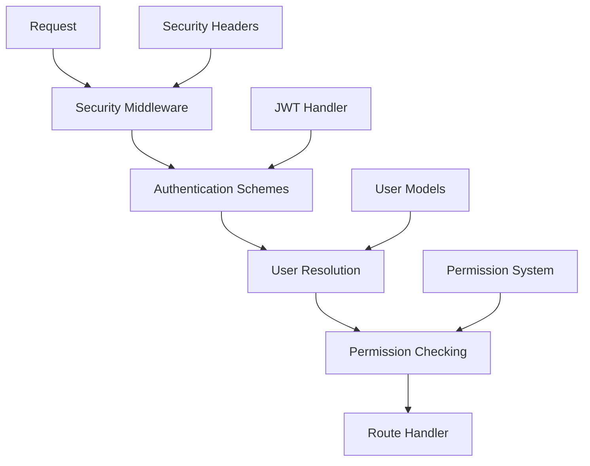

# Security Overview

Velithon provides a comprehensive, production-ready security system inspired by FastAPI's design but enhanced for Velithon's RSGI architecture. The security system includes multiple authentication schemes, role-based access control, automatic OpenAPI integration, and enterprise-grade security features.

## 🔐 Security Features

### Authentication Schemes
- **HTTP Bearer**: JWT and custom token authentication
- **HTTP Basic**: Username/password authentication
- **API Keys**: Header, query parameter, and cookie-based API keys
- **OAuth2**: Password flow and authorization code flow support

### Authorization & Permissions
- **Role-Based Access Control (RBAC)**: Fine-grained permission system
- **Permission Dependencies**: Reusable permission checks
- **User Roles**: Flexible role assignment and management
- **Custom Permissions**: Extensible permission framework

### Security Features
- **JWT Token Management**: Complete token lifecycle management
- **Password Hashing**: BCrypt with PBKDF2 fallback
- **Security Headers**: Automatic security header injection
- **OpenAPI Integration**: Automatic security documentation
- **Middleware Integration**: Authentication and security middleware

## 🏗️ Architecture

The security system consists of several key components:



### Core Components

1. **Authentication Schemes** (`velithon.security.auth`)
   - Handle credential extraction and validation
   - Support multiple authentication methods
   - Integrate with OpenAPI documentation

2. **User Models** (`velithon.security.models`)
   - Structured user data representation
   - Pydantic-based validation
   - JWT token models

3. **JWT Handler** (`velithon.security.jwt`)
   - Token creation, validation, and management
   - Configurable algorithms and expiration
   - Secure key management

4. **Permissions** (`velithon.security.permissions`)
   - Role and permission-based authorization
   - Dependency injection integration
   - Flexible permission checking

5. **Security Middleware** (`velithon.middleware.auth`)
   - Request/response processing
   - Security header injection
   - Error handling

## 🚀 Quick Start

### Basic JWT Authentication

```python
from typing import Annotated

from velithon import Velithon
from velithon.security import HTTPBearer, JWTHandler
from velithon.security.dependencies import get_current_user
from velithon.security.models import User

app = Velithon()

# Configure JWT
jwt_handler = JWTHandler(
    secret_key="your-secret-key",
    algorithm="HS256",
    access_token_expire_minutes=30
)

# Authentication scheme
bearer_scheme = HTTPBearer()

@app.post("/login")
async def login(request: Request):
    # Validate user credentials (implement your logic)
    user = authenticate_user(username, password)
    
    if not user:
        raise HTTPException(status_code=401, detail="Invalid credentials")
    
    # Create JWT token
    access_token = jwt_handler.create_access_token(
        data={"sub": user.username}
    )
    
    return {"access_token": access_token, "token_type": "bearer"}

@app.get("/protected")
async def protected_endpoint(current_user: Annotated[User, get_current_user]):
    return {"message": f"Hello, {current_user.username}!"}
```

### API Key Authentication

```python
from typing import Annotated

from velithon.security import APIKeyHeader

# API key in header
api_key_scheme = APIKeyHeader(name="X-API-Key")

@app.get("/api/data")
async def get_data(api_key: Annotated[str, api_key_scheme]):
    # Validate API key
    if api_key != "valid-api-key":
        raise HTTPException(status_code=401, detail="Invalid API key")
    
    return {"data": "sensitive information"}
```

### Role-Based Access Control

```python
from typing import Annotated

from velithon.security.permissions import require_permission, CommonPermissions

@app.get("/admin/users")
async def list_all_users(
    current_user: Annotated[User, get_current_user],
    _: Annotated[None, require_permission(CommonPermissions.ADMIN_READ)]
):
    # Only accessible to users with admin read permissions
    return {"users": ["all", "users"]}

@app.delete("/admin/users/{user_id}")
async def delete_user(
    request: Request,
    current_user: Annotated[User, get_current_user],
    _: Annotated[None, require_permission(CommonPermissions.ADMIN_WRITE)]
):
    user_id = request.path_params["user_id"]
    # Delete user logic
    return {"deleted": user_id}
```

## 🔧 Authentication Schemes

### HTTP Bearer Token

Most commonly used for JWT authentication:

```python
from typing import Annotated

from velithon.security import HTTPBearer

bearer_auth = HTTPBearer()

@app.get("/profile")
async def get_profile(token: Annotated[str, bearer_auth]):
    # Decode and validate token
    payload = jwt_handler.decode_token(token)
    user = get_user_from_token(payload)
    return {"user": user}
```

### HTTP Basic Authentication

Username/password authentication:

```python
from typing import Annotated

from velithon.security import HTTPBasic
from velithon.security.models import HTTPBasicCredentials

basic_auth = HTTPBasic()

@app.get("/basic-protected")
async def basic_protected(credentials: Annotated[HTTPBasicCredentials, basic_auth]):
    username = credentials.username
    password = credentials.password
    
    # Validate credentials
    if not authenticate_user(username, password):
        raise HTTPException(status_code=401, detail="Invalid credentials")
    
    return {"message": f"Hello, {username}!"}
```

### API Key Authentication

#### Header-based API Key

```python
from typing import Annotated

from velithon.security import APIKeyHeader

api_key_header = APIKeyHeader(name="X-API-Key")

@app.get("/api/data")
async def get_data(api_key: Annotated[str, api_key_header]):
    if not validate_api_key(api_key):
        raise HTTPException(status_code=401, detail="Invalid API key")
    return {"data": "content"}
```

#### Query Parameter API Key

```python
from typing import Annotated

from velithon.security import APIKeyQuery

api_key_query = APIKeyQuery(name="api_key")

@app.get("/api/public-data")
async def get_public_data(api_key: Annotated[str, api_key_query]):
    # Validate API key from query parameter
    return {"data": "public content"}
```

#### Cookie-based API Key

```python
from typing import Annotated

from velithon.security import APIKeyCookie

api_key_cookie = APIKeyCookie(name="api_session")

@app.get("/api/session-data")
async def get_session_data(api_key: Annotated[str, api_key_cookie]):
    # Validate API key from cookie
    return {"data": "session content"}
```

## 🛡️ Security Middleware

Enable automatic security features:

```python
from velithon.middleware import AuthenticationMiddleware, SecurityMiddleware

app = Velithon(
    middleware=[
        Middleware(SecurityMiddleware),  # Security headers
        Middleware(AuthenticationMiddleware),  # Auth error handling
    ],
    include_security_middleware=True  # Enable default security stack
)
```

### Security Headers

The `SecurityMiddleware` automatically adds security headers:

```python
# Automatically added headers:
{
    "X-Content-Type-Options": "nosniff",
    "X-Frame-Options": "DENY",
    "X-XSS-Protection": "1; mode=block",
    "Strict-Transport-Security": "max-age=31536000; includeSubDomains",
    "Referrer-Policy": "strict-origin-when-cross-origin"
}
```

## 🔑 JWT Token Management

### JWT Configuration

```python
from velithon.security.jwt import JWTHandler

jwt_handler = JWTHandler(
    secret_key="your-256-bit-secret",
    algorithm="HS256",
    access_token_expire_minutes=30,
    refresh_token_expire_days=7
)
```

### Token Creation

```python
# Create access token
access_token = jwt_handler.create_access_token(
    data={"sub": "user123", "role": "admin"},
    expires_delta=timedelta(minutes=15)
)

# Create refresh token
refresh_token = jwt_handler.create_refresh_token(
    data={"sub": "user123"}
)
```

### Token Validation

```python
from typing import Annotated

@app.get("/verify-token")
async def verify_token(token: Annotated[str, bearer_auth]):
    try:
        payload = jwt_handler.decode_token(token)
        return {"valid": True, "payload": payload}
    except JWTError:
        raise HTTPException(status_code=401, detail="Invalid token")
```

## 👥 User Management

### User Models

```python
from velithon.security.models import User, UserCreate, UserInDB

# Create new user
new_user = UserCreate(
    username="john_doe",
    email="john@example.com",
    password="secure_password"
)

# User in database (with hashed password)
user_in_db = UserInDB(
    username="john_doe",
    email="john@example.com",
    hashed_password="$2b$12$...",
    is_active=True,
    roles=["user"]
)

# Public user representation
public_user = User(
    username="john_doe",
    email="john@example.com",
    is_active=True,
    roles=["user"]
)
```

### Password Hashing

```python
from velithon.security.utils import hash_password, verify_password

# Hash password during registration
hashed = hash_password("user_password")

# Verify password during login
is_valid = verify_password("user_password", hashed)
```

## 🎯 Permission System

### Basic Permissions

```python
from typing import Annotated

from velithon.security.permissions import Permission, require_permission

# Define custom permissions
READ_POSTS = Permission("posts:read")
WRITE_POSTS = Permission("posts:write")
DELETE_POSTS = Permission("posts:delete")

@app.get("/posts")
async def list_posts(
    _: Annotated[None, require_permission(READ_POSTS)]
):
    return {"posts": []}

@app.delete("/posts/{post_id}")
async def delete_post(
    request: Request,
    _: Annotated[None, require_permission(DELETE_POSTS)]
):
    return {"deleted": request.path_params["post_id"]}
```

### Role-Based Permissions

```python
from typing import Annotated

from velithon.security.permissions import CommonPermissions

# Built-in common permissions
@app.get("/admin/dashboard")
async def admin_dashboard(
    _: Annotated[None, require_permission(CommonPermissions.ADMIN_READ)]
):
    return {"dashboard": "admin_data"}
```

### Multiple Permissions

```python
from typing import Annotated

from velithon.security.permissions import require_permissions

@app.post("/admin/posts")
async def create_admin_post(
    request: Request,
    _: Annotated[None, require_permissions([
        CommonPermissions.ADMIN_WRITE,
        Permission("posts:create")
    ])]
):
    post_data = await request.json()
    return {"post": post_data}
```

## 📖 OpenAPI Integration

Security schemes are automatically documented in OpenAPI:

```python
from typing import Annotated

# The security will automatically appear in Swagger UI
@app.get("/protected-endpoint")
async def protected_endpoint(
    current_user: Annotated[User, get_current_user]
):
    return {"user": current_user.username}
```

Visit `/docs` to see:
- 🔒 Security schemes in the UI
- 🔑 Authentication forms
- 📝 Automatic security documentation

## 🔒 Best Practices

### 1. Use Strong Secrets

```python
import secrets

# Generate secure secret key
SECRET_KEY = secrets.token_urlsafe(32)

jwt_handler = JWTHandler(
    secret_key=SECRET_KEY,
    algorithm="HS256"
)
```

### 2. Implement Token Refresh

```python
@app.post("/refresh")
async def refresh_token(request: Request):
    refresh_token = (await request.json()).get("refresh_token")
    
    try:
        payload = jwt_handler.decode_refresh_token(refresh_token)
        user = get_user(payload["sub"])
        
        # Create new access token
        new_token = jwt_handler.create_access_token(
            data={"sub": user.username}
        )
        
        return {"access_token": new_token}
    except JWTError:
        raise HTTPException(status_code=401, detail="Invalid refresh token")
```

### 3. Secure Headers

```python
app = Velithon(
    include_security_middleware=True  # Enable security headers
)
```

### 4. Environment Variables

```python
import os

JWT_SECRET = os.getenv("JWT_SECRET_KEY")
if not JWT_SECRET:
    raise ValueError("JWT_SECRET_KEY environment variable is required")
```

## 📚 Next Steps

Explore specific security topics:

- **[Authentication](authentication.md)** - Detailed authentication patterns
- **[Authorization](authorization.md)** - Advanced authorization techniques  
- **[JWT Tokens](jwt.md)** - Complete JWT implementation guide
- **[API Keys](api-keys.md)** - API key management strategies
- **[OAuth2](oauth2.md)** - OAuth2 implementation patterns
- **[Permissions](permissions.md)** - Advanced permission systems
- **[Security Middleware](middleware.md)** - Security middleware configuration
- **[Best Practices](best-practices.md)** - Production security guidelines
