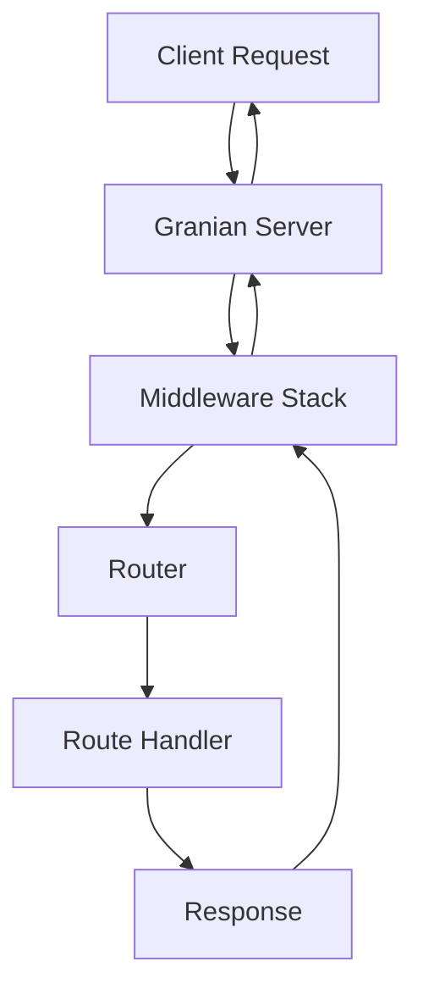

# Core Concepts

This section covers the fundamental concepts you need to understand to build applications with Velithon.

## Application Instance

The `Velithon` class is the central component of your application. It manages routing, middleware, dependency injection, and the application lifecycle.

```python
from velithon import Velithon

app = Velithon(
    title="My API",
    description="A sample API built with Velithon",
    version="1.0.0",
    openapi_url="/openapi.json",
    docs_url="/docs"
)
```

### Application Configuration

The `Velithon` constructor accepts many configuration options:

| Parameter | Type | Description | Default |
|-----------|------|-------------|---------|
| `title` | `str` | API title for documentation | `"Velithon"` |
| `description` | `str` | API description | `""` |
| `version` | `str` | API version | `"1.0.0"` |
| `openapi_version` | `str` | OpenAPI specification version | `"3.0.0"` |
| `openapi_url` | `str \| None` | OpenAPI schema URL | `"/openapi.json"` |
| `docs_url` | `str \| None` | Swagger UI documentation URL | `"/docs"` |
| `routes` | `Sequence[BaseRoute] \| None` | Initial routes | `None` |
| `middleware` | `Sequence[Middleware] \| None` | Middleware stack | `None` |
| `on_startup` | `Sequence[Callable] \| None` | Startup callbacks | `None` |
| `on_shutdown` | `Sequence[Callable] \| None` | Shutdown callbacks | `None` |

## RSGI Protocol

Velithon is built on the **RSGI (Rust Server Gateway Interface)** protocol, which provides:

- **Ultra-high performance**: Direct Rust implementation with Python bindings
- **Granian server**: Uses Granian as the RSGI server (not ASGI/uvicorn)
- **Memory efficiency**: Optimized memory management
- **Concurrent processing**: Advanced concurrency patterns

### RSGI vs ASGI

Unlike ASGI frameworks, Velithon uses RSGI which offers:

```python
# Traditional ASGI application
async def asgi_app(scope, receive, send):
    # ASGI pattern
    pass

# Velithon RSGI application
async def rsgi_app(scope: Scope, protocol: Protocol):
    # RSGI pattern with typed interfaces
    pass
```

## Request-Response Cycle

### Basic Flow

1. **Request arrives** at the Granian server
2. **Middleware stack** processes the request
3. **Router** matches the path and method
4. **Route handler** executes (with DI if configured)
5. **Response** is returned through the middleware stack
6. **Granian** sends the response to the client



### Request Object

Every route handler receives a `Request` object:

```python
from velithon.requests import Request
from velithon.responses import JSONResponse

@app.get("/users/{user_id}")
async def get_user(request: Request):
    user_id = request.path_params["user_id"]
    query_param = request.query_params.get("include_details", False)
    
    # Access request headers
    auth_header = request.headers.get("authorization")
    
    # Access request body
    if request.method == "POST":
        body = await request.json()
    
    return JSONResponse({"user_id": user_id})
```

### Response Types

Velithon provides multiple response types:

```python
from velithon.responses import (
    JSONResponse,
    HTMLResponse,
    PlainTextResponse,
    FileResponse,
    StreamingResponse,
    RedirectResponse,
    SSEResponse  # Server-Sent Events
)

@app.get("/json")
async def json_endpoint():
    return JSONResponse({"message": "Hello, World!"})

@app.get("/html")
async def html_endpoint():
    return HTMLResponse("<h1>Hello, World!</h1>")

@app.get("/file")
async def file_endpoint():
    return FileResponse("path/to/file.pdf")
```

## Routing System

### Route Definitions

Velithon supports multiple ways to define routes:

#### 1. Decorator Style

```python
@app.get("/users")
async def list_users():
    return {"users": []}

@app.post("/users")
async def create_user(request: Request):
    user_data = await request.json()
    return {"user": user_data}

@app.put("/users/{user_id}")
async def update_user(request: Request):
    user_id = request.path_params["user_id"]
    return {"user_id": user_id}
```

#### 2. Manual Route Addition

```python
from velithon.routing import Route

async def user_handler(request: Request):
    return {"method": request.method}

app.add_route("/users", user_handler, methods=["GET", "POST"])
```

#### 3. Router Integration

```python
from velithon.routing import Router

router = Router()

@router.get("/items")
async def list_items():
    return {"items": []}

app.include_router(router, prefix="/api/v1")
```

### Path Parameters

Velithon supports typed path parameters:

```python
@app.get("/users/{user_id:int}")
async def get_user(request: Request):
    user_id: int = request.path_params["user_id"]  # Automatically converted to int
    return {"user_id": user_id}

@app.get("/files/{file_path:path}")
async def get_file(request: Request):
    file_path: str = request.path_params["file_path"]  # Preserves slashes
    return {"file_path": file_path}
```

### Route Matching

Routes are matched in order of definition:

```python
@app.get("/users/me")  # More specific - should come first
async def get_current_user():
    return {"user": "current"}

@app.get("/users/{user_id}")  # Less specific - comes after
async def get_user(request: Request):
    return {"user_id": request.path_params["user_id"]}
```

## Dependency Injection

Velithon includes a powerful dependency injection system:

### Service Container

```python
from velithon.di import ServiceContainer, SingletonProvider, FactoryProvider

class DatabaseService:
    def __init__(self, url: str):
        self.url = url
    
    async def get_connection(self):
        # Return database connection
        pass

class ApiService:
    def __init__(self, api_key: str):
        self.api_key = api_key

# Create a service container
class AppContainer(ServiceContainer):
    database = SingletonProvider(DatabaseService, url="postgresql://localhost/mydb")
    api_service = SingletonProvider(ApiService, api_key="secret-key")

container = AppContainer()

# Register the container with the app
app.register_container(container)
```

### Dependency Injection in Routes

```python
from velithon.di import inject

@app.get("/users")
@inject
async def list_users(
    database: DatabaseService = Provide[container.database],
    api_service: ApiService = Provide[container.api_service]
):
    # Use injected dependencies
    conn = await database.get_connection()
    return {"api_key": api_service.api_key}
```

### Service Providers

```python
class DatabaseService:
    def __init__(self, url: str):
        self.url = url
    
    async def get_connection(self):
        # Return database connection
        pass

# Register as a factory
class AppContainer(ServiceContainer):
    database = FactoryProvider(DatabaseService, url="postgresql://localhost/db")

container = AppContainer()

@app.get("/data")
@inject
async def get_data(db: DatabaseService = Provide[container.database]):
    conn = await db.get_connection()
    return {"data": "from_database"}
```

## Middleware

Middleware provides a way to process requests and responses:

### Built-in Middleware

```python
from velithon.middleware import (
    CORSMiddleware,
    CompressionMiddleware,
    LoggingMiddleware,
    AuthenticationMiddleware,
    SecurityMiddleware
)

app = Velithon(
    middleware=[
        Middleware(CORSMiddleware, allow_origins=["*"]),
        Middleware(CompressionMiddleware, compression_level=6),
        Middleware(LoggingMiddleware, logger_name="velithon.access"),
    ]
)
```

### Custom Middleware

```python
from velithon.middleware.base import BaseHTTPMiddleware

class CustomMiddleware(BaseHTTPMiddleware):
    async def process_request(self, request: Request) -> Request | Response | None:
        # Process incoming request
        request.state.start_time = time.time()
        return request  # Continue to next middleware/handler
    
    async def process_response(self, request: Request, response: Response) -> Response:
        # Process outgoing response
        duration = time.time() - request.state.start_time
        response.headers["X-Process-Time"] = str(duration)
        return response

app = Velithon(
    middleware=[
        Middleware(CustomMiddleware)
    ]
)
```

## Lifecycle Management

### Startup and Shutdown Events

```python
import asyncio

async def startup_handler():
    print("Application starting up...")
    # Initialize database connections, caches, etc.

async def shutdown_handler():
    print("Application shutting down...")
    # Close database connections, cleanup resources

app = Velithon()

# Register lifecycle handlers using decorators
@app.on_startup()
async def register_startup_handler():
    await startup_handler()

@app.on_shutdown()
async def register_shutdown_handler():
    await shutdown_handler()

# Alternative decorator syntax for multiple handlers
@app.on_startup()
async def another_startup_handler():
    print("Another startup task...")

@app.on_shutdown()
async def another_shutdown_handler():
    print("Another shutdown task...")
```

## Error Handling

### Exception Handling

```python
from velithon.exceptions import HTTPException

@app.get("/users/{user_id}")
async def get_user(request: Request):
    user_id = request.path_params["user_id"]
    
    if not user_id.isdigit():
        raise HTTPException(status_code=400, detail="Invalid user ID")
    
    # Fetch user logic here
    user = None
    
    if not user:
        raise HTTPException(status_code=404, detail="User not found")
    
    return {"user": user}
```

### Error Handling

```python
from velithon.requests import Request
from velithon.responses import JSONResponse
from velithon.exceptions import HTTPException

@app.get("/users/{user_id}")
async def get_user(user_id: int):
    try:
        user = get_user_from_db(user_id)
        if not user:
            raise HTTPException(
                status_code=404,
                detail="User not found"
            )
        return {"user": user}
    except ValueError as e:
        # Handle errors within endpoints
        return JSONResponse(
            status_code=400,
            content={"error": "Validation failed", "detail": str(e)}
        )
```
```

## Next Steps

Now that you understand the core concepts, explore the specific guides:

- **[HTTP Endpoints](http-endpoints.md)** - Learn about request/response handling
- **[Routing](routing.md)** - Advanced routing patterns and techniques
- **[Middleware](middleware.md)** - Building and configuring middleware
- **[Dependency Injection](dependency-injection.md)** - Advanced DI patterns
- **[Security](../security/index.md)** - Authentication and authorization
- **[WebSocket Support](websocket.md)** - Real-time communication
- **[Advanced Features](../advanced/gateway.md)** - Gateway, and performance features
